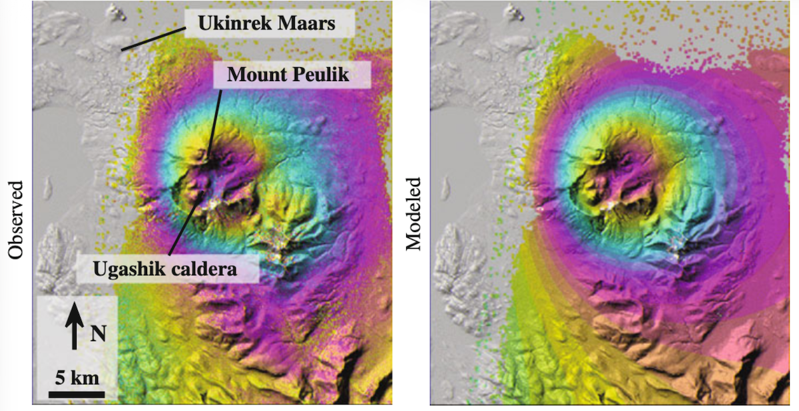
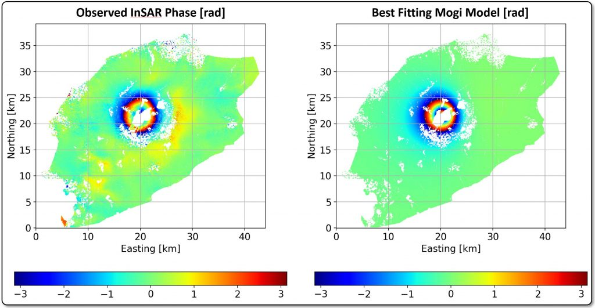

# Modelación inversa de interferogramas con modelos de Mogi y Okada 

El procedimiento de ajuste de un modelo a datos es una herramientas extremadamente versátil y transversal a múltiples en ingeniería y ciencias. Y en ciencias de la tierra lo puede usar desde el cálculo de isocronas en geocronología hasta para problemas muy complejos de tomografía sísmica. Este ajuste de datos también se conoce como inversión, y en ciencias de la tierra ha estado dominada históricamente por el problema de la tomografía sísmica. Sin embargo, hay muchos problemas inversos mucho más didácticos y de mayor utilidad que la tomografía. Esta última es la que ha forzado el avance del pero, es en mi opinión muy poco pedagógica debido a su complejidad y abstracción.

Una inversión es un problema de optimización que busca resolver mínimos cuadrados no lineales expresado mediante la función $$\chi^2(\mathbf{m})$$ ($$\qquad (1)-\qquad (2)$$).

$$\min_{\mathbf{m}}  \chi^2(\mathbf{m}) = \sum_{i=1}^{N} \left( \frac{G_i(\mathbf{m}) - d_i} {\sigma_i} \right)^2 \qquad (1)$$

$$ \chi^{2}(\mathbf{m}) = \left[\mathbf{G}(\mathbf{m})-\mathbf{d}\right]^{T} \mathbf{C}_{d}^{-1} \left[\mathbf{G}(\mathbf{m})-\mathbf{d}\right] \qquad (2)$$

$$\mathbf{C}_d = \mathrm{diag} \left( \sigma_1^2, \sigma_2^2, \ldots, \sigma_N^2 \right) \qquad (3)$$

$$\mathbf{C}_d^{-1} = \mathrm{diag} \left( \frac{1}{\sigma_1^2}, \frac{1}{\sigma_2^2}, \ldots, \frac{1}{\sigma_N^2} \right) \qquad (4)$$

con $$\mathbf{m}$$ los parámetros del modelo, $$\mathbf{G}$$ la función (Okada/Mogi proyectado en el LOS de InSAR), $$d$$ los datos, $$\sigma_i$$ la desviación standard de cada medición, $$\mathbf{C}_d^{-1} $$ la inversa de la matriz de covarianza, que en este caso la asumimos diagonal. Entonces el problema a minimizar es la diferencia entre los datos y el modelo escalado por la incertidumbre. Esto nunca es cero porque los datos tienen ruido y los modelos son simplificaciones de la realidad. Esto es un criterio exclusivamente estadístico y no considera la incertidumbre epistémica que tienen todos los modelos.

El modelo de Mogi predice el desplazamiento en superficie $$\mathbf{u}(x,y)$$ en direcciones EW, NS, Z y en el LOS de InSAR $$u_{\mathrm{LOS}}(x,y)$$ producto de un cambio de volumen $$\Delta V$$ de una esfera pequeña presurizada en un semiespacio infinito en la cual $$\frac{a}{d}<0.4$$ con $$a$$ el radio de la esfera y $$d$$ la profundidad del centro.

$$
\mathbf{u}(x,y) = \left(u_E,u_N,u_U\right)^{\mathsf T} =
\frac{(1-\nu)\Delta V}{\pi} \frac{1}{R^3}
\left(x-x_0,y-y_0,d\right)^{\mathsf T},
\qquad
R^2=(x-x_0)^2+(y-y_0)^2+d^2.
$$

$$
u_{\mathrm{LOS}}(x,y)=
\frac{(1-\nu)\Delta V}{\pi R^3}
\left[l_X(x-x_0)+l_Y(y-y_0)+l_Zd\right].
$$

$$\Delta V$$ es la variacion de volumen, $$x_0$$, $$y_0$$, $$z_0$$ las coordenadas de la esfera, $$R$$ la distancia desde el centro de la esfera al punto de observacion, $$\nu$$ el modulo de Poisson que equivale a 0.25 para rocas volcánicas promedio, $$l_{x}$$, $$l_{y}$$, $$l_{z}$$ los cosenos direccionales del vector LOS de InSAR.  

Para el problema de inversión de minimos cuadrados de un modelo de Mogi $$\mathbf{G(m)} = u_{\mathrm{LOS}}(x,y,\mathbf{m})$$, $$\mathbf{m}=[x_0, y_0, z_0, \Delta V]^T$$, $$\mathbf{d} = U_{LOS}(x,y)$$. Notar que los puntos de observación en $$x$$,$$y$$ son las coordenadas de cada pixel y no son los parámetros del modelo a optimizar. De los cuatro parámetros del modelo $$[x_0, y_0, z_0]^T$$ son no lineales y $$\Delta V$$ es lineal. En general al modelo forward se le añade una rampa lineal para estimar errores orbitales residuales, y señales troposféricas-inosféricas de longitud de onda larga. De esta forma, el modelo forward queda

$$u_{\mathrm{LOS}}(x,y)= \frac{3\Delta V}{4\pi R^3} \left[l_X(x-x_0)+l_Y(y-y_0)+l_Zd\right] + Ax + By + C $$

$$u_{\mathrm{LOS}}(x,y) = \Delta V u_{\mathrm{LOS}}(x,y,\mathbf{x_0,y_0,d}) + Ax + By + C $$

Como ejemplo, para dos interferogramas ascendentes y descendentes que cubren tiempos diferentes, el problema inverso se escribe de forma tal que puede dejar explícitos los parámetros lineales del modelo, como la variación de volumen (slip para un modelo de Okada) y los coeficientes de la rampa. 

$$\mathbf{G_i(m)} =
\begin{bmatrix}
u_{\mathrm{LOS}}(x,y,\mathbf{x_0,y_0,d}) & x & y & 1
\end{bmatrix}
$$

$$
\begin{bmatrix}
  u_{\mathrm{LOS_A}}(x_a,y_a,\mathbf{x_0,y_0,d}) &0 &x_a &y_a &1 & 0 & 0 &0 \\
0&u_{\mathrm{LOS_D}}(x_d,y_d,\mathbf{x_0,y_0,d}) &0 &0 &0 & x_d &y_d & 1 
\end{bmatrix}
\begin{bmatrix}
\Delta V_A \\
\Delta V_D  \\
A \\
B \\
C \\
D \\
E \\
F \\
\end{bmatrix} =
\begin{bmatrix}
U_A(x_a,y_a) \\
U_D(x_d,y_d) \\
\end{bmatrix}
$$

Si por el contrario el source strength (variación de volumen, slip) fuera la misma para los dos interferogramas, como en un terremoto para el modelo de Okada, entonces la expresión anterior es más simple:

$$
\begin{bmatrix}
u_{\mathrm{LOS_A}}(x,y,\mathbf{x_0,y_0,d}) &x_a &y_a &1 & 0 & 0 &0 \\
u_{\mathrm{LOS_D}}(x,y,\mathbf{x_0,y_0,d}) &0 &0 &0 & x_d &y_d & 1 
\end{bmatrix}
\begin{bmatrix}
\Delta V \\
A \\
B \\
C \\
D \\
E \\
F \\
\end{bmatrix} =
\begin{bmatrix}
U_A(x,y) \\
U_D(x,y) \\
\end{bmatrix}
$$


$$\mathbf{G(m_{nonlin})m_{lin}}=\mathbf{d}$$
$$\chi^{2}(\mathbf{m}) = \left[\mathbf{G(m_{nonlin})m_{lin}}-\mathbf{d}\right]^{T} \mathbf{C}_{d}^{-1} \left[\mathbf{G(m_{nonlin})m_{lin}}-\mathbf{d}\right] \qquad (2)$$

La ventaja de utilizar este enfoque entre parámetros lineales y no lineales es que si usa algoritmos de búisqueda aleatoria como el de vecindad (Sambridge, 1999), estos exploran el espacio de parámetros no lineal y para cada conjunto de parámetros invierte con mínimos cuadrados lineales los parámetros lineales.

$$\mathbf{m_{lin}}= (\mathbf{G}^{T}\mathbf{C}_d^{-1}\mathbf{G})^{-1} \mathbf{G}^{T}\mathbf{C}_d^{-1}\mathbf{d}$$

Para minimizar la función $$\chi^2(\mathbf{m})$$, debe lograr que la predicción del modelo explique los datos con la menor diferencia posible, tal como muestran los siguientes ejemplos de Alaska.



Interferograma JERS de banda L del complejo volcánico Ugashik-Mount Peulik (Aleutians, Alaska) que cubre el período 1992/09/24-1997/10/06 e interferograma sintético predicho por el mejor modelo de Mogi que ajusta los datos en base a la fórmula $$\qquad(1)$$. Un ciclo completo de colores es una fringe interferométrica y corresponde a 11.8 cm de deformación superficial en el LOS de InSAR ([figura 6.193](https://link-springer-com.uchile.idm.oclc.org/chapter/10.1007/978-3-642-00348-6_6#Sec216) de [Lu y Dzurisin, 2014](https://link-springer-com.uchile.idm.oclc.org/book/10.1007/978-3-642-00348-6)).



Interferograma ERS de banda C del volcan Okmok (Aleutians, Alaska) e interferograma sintético predicho por el mejor modelo de Mogi que ajusta los datos en base a la fórmula $$\qquad(1)$$. Un ciclo completo de colores es una fringe interferométrica y corresponde a 2.83 cm o $$2\pi$$ radianes de deformación superficial en el LOS de InSAR (https://radar.community.uaf.edu/lab-6-volcano-source-modeling-using-insar-data/).

Para ajustar los datos, utilizará el algoritmo de Levenberg-Marquardt de MATLAB para resolver $$\qquad (1)$$ aplicado a los modelos de Mogi y Okada. El detalle del algoritmo lo puede ver en las secciones 9.2-9.3 del libro de inversión de [Aster et al., 2013](https://www.sciencedirect.com/book/monograph/9780123850485/parameter-estimation-and-inverse-problems). 


## Archivos a Descargar

Descargue  [load_isce](https://github.com/fdelgadodelapuente/isce_utils/blob/main/load_isce.m) y ```Mogi_Aniakchak.zip```, ```inversion2026.zip```,```okada_pishan.zip``` de U-Cursos a una carpeta que llamaremos  ```insar```. Mueva  ```load_isce.m``` a ```inversion/scripts```, reescribiendo el que hay ahí. La carpeta ```inversion/load_isce201708``` es una versión muy vieja de este codigo y la puede borrar. 

## Mogi Volcán Aniakchak 2023

Añadir carpetas al path de Matlab

```
addpath('inversion/InSamp/')
addpath('inversion/scripts/')
addpath('inversion/resamp_sill/')
addpath('inversion/mogi_invert/')
addpath('inversion/')
```
Correr ```mogi_example/220905_230807_1swath/synth_mogi``` 

Para el downsampling, correr ```resamptool_isce_roipac``` . Para downsamplear otros datos cambiar  ```mogi_example/220905_230807_1swath/resamp_in.m``` y volver a correr. Las variables clave son ``` filename```, ``` losfilename```, ``` demf```, ``` lambda```, ``` savestructname```, ``` zone```, al igual que las líneas 36,37,39,40 que cambian las dimensiones de la dislocación que fuerza el downsampling a zonas con deformación en el algoritmo de [Lohman y Simons, 2005](https://agupubs.onlinelibrary.wiley.com/doi/10.1029/2004GC000841) y Appendix A de [Lohman et al., 2010](https://agupubs.onlinelibrary.wiley.com/doi/full/10.1029/2010JB007710).

El bloque de texto que dice 

```
coords.x1=-158.52083333333334;
coords.y2=58.200833333333335;
coords.nx=1945;
coords.ny=2401;
coords.dx=0.0008333333333333334;
```
lo puede reemplazar por ```coords=NaN```, ya que es para una versión muy antigua del código que leía la metadata de los .vrt de ISCE2 mediante grep de Linux.

Para invertir, correr ``` lsqnl_mogi2_chisq_Jac.m```. Puede cambiar los datos con las líneas 11-12.  Si usa MATLAB R2026 y falla, comentar las linas 58-60 que convierten las coordenadas de la fuente de UTM a geográficas. Eso lo puede hacer con Google Earth. 

## Okada Terremoto de Pishan 2016

Añadir carpetas al path de Matlab

```
addpath('inversion/InSamp/')
addpath('inversion/scripts/')
addpath('inversion/resamp_sill/')
addpath('inversion/')
```

Abrir ```okada_pishan/asc/resamp_in.m``` modificar linea 11 a ```lambda='sentinel'``` y comentar lineas 40-46

Correr ```okada_pishan/asc/okada_forward_int.m``` y modificar los parametros de entrada del modelo. La linea 20 cambia las coordenadas UTM del area de interes (linea 24 de ```okada_pishan/asc/resamp_in.m```)

Para el downsampling descomentar las lineas 40-46 de ```okada_pishan/asc/resamp_in.m``` y correr ```resamptool_isce_roipac```

Para invertir, con los parametros por defecto correr ```okada_pishan/invert_eq.m```

Para modificar para otros datos debe cambiar los inputs de ```okada_pishan/asc/resamp_in.m``` de la misma forma que para Mogi. El procedimiento de downsampling es idéntico para ambos ejemplos. 
