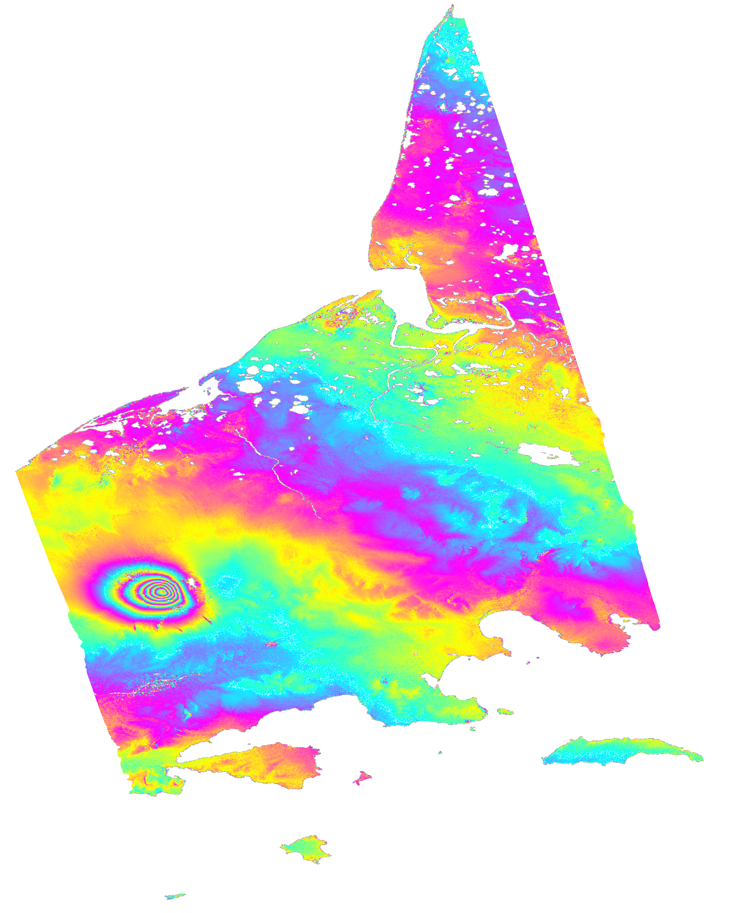
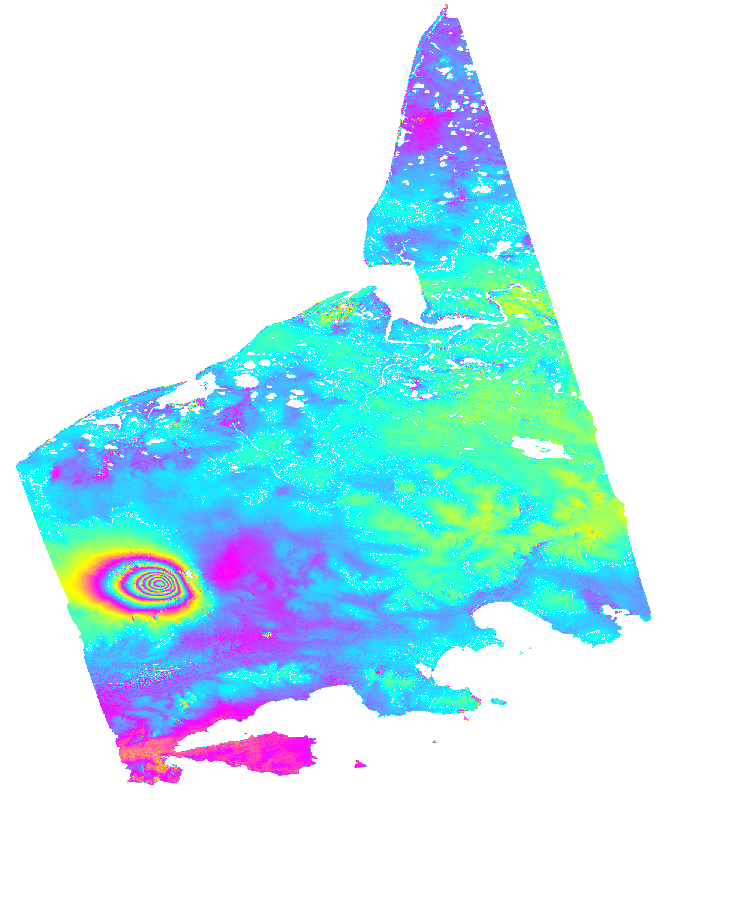

ISCE2 example for processing a single swath of an ALOS-2 interferogram of Aniakchak crater, Aleutians. It does not include the ionospheric correction because in this case it fails for single swath processing.


You can process ALOS-2 stripmap data with `stripmapApp.py`. For ALOS-2 SM3 the data are provided as a double polarization IMG-HH and IMG-HV files with the same pixel size for each file – there is no need to run an FBD2FBS conversion. The SM1 data are provided as single polarization files with a single IMG-HH file. HH interferograms have a higher SNR than HV interferograms.

Download the data
```
wget https://cumulus.asf.earthdatacloud.nasa.gov/L1.1/ALOS2/ALOS2447461150-220905-WBSR1.1__A.zip
wget https://cumulus.asf.earthdatacloud.nasa.gov/L1.1/ALOS2/ALOS2497141150-230807-WBDR1.1__A.zip
```
Create the input file `alos2App.xml` in the folder `20220905_20230807`. You only need to specify a single swath
```
<?xml version="1.0" encoding="UTF-8"?>
<alos2App>
  <component name="alos2insar">

    <property name="reference directory">../ALOS2447461150-220905</property>
    <property name="secondary directory">../ALOS2497141150-230807</property>
    <!-- <property name="reference frames">[1150]</property>
    <property name="secondary frames">[1150]</property> -->
    <property name="starting swath">3</property>
    <property name="ending swath">3</property>

        
    <property name="dem for coregistration">dem_1_arcsec/demLat_N56_N60_Lon_W160_W156.dem.wgs84</property>
    <property name="dem for geocoding">dem_3_arcsec/demLat_N55_N60_Lon_W162_W154.dem.wgs84</property>

    <property name="use GPU">False</property>


<!--=====================================================================================================
                                    instructions for alos2App.py/alos2burstApp.py

This is the input file of alos2App.py/alos2burstApp.py. Below are all parameters users can set. 
Instructions on how to set these parameters are also provided. Parameter default values are shown in the 
brackets. Remove the first four characters and the last three characters in a parameter line to set a 
parameter value.

For the techinques and algorithms implemented in the software, refer to:

1. ScanSAR or multi-mode InSAR processing
C. Liang and E. J. Fielding, "Interferometry with ALOS-2 full-aperture ScanSAR data," 
IEEE Transactions on Geoscience and Remote Sensing, vol. 55, no. 5, pp. 2739-2750, May 2017.

2. Ionospheric correction, burst-by-burst ScanSAR processing, and burst-mode spectral diversity (SD) or 
multi-aperture InSAR (MAI) processing
C. Liang and E. J. Fielding, "Measuring azimuth deformation with L-band ALOS-2 ScanSAR interferometry," 
IEEE Transactions on Geoscience and Remote Sensing, vol. 55, no. 5, pp. 2725-2738, May 2017.

3. Ionospheric correction
C. Liang, Z. Liu, E. J. Fielding, and R. Bürgmann, "InSAR time series analysis of L-band wide-swath SAR 
data acquired by ALOS-2," 
IEEE Transactions on Geoscience and Remote Sensing, vol. 56, no. 8, pp. 4492-4506, Aug. 2018.
======================================================================================================-->


    <!--Note that, in ScanSAR-stripmap interferometry, ScanSAR must be reference!-->
    <!--<property name="reference directory">None</property>-->
    <!--<property name="secondary directory">None</property>-->

    <!--=========================================================================================
    This is a list of frames, e.g., [0680, 0690]. Here is how you can find frame number. Below 
    is a JAXA SLC product
    0000168233_001001_ALOS2183010690-171012.zip
    After you unpack the JAXA SLC product, you will find an image file like:
    IMG-HH-ALOS2183010685-171012-FBDR1.1__A
                     ^^^^
    The number 0685 (indicated by ^) is the frame number. DON'T use the frame number in the zip
    file name, as it may be incorrect (like the above example).
    ==========================================================================================-->
    <!--<property name="reference frames">None</property>-->
    <!--<property name="secondary frames">None</property>-->
    <!--<property name="reference polarization">HH</property>-->
    <!--<property name="secondary polarization">HH</property>-->


    <!--=========================================================================================
    for ScanSAR-stripmap, always process all swaths, user's settings are overwritten
    ==========================================================================================-->
    <!--<property name="starting swath">None</property>-->
    <!--<property name="ending swath">None</property>-->


    <!--=========================================================================================
    DEM and water body will be automatically downloaded if not specified. If you want to process
    multiple pairs over one area, we recommend downloading your own dem using to avoid download
    it multiple times. Here is how you can download a DEM and water body.
    #3 arcsec for geocoding
    mkdir dem_3_arcsec
    cd dem_3_arcsec
    dem.py -a stitch -b 29 37 125 133 -k -s 3 -c -f -u http://e4ftl01.cr.usgs.gov/MEASURES/SRTMGL3.003/2000.02.11
    fixImageXml.py -i demLat_*_*_Lon_*_*.dem.wgs84 -f
    rm *.hgt* *.log demLat_*_*_Lon_*_*.dem demLat_*_*_Lon_*_*.dem.vrt demLat_*_*_Lon_*_*.dem.xml
    cd ../

    #1 arcsec for creating differential interferogram
    mkdir dem_1_arcsec
    cd dem_1_arcsec
    dem.py -a stitch -b 29 37 125 133 -k -s 1 -c -f -u http://e4ftl01.cr.usgs.gov/MEASURES/SRTMGL1.003/2000.02.11
    fixImageXml.py -i demLat_*_*_Lon_*_*.dem.wgs84 -f
    rm *.hgt* *.log demLat_*_*_Lon_*_*.dem demLat_*_*_Lon_*_*.dem.vrt demLat_*_*_Lon_*_*.dem.xml
    cd ../

    #water body
    #do correct missing water body tiles problem here!!! check usage of wbd.py for more details,
    #or simply follow the commands below
    mkdir wbd_1_arcsec
    cd wbd_1_arcsec
    wbd.py 29 37 125 133
    fixImageXml.py -i swbdLat_*_*_Lon_*_*.wbd -f
    cd ../
    ==========================================================================================-->
    <!--<property name="dem for coregistration">None</property>-->
    <!--<property name="dem for geocoding">None</property>-->

    <!--=========================================================================================
    this water body is used to create water body in radar coordinate used in processing.
    radar-coordinate water body is created three times in runRdr2Geo.py, runLook.py and 
    runIonUwrap.py, respectively. radar-coordinate water body is used in:
    (1) determining the number of offsets in slc offset estimation, and radar/dem offset 
        estimation
    (2) masking filtered interferogram or unwrapped interferogram
    (3) determining the number of offsets in slc residual offset estimation after geometric 
        offset computation in coregistering slcs in dense offset.
    (4) masking dense offset field
    (5) mask coherence in ionosphere fitting and filtering
    ==========================================================================================-->
    <property name="water body">wbd_1_arcsec/swbdLat_N56_N60_Lon_W160_W156.wbd</property>


    <property name="use virtual file">True</property>
    <!--<property name="use GPU">False</property>-->


    <!--=========================================================================================
    if ScanSAR burst synchronization is lower than this threshold, an MBF filter is applied to 
    the reference/secondary images to remove non-overlap azimuth burst spectrum to improve coherence.
    ==========================================================================================-->
    <!--<property name="burst synchronization threshold">75.0</property>-->


    <!--=========================================================================================
    crop slcs to the reference/secondary overlap area. Cropping is always done for ScanSAR-stripmap 
    interferometry
    ==========================================================================================-->
    <!--<property name="crop slc">False</property>-->


    <!--=========================================================================================
    This is for determining the number of offsets to be estimated between reference and secondary SLCs.
    for areas where no water body data available, turn this off, otherwise the program will use 
    geometrical offset, which is not accuate enough. If it still does not work, set 
    "number of range offsets for slc matching" and "number of azimuth offsets for slc matching"
    ==========================================================================================-->
    <!--<property name="use water body to dertermine number of matching offsets">True</property>-->

    <!--=========================================================================================
    These are 2-D lists, with frame as the first dimension and swath as the second dimension. 
    For example, if you want to process two frames and three swaths, you can specify one of 
    these parameters as:
    [[20, 30, 20],[15, 20, 20]]
    ==========================================================================================-->
    <!--<property name="number of range offsets for slc matching">None</property>-->
    <!--<property name="number of azimuth offsets for slc matching">None</property>-->


    <!--=========================================================================================
    These are the numbers of looks to be taken when forming the interferogram
    ==========================================================================================-->
    <!--<property name="number of range looks 1">None</property>-->
    <!--<property name="number of azimuth looks 1">None</property>-->

    <!--=========================================================================================
    These are the numbers of looks to be taken after taking the numbers of range/azimuth looks 1
    ==========================================================================================-->
    <property name="number of range looks 2">5</property>
    <property name="number of azimuth looks 2">2</property>


    <!--=========================================================================================
    These are the numbers of looks to be taken after taking the numbers of range/azimuth looks 1.
    This is for matching the radar image and DEM
    ==========================================================================================-->
    <!--<property name="number of range looks sim">None</property>-->
    <!--<property name="number of azimuth looks sim">None</property>-->


    <!--<property name="do matching when computing adjacent swath offset">True</property>-->
    <!--<property name="do matching when computing adjacent frame offset">True</property>-->


    <!--=========================================================================================
    These are interferogram filtering parameters
    ==========================================================================================-->
    <property name="interferogram filter strength">0.5</property>
    <!--<property name="interferogram filter window size">32</property>-->
    <!--<property name="interferogram filter step size">4</property>-->
    <!--<property name="remove magnitude before filtering">True</property>-->


    <!--=========================================================================================
    water body mask starting step: None, filt, unwrap
    ==========================================================================================-->
    <!--<property name="water body mask starting step">unwrap</property>-->


    <!--=========================================================================================
    This is a list of files to be geocoded
    Wild card such as * is accepted, e.g. filt_*-*_5rlks_28alks.unw.conncomp
    ==========================================================================================-->
    <!-- <property name="geocode file list">filt_*-*_5rlks_28alks.int</property>-->

    <!--=========================================================================================
    This is a four-element list [s, n, w, e], e.g. [26.24, 30.04, 33.45, 37.79].
    ==========================================================================================-->
    <property name="geocode bounding box">[56.2,58.2,-158.52,-156.9]</property>

    <!--=========================================================================================
    geocode interpolation method: sinc, bilinear, bicubic, nearest
    ==========================================================================================-->
    <!--<property name="geocode interpolation method">None</property>-->


    <!--=========================================================================================
    These parameters are for ionospheric corrections
    ==========================================================================================-->
    <property name="do ionospheric phase estimation">False</property>
    <property name="apply ionospheric phase correction">False</property>

    <!--=========================================================================================
    These are the numbers of looks to be taken after taking the numbers of range/azimuth looks 1.
    This is for ionospheric correction
    ==========================================================================================-->
    <!--<property name="number of range looks ion">None</property>-->
    <!--<property name="number of azimuth looks ion">None</property>-->

    <!--=========================================================================================
    seperated islands or areas usually affect ionosphere estimation and it's better to mask them
    out. check ion/ion_cal/lower_40rlks_224alks.int (here number of looks 40 and 224 depends on 
    your particular case) for areas to be masked out.
    The parameter is a 2-D list. Each element in the 2-D list is a four-element list: [firstLine,
    lastLine, firstColumn, lastColumn], with line/column numbers starting with 1. If one of the
    four elements is specified as -1, the program will use firstLine/lastLine/firstColumn/
    lastColumn instead. For exmple, if you want to mask the following two areas out, you can
    specify a 2-D list like:
    [[100, 200, 100, 200],[1000, 1200, 500, 600]]
    ==========================================================================================-->
    <!--<property name="areas masked out in ionospheric phase estimation">None</property>-->
    <!--<property name="apply polynomial fit before filtering ionosphere phase">True</property>-->
    <!--<property name="maximum window size for filtering ionosphere phase">151</property>-->
    <!--<property name="minimum window size for filtering ionosphere phase">41</property>-->

    <!--=========================================================================================
    parameters for filtering subband interferograms used for ionospheric phase estimation
    ==========================================================================================-->
    <!--<property name="filter subband interferogram">False</property>-->
    <!--<property name="subband interferogram filter strength">0.3</property>-->
    <!--<property name="subband interferogram filter window size">32</property>-->
    <!--<property name="subband interferogram filter step size">4</property>-->
    <!--<property name="remove magnitude before filtering subband interferogram">True</property>-->

    <!--<property name="swath phase difference snap to fixed values">[[True, True, True, True]]</property> -->


    <!--=========================================================================================
    These parameters are for dense offset
    ==========================================================================================-->
    <!--<property name="do dense offset">False</property>-->
    <!--<property name="estimate residual offset after geometrical coregistration">True</property>-->
    <!--<property name="delete geometry files used for dense offset estimation">False</property>-->

    <!--=========================================================================================
    #For the following set of matching parameters
    from: dense offset estimation window width
    to:   dense offset covariance surface oversample window size
    Normally we only have to set the following parameters. A good set of parameters other than default is:
    <property name="dense offset estimation window width">128</property>
    <property name="dense offset estimation window hight">128</property>
    <property name="dense offset skip width">64</property>
    <property name="dense offset skip hight">64</property>
    ==========================================================================================-->
    <!--<property name="dense offset estimation window width">64</property>-->
    <!--<property name="dense offset estimation window hight">64</property>-->

    <!--=========================================================================================
    NOTE: actual number of resulting correlation pixels: offsetSearchWindowWidth*2+1
    ==========================================================================================-->
    <!--<property name="dense offset search window width">8</property>-->

    <!--=========================================================================================
    NOTE: actual number of resulting correlation pixels: offsetSearchWindowHeight*2+1
    ==========================================================================================-->
    <!--<property name="dense offset search window hight">8</property>-->
    <!--<property name="dense offset skip width">32</property>-->
    <!--<property name="dense offset skip hight">32</property>-->
    <!--<property name="dense offset covariance surface oversample factor">64</property>-->
    <!--<property name="dense offset covariance surface oversample window size">16</property>-->
    <!--<property name="mask dense offset with water body">True</property>-->
    <!--<property name="do offset filtering">False</property>-->
    <!--<property name="offset filter window size">3</property>-->
    <!--<property name="offset filter snr threshold">0.0</property>-->


    <!--=========================================================================================
    system parameters, better not set these
    ==========================================================================================-->
    <!--<property name="pickle dump directory">PICKLE</property>-->
    <!--<property name="pickle load directory">PICKLE</property>-->
    <!--<property name="renderer">xml</property>-->

  </component>
</alos2App>
```


Download the SRTM DEM in the `20220905_20230807/dem_1_arcsec` folder
```
dem.py -a stitch -b 56 60 -160 -156 -r -s 1 -c -u http://step.esa.int/auxdata/dem/SRTMGL1 -f
```

Download the water body mask in the `20220905_20230807/wbd_1_arcsec` folder
```
wbd.py 56 60 -160 -156 1
```


Run it with
```
alos2App.py alos2App.xml --steps
```

Despite the lack of a split spectrum correction, the ionospheric ramp can be removed with the deramp.py script from https://github.com/fdelgadodelapuente/isce_utils. After removing the ramp, export the interferogram to Google Earth.

```
cd insar
mdx.py filt_220905-230807_5rlks_28alks.unw.geo -kml filt_220905-230807_5rlks_28alks.unw.geo.kml
mdx filt_220905-230807_5rlks_28alks.unw.geo -s 1945 -CW -unw -r4 -rhdr 7780 -cmap cmy -wrap 6.283185307179586 -P ; convert out.ppm -transparent cyan filt_220905-230807_5rlks_28alks.unw.geo.png 

```


You should get the following file








You can clean-up intermediate files with

```
rm -v  f?_????/s?/*.slc f?_????/s?/*.int  f?_????/s?/*.amp  f?_????/mosaic/*.int  f?_????/mosaic/*.amp  ion/*/f?_????/s?/*.int  ion/*/f?_????/s?/*.amp  ion/*/insar/*.int  ion/*/insar/*.amp  ion/*/*/mosaic/*.amp ion/*/*/mosaic/*.int insar/*_1rlks_14alks.???  insar/*_1rlks_14alks_??.??? insar/*_1rlks_14alks_rg_rect.off  insar/rdr_dem_offset/*_1rlks_14alks.??? insar/rdr_dem_offset/???_3rlks_14alks.float
```


## alos2App.py

The ALOS-2 processor was released in October 2019 as an additional toolbox to ISCE 2.3.2 and was properly integrated with the rest of the ISCE modules in version 2.3.3 in March 2020. It can process both stripmap and ScanSAR data with split spectrum corrections . ScanSAR images suitable for InSAR are focused with a full aperture processing chain, and not with a SPECAN algorithm whoch is ideal for these burst by burst acquisition modes. Although `stripmapApp.py` can process ALOS-2 SM3 and SM1 data, it cannot correct the ionospheric phase. The module tutorial and examples are at

```
isce2-2.6.3/examples/input_files/alos2/example_input_files
```

To process an interferogram

```
alos2App.py alos2app.xml --steps
```

The ScanSAR processing is time consuming and requires $\sim$60 Gb of storage for every frame. Every ALOS-2 ScanSAR swath is $\sim$6 Gb and every interferograms must be calculated three times for the range spectral filtering to separate the dispersive and non-dispersive components of the phase. In my experience ScanSAR data for volcanic applications is only useful for large scale surveys of volcanic deformation. For example, a single ScanSAR swath in two frames can cover a almost all of the most active volcanoes of the Southern Andes. And obviously when there is no other coherent data that span the event of interest. The advantages of ScanSAR for large earthquakes are obvious like during the 2015 Gorkha  and the 2016 Kaikoura  earthquakes.

For processing ScanSAR data the tutorial recommends using 5 looks in range and 2 looks in azimuth. The pixel sizes are 25 m in range – similar to the SM3 pixel size, and 60 m in azimuth. This results in a pixel size of $\sim$100 m, so the interferograms are geocoded with the 90 m DEM. You can stitch ScanSAR frames and process as many swaths and frames as you want.

For the SM3 data the pixel ratio is 2, but alos2App.py applies by default the pixel ratio and 2 additional looks in range and azimuth. These data are usually processed with either 2 or 4 additional looks resulting in a total of 16 looks in azimuth and 8 looks in range.

### Technical notes from JAXA

The following links detail known issues with ALOS-2 data.

[Effective data for interferometric analysis with PALSAR-2 ScanSAR mode](https://www.eorc.jaxa.jp/ALOS/en/alos-2/pdf/auig2/ScanSAR_Burst_Overlap_20151127_e.pdf). ScanSAR interferometry is not possible with data acquired before February 2015. More details in . But ScanSAR to stripmap interferometry before February 2015 is possible (e.g., ).

[Change of the center frequency for the beam F2-6 in Stripmap Fine \[10 m\] mode](https://www.eorc.jaxa.jp/ALOS/en/alos-2/pdf/auig2/AUIG2_CenterFrequency_20151127_e.pdf). If your data is from the F2-6 stripmap beam, you cannot calculate stripmap interferograms with images acquired before and after June 01 2015. Several stripmap tracks have this issue. More details in .

[Correction of the range offset error in Stripmap \[10 m\] and ScanSAR \[350 km / 490 km\] modes](https://www.eorc.jaxa.jp/ALOS/en/alos-2/pdf/auig2/Update_ALOS2_RangeOffset_20181122_En.pdf). Split spectrum corrections are not possible with data acquired before November 2018.

### ALOS-2 files naming convention

[ALOS-2/PALSAR-2 Level 1.1/1.5/2.1/3.1 CEOS SAR Product Format Description](https://www.eorc.jaxa.jp/ALOS-2/en/doc/fdata/PALSAR-2_xx_Format_CEOS_E.pdf)

ALOS-2 has 15 observation modes (SBS, UBS, UBD, HBS, HBD, HBQ, FBS, **FBD**, FBQ, **WBS**, **WBD**, WWS, WWD, VBS, VBD) and the relevant modes are stripmap FBD fine mode (dual polarization), WBS and WBD ScanSAR nominal \[14MHz\] mode (single and dual polarization).

    IMG-HH-ALOS2471852900-230217-WBSR1.1__D-F3

`HH` polarization (reception - emission, here both Horizontal, can also be HV Horizontal and Vertical for double polarization mode)

`ALOS2` sensor

`47185` Orbit accumulation number of a scene center

`2900` frame

`230217` acquisition date, YYMMDD

`WBS` acquisition mode. WBS is ScanSAR nominal \[14MHz\] mode Single polarization. 14 MHz is the range bandwith that results in a ground range pixel size of $\sim$20 m/pixel. It can also be `WBD` which is ScanSAR nominal \[14MHz\] mode Double polarization. This results in a HH and a HV file for every swath.

`R` observation direction, right looking

`1.1` processing level, range-azimuth single look complex.

`D` descending

`F3` swath 3


### SM3 and SM1 processing in `alos2App.py` compared with `stripmapApp.py`

Both `alos2App.py` and `stripmapApp.py` can process SM3 and SM1 data. The phase difference of a multilooked unfiltered interferogram processed with `alos2App.py` and the same interferorgam processed with `stripmapApp.py` is approximately a constant value smaller than $\pi$. This phase difference is accounted for when you remove a ramp as part of source modeling. Hence, both workflows produce equivalent interferograms for geological and geophysical applications. Of course the phase difference will be a ramp if you apply the split spectrum correction available in `alos2App.py`.

### Ionospheric correction for SM3 data

Ionospheric corrections only work with SM3 SLCs with the [range offset error](https://www.eorc.jaxa.jp/ALOS-2/en/calval/Update_ALOS2_RangeOffset_20181122_En.pdf) fixed. These are data provided by JAXA after November 2018. If your SLC was processed before this date, then the software cannot correct the dispersive phase.

If the split spectrum correction for SM3 data fails, you can improve it with the following:

```
<property name="number of range looks ion">16</property>
<property name="number of azimuth looks ion">16</property>

<property name="maximum window size for filtering ionosphere phase">151</property>
<property name="minimum window size for filtering ionosphere phase">51</property>
```

Increasing the number of looks, and window size for filtering the ionosphere phase, avoided anomalous short wavelength ionospheric fringes in the correction. However, if the window size is too large, then the polynomial contribution of the ionosphere correction will dominate.

If the `ion/ion_cal/ion_80rlks_448alks.ion` file displays a jump between the swaths, then this isue will propagate into the final corrected interferogram. To fix it, open the `alos2App.py` input file, and add the following

```
<property name="swath phase difference snap to fixed values">[[True, True, True, False]]</property>
```

Here the False flag refers to the fourth and fifth swaths, which is the one that shows the phase discontinuity. Then, restart the processing from `ion_subband`.

