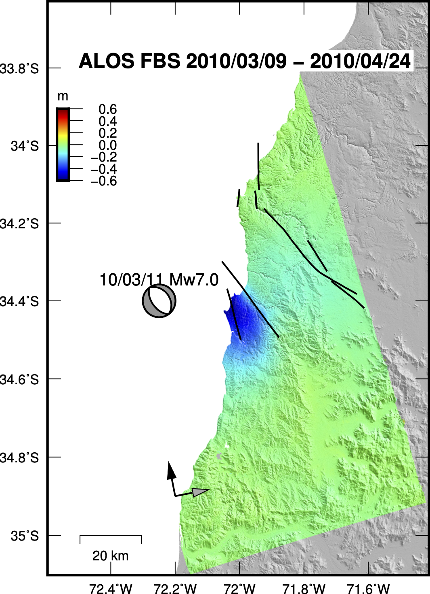

ISCE2 example for processing an ALOS interferogram of the 2010 Mw 7.0 Pichilemu earthquake, Chile.


Download the data
```
wget https://datapool.asf.alaska.edu/L1.0/A3/ALPSRP219546480-L1.0.zip
wget https://datapool.asf.alaska.edu/L1.0/A3/ALPSRP219546490-L1.0.zip
wget https://datapool.asf.alaska.edu/L1.0/A3/ALPSRP226256480-L1.0.zip
wget https://datapool.asf.alaska.edu/L1.0/A3/ALPSRP226256490-L1.0.zip
```

Create the input file `sm_alos.xml` in the `20100309_20100424`  folder
```
<stripmapApp>
	<component name="insar">

	<property name="Sensor Name">ALOS</property>
	<property name="reference doppler method">useDOPIQ</property>
	<property name="secondary doppler method">useDOPIQ</property>
	<property name="demFilename">demLat_S36_S34_Lon_W073_W071.dem.wgs84</property>
	<property name="range looks">4</property>
	<property name="azimuth looks">8</property>

	<component name="reference">
		<property name="IMAGEFILE">../ALPSRP219546480-L1.0/IMG-HH-ALPSRP219546480-H1.0__A, ../ALPSRP219546490-L1.0/IMG-HH-ALPSRP219546490-H1.0__A</property>
		<property name="LEADERFILE">../ALPSRP219546480-L1.0/LED-ALPSRP219546480-H1.0__A, ../ALPSRP219546490-L1.0/LED-ALPSRP219546490-H1.0__A</property>
		<!--<property name="RESAMPLE_FLAG">dual2single</property>-->
		<property name="OUTPUT">reference</property>
	</component>

	<component name="secondary">
		<property name="IMAGEFILE">../ALPSRP226256480-L1.0/IMG-HH-ALPSRP226256480-H1.0__A, ../ALPSRP226256490-L1.0/IMG-HH-ALPSRP226256490-H1.0__A</property>
		<property name="LEADERFILE">../ALPSRP226256490-L1.0/LED-ALPSRP226256490-H1.0__A, ../ALPSRP226256490-L1.0/LED-ALPSRP226256490-H1.0__A</property>
		<!--<property name="RESAMPLE_FLAG">dual2single</property>-->
		<property name="OUTPUT">secondary</property>
	</component>

	<property name="filter strength">0.5</property>
	<property name="do unwrap">True</property>
	<property name="unwrapper name">icu</property>
	<property name="geocode list">["ionosphere/dispersive.bil.unwCor.filt","interferogram/filt_topophase.unw","interferogram/filt_topophase.conncomp","geometry/los.rdr","interferogram/phsig.cor","interferogram/topophase.cor"]</property>
	<!--<property name="geocode bounding box">[S,N,W,E]</property>-->
	<!--<property name="regionOfInterest">[S,N,W,E]</property>-->

	<!--for ionospheric correction only-->
    <property name="do split spectrum">True</property>
    <property name="do dispersive">True</property>
    <property name="do rubbersheetingRange">False</property>
    <property name="do rubbersheetingAzimuth">False</property>
	<!-- <property name="dispersive filter kernel x-size">800</property>
   	<property name="dispersive filter kernel y-size">800</property>
   	<property name="dispersive filter kernel sigma_x">100</property>
    <property name="dispersive filter kernel sigma_y">100</property>
    <property name="dispersive filter kernel rotation">0</property>
    <property name="dispersive filter number of iterations">5</property>
    <property name="dispersive filter mask type">connected_components</property>
   	<property name="dispersive filter coherence threshold">0.6</property> -->

</component>
</stripmapApp>
```

Download the SRTM DEM in the `20100309_20100424`  folder
```
dem.py -a stitch -b -36 -33 -73 -71 -r -s 1 -c -u http://step.esa.int/auxdata/dem/SRTMGL1 -f
```

The only difference for the input file is that ALOS stripmap data was acquired in two different beams, FBD (fine beam double, HH-HV double polarization, 14 MHz range bandwidth) and FBS (fine beam single, HH single polarization, 28 MHz range bandwidth), resulting in twice the range resolution of the FBS beam compared with FBD (`tab:slcres`; ). Every FBD image contains one IMG-HH and one IMG-HV files, whereas a FBS image contains a single IMG-HH file. To form a usable interferogram, the images must have the same resolution, so the FBD images are zero-padded in the range direction in the frequency domain to match the length and the resolution of the FBS image. To process an interferogram with FBS and FBD images (either as reference, secondary or both), you need to include the following flag in the control file under the respective FBD image (either secondary or reference) for the FBD2FBS conversion.

FBD image to FBS

```
<property name="RESAMPLE_FLAG">dual2single</property>
```

FBS image to FBD

```
<!--<property name="RESAMPLE_FLAG">single2dual</property>-->
```

I have done test processing FBD2FBS (oversample 14 to 28 Mhz) and FBS2FBD (downsample 28 to 14 MHz). The interferograms that result are nearly equivalent and differ only by a phase constant. The split spectrum corrections are also equivalent between both products.

Note that some ALOS-1 raw images have changes in the PRF in the middle of the scene. If this happens, the image can only be processed by ISCE 2.5.0 version or newer. Alternatively you can use the old ROI_PAC with the SIO ALOS parser in GMTSAR to process them. The split spectrum method implemented in `stripmapApp.py`, only works with ALOS-1 raw data, not with ALOS-1 SLC data.

If the perpendicular baseline is longer than $\sim$0.5 km, you should process the ALOS data with a higher resolution DEM like that from Copernicus. Otherwise, if you use SRTM, the data will have several residual artifacts that result from the use of the low resolution DEM in the geometric coregistration.

You can stitch several ENVISAT and ALOS raw images just by adding more images under `IMAGEFILE` and `LEADERFILE`. The latter is an ALOS-only specific parameter.

Run it with
```
stripmapApp.py sm_alos.xml --steps
```

Apply the split spectrum ionospheric correction with 
```
imageMath.py -e='a_0;a_1*(c>0)-b_0*(c>0)' -s BIL  --a=interferogram/filt_pophase.unw.geo  --b=Ionosphere/dispersive.bil.unwCor.filt.geo  -o  interferogram/filt_topophase_nondispersive.unw.geo  --c=interferogram/filt_topophase.conncomp.geo
```
You can apply the split spectrum correction in radar coordinates. To do so, repeat the instruction but without any .geo extension, and then geocode the resulting *interferogram/filt_topophase_nondispersive.unw* file

Export to Google Earth
```
cd interferogram

mdx.py filt_topophase_nondispersive.unw.geo -kml filt_topophase_nondispersive.unw.geo.kml

mdx filt_topophase_nondispersive.unw.geo -s 4267 -ch2 -r4 -dr 17068 -cmap CMY -wrap 6.28 -P; convert out.ppm -transparent cyan filt_topophase_nondispersive.unw.geo.png
```
You should get the following file


You can then load the interferogram to MATLAB, remove the remaining ramp after masking the coseismic signal with my utilities (https://github.com/fdelgadodelapuente/isce_utils) and export it to a GMT grid. Here I have incoporated the GCMT double couple moment tensor and a [compilation of active and potentially active Chilean faults](https://doi.pangaea.de/10.1594/PANGAEA.922241). 



