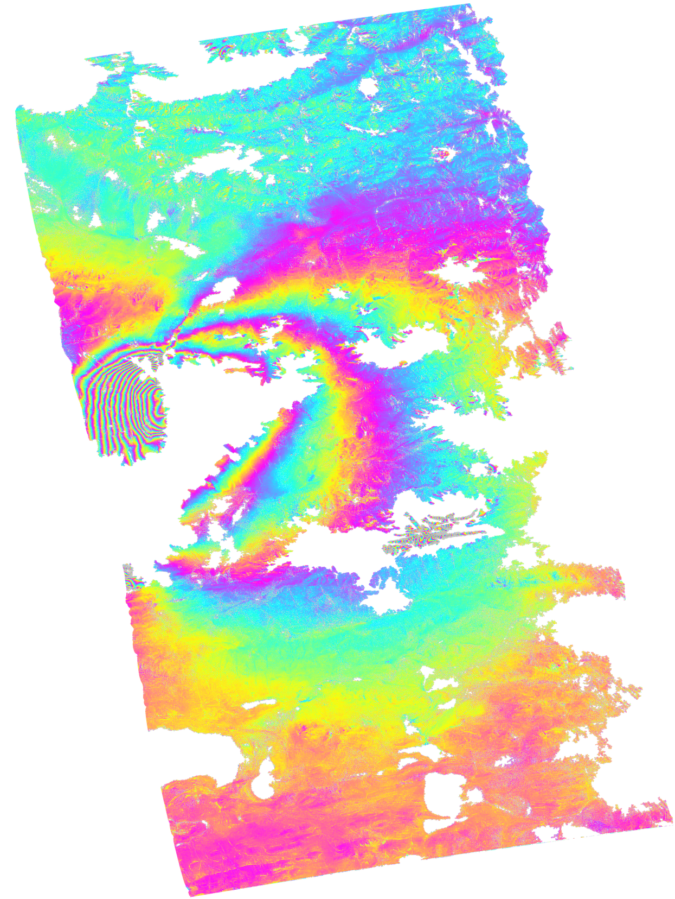

ISCE2 example for processing an ALOS interferogram of the 2008 Mw 7.2 Yutian earthquake, China.

Download the data
```
wget https://datapool.asf.alaska.edu/L1.0/A3/ALPSRP111100690-L1.0.zip
wget https://datapool.asf.alaska.edu/L1.0/A3/ALPSRP111100700-L1.0.zip
wget https://datapool.asf.alaska.edu/L1.0/A3/ALPSRP124520690-L1.0.zip
wget https://datapool.asf.alaska.edu/L1.0/A3/ALPSRP124520700-L1.0.zip
```

Create the input file `sm_alos.xml` in the `20100309_20100424`  folder
```
<stripmapApp>
	<component name="insar">

		<property name="Sensor Name">ALOS</property>
		<property name="demFilename">/home/lgodoy/insar_curso/yutian/demLat_N34_N37_Lon_E080_E083.dem.wgs84</property>
		<property name="reference doppler method">useDOPIQ</property>
		<property name="secondary doppler method">useDOPIQ</property>
		<property name="range looks">4</property>
		<property name="azimuth looks">8</property>

	<component name="reference">
		<property name="IMAGEFILE">../ALPSRP111100690-L1.0/IMG-HH-ALPSRP111100690-H1.0__A, ../ALPSRP111100700-L1.0/IMG-HH-ALPSRP111100700-H1.0__A</property>
		<property name="LEADERFILE">../ALPSRP111100690-L1.0/LED-ALPSRP111100690-H1.0__A, ../ALPSRP111100700-L1.0/LED-ALPSRP111100700-H1.0__A</property>
<!--		<property name="RESAMPLE_FLAG">dual2single</property>-->
		<property name="OUTPUT">reference</property>
	</component>

	<component name="secondary">
		<property name="IMAGEFILE">../ALPSRP124520690-L1.0/IMG-HH-ALPSRP124520690-H1.0__A, ../ALPSRP124520700-L1.0/IMG-HH-ALPSRP124520700-H1.0__A</property>
		<property name="LEADERFILE">../ALPSRP124520690-L1.0/LED-ALPSRP124520690-H1.0__A, ../ALPSRP124520700-L1.0/LED-ALPSRP124520700-H1.0__A</property>
		<property name="RESAMPLE_FLAG">dual2single</property>
		<property name="OUTPUT">secondary</property>
	</component>

	<property name="filter strength">0.3</property>
	<property name="do unwrap">True</property>
	<property name="unwrapper name">icu</property>
	<property name="geocode list">["interferogram/filt_topophase.unw","interferogram/filt_topophase.unw.conncomp","interferogram/los.rdr","interferogram/phsig.cor","interferogram/topophase.cor","ionosphere/dispersive.bil.unwCor.filt","geometry/los.rdr"]</property>
   <!--	<property name="regionOfInterest">[19.18,19.76,-155.47,-154.8]</property>  -->

	<!--for ionospheric correction only-->
    	<property name="do split spectrum">False</property>
    	<property name="do dispersive">False</property>
<!--    <property name="dispersive filter kernel x-size">800</property>
   	<property name="dispersive filter kernel y-size">800</property>
	<property name="dispersive filter kernel sigma_x">100</property>
    	<property name="dispersive filter kernel sigma_y">100</property>
    	<property name="dispersive filter kernel rotation">0</property>
    	<property name="dispersive filter number of iterations">5</property>
    	<property name="dispersive filter mask type">connected_components</property>
   	<property name="dispersive filter coherence threshold">0.6</property>
-->
</component>
</stripmapApp>

```

Download the SRTM DEM in the `20100309_20100424`  folder
```
dem.py -a stitch -b 34 37 80 83 -r -s 1 -c -u http://step.esa.int/auxdata/dem/SRTMGL1 -f
```

Run it with
```
stripmapApp.py sm_alos.xml --steps
```

Export to Google Earth
```
cd interferogram

mdx.py filt_topophase_nondispersive.unw.geo -kml filt_topophase_nondispersive.unw.geo.kml

```
You should get the following file




KMZ
https://github.com/fdelgadodelapuente/isce2_install/blob/main/figures/alos_p514_asc_20080224_20080526_2frames.kmz

KMZ path 515
https://github.com/fdelgadodelapuente/isce2_install/blob/main/figures/alos_p515_asc_20080126_20080427_2frames.zip
