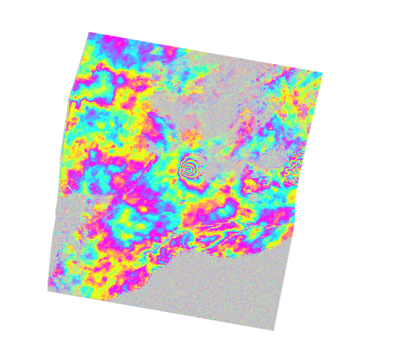

ISCE2 example for processing a CSK interferogram of the 2018 Kilauea eruption.

We process the data with the TanDEM-X 12 m DEM to take advantage of the high resolution of the X-band stripmap data (2 m/pixel in ground range). You can get the DEM from DLR and then you need to convert to the ISCE2 file format with GDAL.

Create the input file `sm_csk.xml` in the `20180508_20180509` folder 
```
<stripmapApp>
	<component name="insar">
	<property name="Sensor Name">TERRASARX</property>
    	<property name="demFilename">/home/fdelgado/dem/iceland/cop_dem_glo30m_wgs84_hawaii.dem</property> 
	<property name="reference doppler method">useDEFAULT</property>
	<property name="secondary doppler method">useDEFAULT</property>
	<property name="range looks">8</property> 
	<property name="azimuth looks">8</property> 

	<component name="reference">
		<property name="HDF5">../CSKS2_RAW_B_HI_10_HH_RD_SF_20180508035856_20180508035903.h5</property>
		<property name="OUTPUT">reference</property>
	</component>

	<component name="secondary">
		<property name="HDF5">../CSKS3_RAW_B_HI_10_HH_RD_SF_20180509035854_20180509035902.h5</property>
		<property name="OUTPUT">secondary</property>
	</component>

	<property name="filter strength">0.1</property>
	<property name="do unwrap">True</property>
	<property name="unwrapper name">icu</property>
	<property name="geocode list">["interferogram/filt_topophase.unw","interferogram/phsig.cor"]</property>

</component>

</stripmapApp>

```

Run it with
```
stripmapApp.py sm_csk.xml --steps
```

Export to Google Earth
```
cd interferogram

mdx.py filt_topophase.unw.geo -kml filt_topophase.unw.geo.kml

```
You should get the following file



