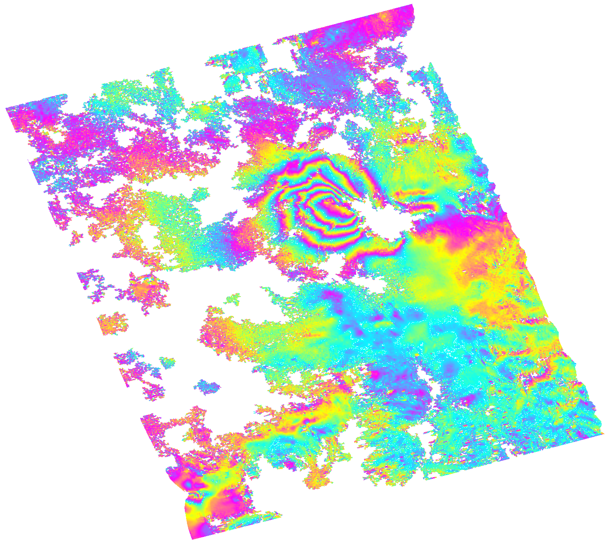

ISCE2 example for processing an ENVISAT IM6 interferogram of the 2011-2012 Cordon Caulle eruption. The key difference compared with the Kilauea and Yellowstone examples is that tgis is a noisy data set despite being a small baseline interferogram, so it must be processed averaging pixels with many looks. It is also an IM6 beam  interferogram from the mission extension phase,  not from the standard IM2 beam from the nominal phase. I process the data with 8 looks in range, 24 looks in azimuth for a pixel size of ~80 m (pixel ratio of 3 instead of 5 os IM2) and a strong power spectrum filtering strength of 0.8. I remove the topographic phase with the Copernicus 1 arcsec DEM instead of the 1 arcsec SRTM DEM.

Create the input file `sm_envisat.xml` in the `20111204_20120202` folder 
```
<stripmapApp>
	<component name="insar">

		<property name="Sensor Name">ENVISAT</property>
		<property name="demFilename">/Users/francisco/insarproc/dem/copernicus/svz_30m/cop_dem_glo30m_wgs84_svz.dem</property>
<!--		<property name="demFilename">/Users/francisco/insarproc/dem/copernicus/svz_90m/cop_dem_glo90m_wgs84_svz.dem</property> -->
		<property name="reference doppler method">useDOPIQ</property>
		<property name="secondary doppler method">useDOPIQ</property>
		<property name="range looks">8</property>
		<property name="azimuth looks">24</property>

	<component name="reference">
		<property name="IMAGEFILE">../raw/ASA_IM__0CNPDE20111204_035308_000000163109_00176_51052_5027.N1</property>
		<property name="INSTRUMENT_DIRECTORY">/Applications/isce/esa/envisat/ins</property>
		<property name="ORBIT_DIRECTORY">/Applications/isce/esa/envisat/dor_vor</property>
		<property name="OUTPUT">reference</property>
	</component>

	<component name="secondary">
		<property name="IMAGEFILE">../raw/ASA_IM__0CNPDE20120202_035321_000000173111_00176_51914_5678.N1</property>
		<property name="INSTRUMENT_DIRECTORY">/Applications/isce/esa/envisat/ins</property>
		<property name="ORBIT_DIRECTORY">/Applications/isce/esa/envisat/dor_vor</property>
		<property name="OUTPUT">secondary</property>
	</component>

	<property name="filter strength">0.8</property>
	<property name="do unwrap">True</property>
	<property name="unwrapper name">snaphu</property>
	<property name="geocode list">["interferogram/filt_topophase.unw","interferogram/filt_topophase_msk.unw","interferogram/filt_topophase.unw.conncomp","geometry/los.rdr","interferogram/phsig.cor","interferogram/topophase.cor"]</property>
	<property name="geocode bounding box">[-41.21,-40.1,-72.89,-71.65]</property>
<!--	<property name="regionOfInterest">[-40.64,-40.41,-72.37,-72.01]</property>-->

</component>
</stripmapApp>
```

ENVISAT data requires precise orbits and the instrument files. You need either DOR (DORIS) or VOR (verified final) orbits. VOR orbits are more accurate. You can get these files from  http://topex.ucsd.edu/gmtsar/tar/ORBITS.tar

Run it with
```
stripmapApp.py sm_alos.xml --steps
```

You can mask the unwrapped phase with the connected components mask
```
imageMath.py --e='a_0;a_1*(b>0)' --a=filt_topophase.unw --b=filt_topophase.unw.conncomp -o filt_topophase_msk.unw -s BIL
```
and geocode again. To do so

Uncomment the line with the 90 m Copernicus DEM 
```
		<property name="demFilename">/Users/francisco/insarproc/dem/copernicus/svz_90m/cop_dem_glo90m_wgs84_svz.dem</property>
```

and geocode with the low resolution DEM. That way the interferogram will not be stretched.
```
stripmapApp.py sm_alos.xml --steps --dostep=geocode
```

Export to Google Earth
```
cd interferogram

mdx.py filt_topophase.unw.geo -kml filt_topophase.unw.geo.kml

mdx filt_topophase_msk.unw.geo -s 1489 -ch2 -r4 -rhdr 5956 -cmap CMY -wrap 6.28 -P; convert out.ppm -transparent cyan filt_topophase.unw.geo.png
```
You should get the following file



