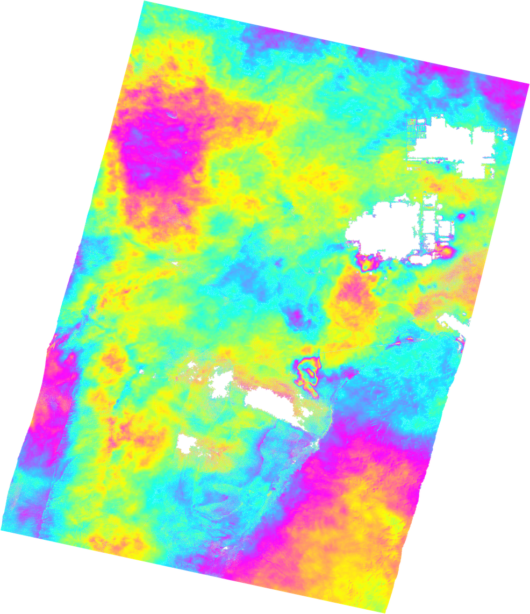

ISCE2 example for processing a PAZ interferogram of the Salar de Atacama basin.

Create the input file **sm_paz.xml** in the **20060823_20081031** folder 
```
<stripmapApp>
	<component name="insar">
	<property name="Sensor Name">TERRASARX</property>
	<property name="demFilename">/home/lgodoy/dem/tandemx12m_salar_atacama.dem</property>
	<!--	<property name="demFilename">/home/fdelgado/dem/atacama/cop_dem_glo30m_wgs84_salar.dem</property>-->
	<property name="reference doppler method">useDEFAULT</property>
	<property name="secondary doppler method">useDEFAULT</property>
	<property name="range looks">4</property> 
	<property name="azimuth looks">4</property> 

	<component name="reference">
		<property name="XML">../PAZ1_SAR__SSC______SM_S_SRA_20250311T100425_20250311T100432/PAZ1_SAR__SSC______SM_S_SRA_20250311T100425_20250311T100432.xml</property>
		<property name="OUTPUT">reference</property>
	</component>

	<component name="secondary">
		<property name="XML">../PAZ1_SAR__SSC______SM_S_SRA_20260320T100425_20260320T100432/PAZ1_SAR__SSC______SM_S_SRA_20260320T100425_20260320T100432.xml</property>
		<property name="OUTPUT">secondary</property>
	</component>

	<property name="filter strength">0.1</property>
	<property name="do unwrap">True</property>
	<property name="unwrapper name">icu</property>
	<property name="geocode list">["interferogram/filt_topophase.unw","interferogram/phsig.cor"]</property>

</component>

</stripmapApp>

```

We process the dayta with the TanDEM-X 12 m DEM to take advantaege of the high resolution of the X-band stripmap data (2 m/pixel in ground range).

Run it with
```
stripmapApp.py sm_alos.xml --steps
```

Export to Google Earth
```
cd interferogram

mdx.py filt_topophase.unw.geo -kml filt_topophase.unw.geo.kml

mdx filt_topophase.unw.geo -s 3945-CW -unw -r4 -rhdr 15780 -cmap cmy -wrap 6.283185307179586 -P; convert out.ppm -transparent cyan filt_topophase.unw.geo.png
```
You should get the following file



