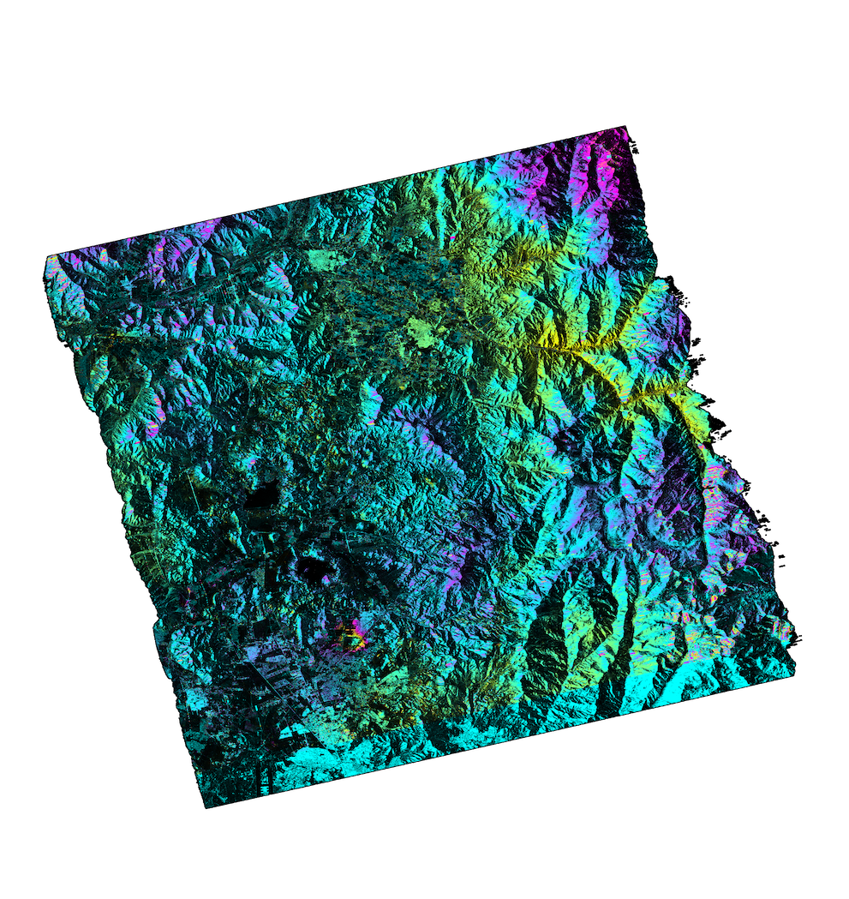

ISCE2 example for processing an ENVISAT interferogram of the Santiago basin.

Create the input file `sm_saocom.xml` in the `20220201_20241129` folder 
```
<stripmapApp>
        <component name="insar">

       <property name="Sensor Name">SAOCOM_SLC</property>
        <property name="demFilename">/home/lgodoy/dem/copernicus_stgo/cop_dem_glo30m_wgs84_chilecentral.dem</property>
       <property name="reference doppler method">useDEFAULT</property>
       <property name="secondary doppler method">useDEFAULT</property>
       <property name="range looks">4</property>
       <property name="azimuth looks">8</property>

        <component name="reference">
       <property name="IMAGEFILE">../20220201_EOL1ASARSAO1B13128179/S1B_OPER_SAR_EOSSP__CORE_L1A_OLF_20250813T175832/Data/slc-acqId0000722184-b-sm4-2508131854-s4dp-hh</property>
       <property name="XMLFILE">../20220201_EOL1ASARSAO1B13128179/S1B_OPER_SAR_EOSSP__CORE_L1A_OLF_20250813T175832/Data/slc-acqId0000722184-b-sm4-2508131854-s4dp-hh.xml</property>
       <property name="XEMTFILE">../20220201_EOL1ASARSAO1B13128179/S1B_OPER_SAR_EOSSP__CORE_L1A_OLF_20250813T175832.xemt</property>
       <property name="OUTPUT">reference</property>
        </component>

        <component name="secondary">
       <property name="IMAGEFILE">../20241129_EOL1ASARSAO1A13128018/S1A_OPER_SAR_EOSSP__CORE_L1A_OLF_20250813T173053/Data/slc-acqId0000704838-a-sm4-2508131817-s4dp-hh</property>
       <property name="XMLFILE">../20241129_EOL1ASARSAO1A13128018/S1A_OPER_SAR_EOSSP__CORE_L1A_OLF_20250813T173053/Data/slc-acqId0000704838-a-sm4-2508131817-s4dp-hh.xml</property>
       <property name="XEMTFILE">../20241129_EOL1ASARSAO1A13128018/S1A_OPER_SAR_EOSSP__CORE_L1A_OLF_20250813T173053.xemt</property>
       <property name="OUTPUT">secondary</property>
        </component>

        <property name="filter strength">0.3</property>
        <property name="do unwrap">True</property>
        <property name="unwrapper name">snaphu</property>
        <property name="geocode list">["interferogram/filt_topophase.unw","interferogram/filt_topophase.unw.conncomp","geometry/los.rdr","interferogram/topophase.cor"]</property>

</component>
</stripmapApp>

```

Run it with
```
stripmapApp.py sm_saocom.xml --steps --end=unwrap
```

Remove ramp with deramp and then geocode 
```
python3  ~/insar_curso/scripts/deramp.py
stripmapApp.py sm_saocom.xml --steps --start=geocode
```


Export to Google Earth
```
cd interferogram

mdx.py filt_topophase.unw.geo -kml filt_topophase.unw.geo.kml

```
You should get the following file


