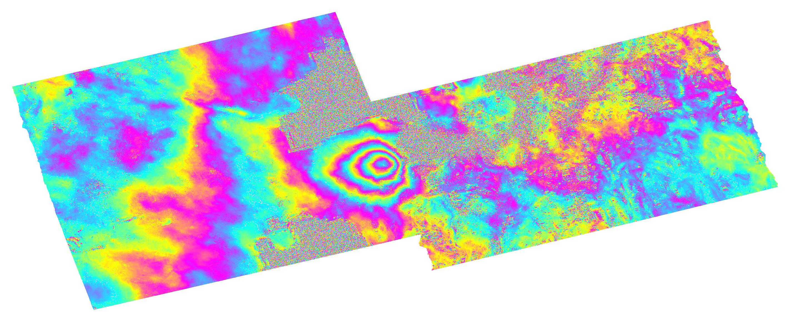

ISCE2 example for processing a Sentinel-1 TOPS interferogram of the 2015 Calbuco eruption.

Download the SLC data and the precise orbits 
```
wget https://datapool.asf.alaska.edu/SLC/SA/S1A_IW_SLC__1SSV_20150414T234157_20150414T234224_005486_007013_5C44.zip
wget https://datapool.asf.alaska.edu/SLC/SA/S1A_IW_SLC__1SDV_20150426T234151_20150426T234227_005661_007430_AFBE.zip

wget https://s1qc.asf.alaska.edu/aux_poeorb/S1A_OPER_AUX_POEORB_OPOD_20150505T123046_V20150413T225944_20150415T005944.EOF
wget https://s1qc.asf.alaska.edu/aux_poeorb/S1A_OPER_AUX_POEORB_OPOD_20150517T123037_V20150425T225944_20150427T005944.EOF

```
Create the input file **topsapp.xml** in the folder **20150414_20150426**
```
<topsApp>
	<component name="topsinsar">

       <property name="Sensor Name">SENTINEL1</property>

	<component name="reference">
       <property name="safe">../S1A_IW_SLC__1SDV_20150426T234151_20150426T234227_005661_007430_AFBE.zip</property>
       <property name="output directory">reference</property>
		<property name="orbit directory">../orb</property> 
		<property name="auxiliary data directory">../orb</property> 
	</component>

	<component name="secondary">
       <property name="safe">../S1A_IW_SLC__1SSV_20150414T234157_20150414T234224_005486_007013_5C44.zip</property>
       <property name="output directory">secondary</property>
		<property name="orbit directory">../orb</property> 
		<property name="auxiliary data directory">../orb</property> 
	</component>

	<property name="swaths">[1,2]</property>
	<property name="region of interest">[-41.49,-41.32,-72.91,-72.46]</property>
	<property name="azimuth looks">5</property>
	<property name="range looks">19</property>
	<property name="filter strength">0.5</property>
	<property name="do unwrap">True</property>
	<property name="unwrapper name">snaphu_mcf</property>
	<property name="geocode list">["merged/filt_topophase.unw","merged/filt_topophase.unw.conncomp","merged/los.rdr","merged/topophase.cor","merged/phsig.cor"]</property>
<!--	<property name="geocode bounding box">[-41.8,-40.84,-73.79,-72.00]</property>-->

</component>
</topsApp>

```


You should get the following file



