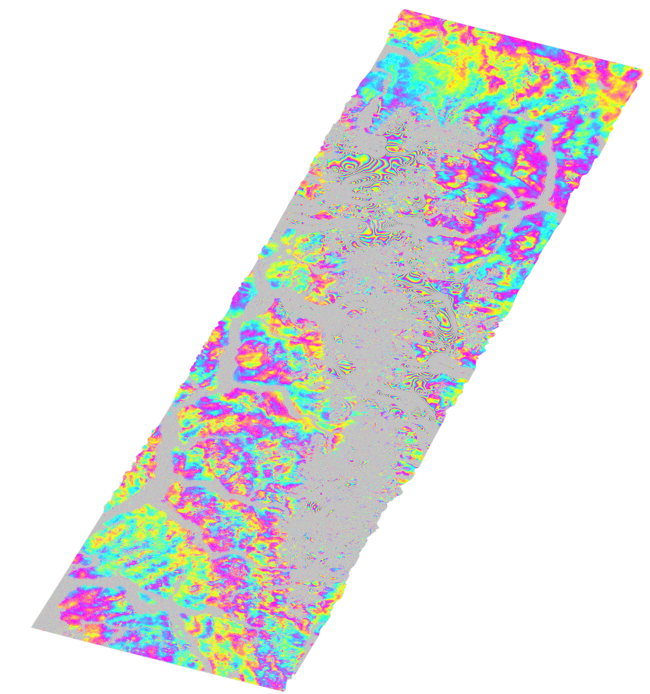

ISCE2 example for processing a Sentinel-1C/D TOPS interferogram of the Southern Patagonian Icefield.

Download the SLC data and the precise orbits. Sentinel-1 data requires precise orbits. These are restituted orbits [RESORB](https://s1qc.asf.alaska.edu/aux_resorb/) available hours after the SLC acquistion (accuracy better than 10 cm)  and precise orbits [POEORB](https://s1qc.asf.alaska.edu/aux_poeorb/), available three weeks later (accuracy better than 5 cm). 
```

wget https://datapool.asf.alaska.edu/SLC/SC/S1C_IW_SLC__1SDV_20260606T094330_20260606T094357_007983_0103C5_EE16.zip
wget https://datapool.asf.alaska.edu/SLC/SC/S1C_IW_SLC__1SDV_20260606T094302_20260606T094333_007983_0103C5_214F.zip
wget https://datapool.asf.alaska.edu/SLC/SD/S1D_IW_SLC__1SDV_20260607T094343_20260607T094410_003128_0056E1_033B.zip
wget https://datapool.asf.alaska.edu/SLC/SD/S1D_IW_SLC__1SDV_20260607T094318_20260607T094345_003128_0056E1_C903.zip

wget https://s1qc.asf.alaska.edu/aux_resorb/S1C_OPER_AUX_RESORB_OPOD_20260606T105716_V20260606T070115_20260606T101845.EOF
wget https://s1qc.asf.alaska.edu/aux_resorb/S1D_OPER_AUX_RESORB_OPOD_20260607T105813_V20260607T070125_20260607T101855.EOF

```
Most of the Sentinel-1D data are available at the [Copernicus Browser](https://browser.dataspace.copernicus.eu) and do not have direct download links. A few of them are at ASF Vertex as of June 2026.

Create the input file `topsapp.xml` in the `20260606_20260607` folder
```
<topsApp> 
	<component name="topsinsar"> 
		<property name="Sensor Name">SENTINEL1</property>
		<property name="demFilename">/Users/francisco/insarproc/dem/copernicus/cop_dem_glo30m_wgs84_icefields.dem</property>
        <property name="geocode demFilename">/Users/francisco/insarproc/dem/copernicus/cop_dem_glo30m_wgs84_icefields.dem</property>
 
	<component name="reference"> 
		<property name="safe">../S1C_IW_SLC__1SDV_20260606T094302_20260606T094333_007983_0103C5_214F.zip, ../S1C_IW_SLC__1SDV_20260606T094330_20260606T094357_007983_0103C5_EE16.zip</property> 
		<property name="output directory">"reference"</property>              
 		<property name="orbit directory">/Users/francisco/insarproc/esa/s1orb</property> 
		<property name="auxiliary data directory">/Users/francisco/insarproc/esa/s1orb</property> 
	</component>
 
	<component name="secondary"> 
		<property name="safe">../S1D_IW_SLC__1SDV_20260607T094318_20260607T094345_003128_0056E1_C903.zip, ../S1D_IW_SLC__1SDV_20260607T094343_20260607T094410_003128_0056E1_033B.zip</property> 
		<property name="output directory">"secondary"</property>     
<!--> 		<property name="orbit directory">/Users/francisco/insarproc/esa/s1orb</property> -->
		<property name="auxiliary data directory">/Users/francisco/insarproc/esa/s1orb</property> 
	</component>
 
	<property name="swaths">[3]</property>
	<property name="ESD coherence threshold">0.85</property>
	<property name="do ESD">True</property>
	<!-- <property name="extra ESD cycles">0</property> -->
	<property name="apply ionosphere correction">False</property> 
	<property name="do ionosphere correction">False</property> 
	<property name="consider burst properties in ionosphere computation">True</property> 
	<property name="azimuth looks">2</property>
	<property name="range looks">8</property>
	<property name="filter strength">0.5</property>
	<property name="do unwrap">True</property>
	<property name="unwrapper name">snaphu_mcf</property>
<!--	<property name="geocode list">["merged/filt_topophase.unw","merged/filt_topophase.unw.conncomp","merged/phsig.cor"]</property>
	<property name="geocode list">["merged/topophase.flat"]</property>
	<property name="geocode list">["merged/filt_topophase.flat"]</property>-->
 	<property name="regionOfInterest">-50.45, -48.37, -74.19, -72.91</property>
 
 <!--
    <property name="do denseoffsets">True</property>
    <property name="Filter window size">3</property>
    <property name="Ampcor window width">128</property>
    <property name="Ampcor window height">32</property>
    <property name="Ampcor search window width">40</property>
    <property name="Ampcor search window height">10</property>
    <property name="Ampcor skip width">16</property>
    <property name="Ampcor skip height">4</property>
 -->
 </component>
 </topsApp>


```

Run it with
```
topsApp.py topsapp.xml --steps
```

Export to Google Earth
```
cd merged

mdx.py filt_topophase.unw.geo -kml filt_topophase.unw.geo.kml

```


You should get the following file





Unwrapping with SNAPHU_MCF results in errors in the noisy regions. Therefore you have to apply the connected components mask to the unwrapped phase

```
imageMath.py -e='a_0;a_1*(b>0)' --a=filt_topophase.unw --b=filt_topophase.unw.conncomp -o filt_topophase_masked.unw -s BIL
fixImageXml.py -f -i filt_topophase_masked.unw
```
Edit topsapp.xml to geocode this file and then geocode
```
	<property name="geocode list">merged/filt_topophase_masked.unw</property>
```
```
topsApp.py topsapp.xml --dostep=geocode 
```

### Dense offsets

One particular advantage of the TOPS mode with respect to other stripmap modes is the small pixel size in the slant range direction. Therefore if your interferogram is decorrelated due to large strain, you can still retrieve deformation from range offsets instead of interferometry. Due to the small pixel size in range, you can also extract more accurate range than azimuth offsets, which are particularly useful for glaciology. Note that offsets are much lower resolution and their accuracy is lower compared with measurements made with phase. 


Dense offsets are calculated with the ```ampcor``` module of ISCE2. [Box sizes for ampcor](https://raw.githubusercontent.com/parosen/Geo-SInC/7f89ccfa906e36c12726a663ee3d34c621797214/UNAVCO2021/4.4_Offset_stack_for_velocity_dynamics/support_files/offset_parameters.png).

```
<!-- Ssearch Window Size Height should be < 2 * Window Size Height-->
<property name="do denseOffsets">True</property>
<property name="Ampcor window width">40</property>
<property name="Ampcor window height">8</property>
<property name="Ampcor search window height">10</property>
<property name="Ampcor search window width">10</property>
<property name="Ampcor skip width">32</property>
<property name="Ampcor skip height">8</property>
```

Example for Pine Island glacier (Antarctica) from the [2021 UNAVCO ISCE Workshop.](https://github.com/parosen/Geo-SInC/blob/main/UNAVCO2021/4.4_Offset_stack_for_velocity_dynamics/nb_topsApp_offsets.ipynb)

Example for Pine Island glacier (Antarctica) from the [2023 EarthScope ISCE Workshop.](https://github.com/parosen/Geo-SInC/blob/main/EarthScope2023/4.3_Offset_stack_for_velocity_dynamics_with_autoRIFT/nb_dense_offsets.ipynb)

```
    <property name="do denseoffsets">True</property>
    <property name="Filter window size">3</property>
    <property name="Ampcor window width">256</property>
    <property name="Ampcor window height">64</property>
    <property name="Ampcor search window width">40</property>
    <property name="Ampcor search window height">10</property>
    <property name="Ampcor skip width">128</property>
    <property name="Ampcor skip height">32</property>
```

Example for southern Patagonia Icefield (Chile/Argentina)

```
    <property name="do denseoffsets">True</property>
    <property name="Filter window size">3</property>
    <property name="Ampcor window width">128</property>
    <property name="Ampcor window height">32</property>
    <property name="Ampcor search window width">40</property>
    <property name="Ampcor search window height">10</property>
    <property name="Ampcor skip width">16</property>
    <property name="Ampcor skip height">4</property>
```

Then multiply the range and azimuth offsets by their pixel sizes of 2.3 and 14.1 m, respectively. The offset tracking uncertainty is 1/5 to 1/10 of the pixel size, so this results in theoretical uncertainties of 0.23-0.45 m for range offsets, and 1.41-2.82 m for azimuth offsets.

<figure>
  
  <figcaption><strong>Figure.</strong> Range and azimuth offsets for 12 day Sentinel-1 pair.</figcaption>
</figure>


