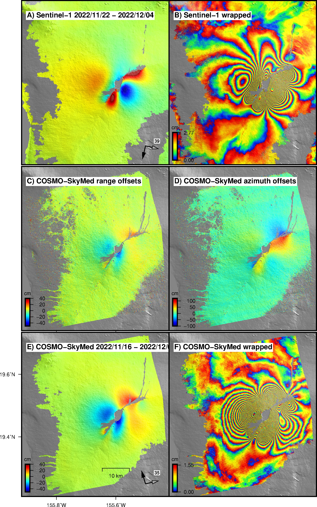

\setlength\parindent{0pt}

\setcitestyle{authoryear,open={},close={}}

%%%%
%%%\bibliographystyle{agufull08.bst}

\setlength{\parskip}{1em}
\renewcommand{\baselinestretch}{1} %line spacing
%\vspace{-4em}
\title{**\Large ISCE2 Software Manual for Earth Science, May 2026**\vspace{-2ex}}
\author{Francisco Delgado, Universidad de Chile}\vspace{-2ex}
%\affil{ Universidad de Chile}\vspace{-2ex}
\date{August 2025}
\date{}

%\bibliographystyle{agufull08.bst}

%\large

%%%%\begin{figure}[H]
%%%%\begin{center}
%%%%
%%%%\end{center}
%%%%
*\footnotesize a) ERS-1/2 1-day interferogram of the Northern Patagonian ice field draped atop the 1 arcsec SRTM topography %%%%([Mouginot, J. and Rignot, E. (2015), Ice motion of the Patagonian Icefields of South America: 1984–2014. Geophys. Res. Lett., 42: 1441– 1449. doi: 10.1002/2014GL062661.](https://agupubs.onlinelibrary.wiley.com/doi/full/10.1002/2014GL062661)). The unwrapped interferogram  shows the westward and downward displacement of the San Rafael and San Quintin glaciers, plus some eastward and downward displacement in the Colonia glacier. The maximum displacement measured by InSAR is $\sim$1.2 m/day or 0.44 km/year in the LOS direction in the San Quintin glacier. The interferogram is referenced to the drainage basin boundary between these two glaciers. The black arrow shows the satellite heading and the grey arrow shows the horizontal component of the line-of-sight vector in which the displacement is measured. The wrapped interferogram in b) shows widespread displacement across the ice field. The displacement is large enough such that it results in large strain beyond the maximum strain threshold that can be detected by the ERS SAR. Hence pixel tracking resulting in range and azimuth offsets (c) are better suited to study glacier displacements in temperate regions. The maximum displacement measured by range offsets is $\sim$7 m/day or 2.5 km/year. Range offsets and line-of-sight displacements contain the same information, but pixel offsets are one order of magnitude less accurate than phase measurements from InSAR. But the glacier displacement is not large enough to result in relatively noise-free range offset displacement. The ERS pixel offsets are far more accurate in azimuth than in range because of the $\sim$5 times smaller pixel size in the former direction. In summary, InSAR is targeted to study slow deformation like that above the ablation zone while pixel offsets are better to study large deformation like that in the calving and heavily crevassed areas.*

%%%%\end{figure}

\begin{figure}[H]
\begin{center}

\end{center}

*\footnotesize Examples of multi constellation InSAR and SAR data from the 2022 Mauna Loa dike intrusion and eruption. The volcano erupted more than 0.23 km$^3$ of basaltic lava during the 14 day-long eruption ([JPL, 2022](https://www.jpl.nasa.gov/images/pia25526-airborne-nasa-radar-maps-mauna-loa-lava-changes-in-hawaii)). A-B) Sentinel-1A unwrapped and wrapped descending interfeorgram. C-D) COSMO-SkyMed ascending range and azimuth offsets. E-F) COSMO-SkyMed unwrapped and wrapped ascending interferogram (\citep{Delgado2024*
). Interferograms and range offsets are sensitive to displacement in the across track direction while azimuth offsets are sensitive to displacement in the along track direction. Observations from range offsets and interferometry resolve the same displacement. Range offsets are one order of magnitude less sensitive to deformation than interferometry, but unlike phase they are not prone to aliasing due to large strain. InSAR and azimuth offsets can be decomposed to resolve for the three dimensional displacement field. Sentinel-1A data are open access provided by the European Space Agency while COSMO-SkyMed data were provided by the Hawaiian Volcanoes Supersite .%hosted by the EarthScope Consortium  [Seamless SAR Archive (SSARA)](https://web-services.unavco.org/brokered/ssara/gui ).
}
\end{figure}

\newpage

# Introduction and Acknowledgements

[ISCE](https://github.com/isce-framework/isce2) (InSAR Scientific Computing Environment) is an InSAR processing software developed by NASA's Jet Propulsion Laboratory (JPL) and it is currently the best free available software of its kind. ISCE contains three processors for different data sets: \texttt{stripmapApp.py} for stripmap data, \texttt{topsApp.py} for Sentinel-1 TOPS (Terrain Observations by Progressive Scans) data and \texttt{alos2App.py} for ALOS-2 data. It also includes stack processors for the different data sets. ISCE can process almost any SAR data set of interest for earthquake, volcano, glacier and  hydro geodesy, except for TanDEM-X CoSSC.

This document provides a quick guide on how to use the ISCE software with several examples in volcanology and active tectonics. These examples are taken from the scientific literature or from my own research in these fields. If you have never used the software, this manual  does not replace a formal software training like that provided by the JPL engineers during the UNAVCO ISCE workshops. In this document I have tried to compile common issues that new users run into when using the software for the first time. I wrote this document over a time span of several years when I was either a grad student at Cornell University, postdoc at Institut de Physique du Globe de Paris or faculty at Universidad de Chile. It is based on my own experience teaching ISCE to other colleagues, students and postdocs. It is inspired by Matthew Pritchard's [Open-source software for geodetic imaging: ROI\_PAC for InSAR and pixel tracking.](http://www.geo.cornell.edu/eas/PeoplePlaces/Faculty/matt/pub/winsar/InSAR_textbook_for_web_2014.pdf) I want to thank to several JPL scientists and engineers (Paul Rosen, Piyush Agram, Eric Fielding, Heresh Fattahi, Cunren Liang, and Paul Lundgren) for teaching me how to use ISCE, for answering many technical questions, and guiding me through the software internals. Many thanks to Tara Shreve, Whyjay Zheng, Patricia Macqueen, and Diego Lobos for providing comments that have improved this document. 

# ISCE2 processors and data access

\begin{table}[H]
\begin{tabular}{ llllll } 
 \hline
**Satellite** & **Year** & **stripmapApp** & **topsApp** & **alos2App** \\ \hline 
ERS-1/2 raw/SLC & 1991-2012 & Y & N & N\\  
JERS & 1992-1998  & N & N & N\\  
RADARSAT-1 & 1995-2013  & Y & N & N\\  
ENVISAT raw/SLC  & 2002-2012/04  & Y & N& N  \\  
ENVISAT ScanSAR & 2002-2010  & N & N & N \\  
ALOS-1 raw/SLC & 2006-2011/04  & Y & N & N \\  
ALOS-1 ScanSAR & 2006-2011/04  & N & N & N \\  
TerraSAR-X & 2007-  & Y & N & N\\  
%%%%%TerraSAR-X spot & 2007-  & Y & N & N\\  
TanDEM-X CoSSC & 2011-  & Y* & N & N\\  
COSMO-SkyMED raw/SLC & 2011-  & Y & N & N\\  
%%%%%%COSMO-SkyMED SLC spot & 2011-  & Y & N & N\\  
RADARSAT-2 & 2007-  & Y & N & N\\  
Sentinel-1 SM & 2014/10-  & Y & N & N\\  
Sentinel-1 TOPS & 2014/10-  & N & Y & N\\  
ALOS-2 SM & 2014/09-  & Y & N & Y \\  
ALOS-2 ScanSAR & 2015/02-  & Y** & N & Y \\  
ALOS-2 ScanSAR to SM & 2015/02-  & N & N & Y \\  
ALOS-2 MAI & 2015/02-  & N & N & Y \\ 
PAZ & 2018/02 -  & Y*** & N & N \\  
SAOCOM-1A/B SM & 2018/10-  & Y++ & N  & N \\  
RADARSAT Constellation Mission & 2019/06-  & N & N  & N \\  
CSK Second generation & 2021-  & N & N  & N \\  
LuTan-1 & 2022-  & Y & N  & N \\  
ALOS-4 & 2025-  & Y++ & N  & N \\  
NISAR & 2025-  & N & N  & N \\  \hline
\end{tabular}

*Processing capabilities of each of the  ISCE workflows. All data sets are stripmap (SM) except those labeled as either spotlight, ScanSAR or TOPS. TerraSAR-X, RADARSAT-2, ALOS-2, Sentinel-1, and SAOCOM-1 data are all distributed as zero-doppler SLC data only. *Only with JPL unreleased bistatic processor. **Yes but for a single swath only, and cannot do operations that require to extract the data as bursts (remove azimuth non-overlap spectra, range split-spectrum). ***as TanDEM-X data for \texttt{stripmapApp.py*
 and with a patch for the stripmap stack processor with [PAZ Parser](https://github.com/isce-framework/isce2/files/7597811/unpackFrame_PAZ.zip) ( [ISCE forum](https://github.com/isce-framework/isce2/discussions/401)). ++ SAOCOM-1 data can be ingested in the stripmap stack processor and ALOS-4 SM3 data can be processed with \texttt{stripmapApp.py} and the stripmap stack processor with [patches](https://github.com/isce-framework/isce2/pull/982) made by Francisco Delgado. } 

\end{table}

ISCE can process all the data sets described in Table 1, but it is does not necessarily incorporate the best algorithms targeted for processing a specific type of data set. You can think of ISCE as the Swiss Army knife of all the open-source InSAR processing software available. 

\newpage

# Range and azimuth sampling frequencies and pixel sizes

The fundamental frequencies of SAR imaging are the carrier frequency (9.6, 5.4, and 1.2 GHz for X-, C-, and L-band), the range bandwidth \textit{B}, and the pulse repetion frequency \textit{PRF}. The last two frequencies control the pixel size.

The slant range pixel size is 

\begin{equation}
\Delta X_{sr} = \frac{c}{2B}    
\end{equation}
and the ground range pixel size is 

\begin{equation}
\Delta X_{sr_g} = \frac{c}{2Bsin(\theta)}   
\end{equation}
with $c$ the speed of light, $B$ the range bandwidth, and $\theta$ the look angle. The last two numbers are platform dependent.

The azimuth pixel size is 

\begin{equation}
\Delta X_{a} = \frac{|V_s|}{PRF}
\end{equation}
with $V_{s}$ the (slow) velocity in the along track direction (azimuth) of $\sim$7.6 km/s and $PRF$ the pulse repetition frequency.  The $PRF$ and slow velocity are also platform dependent.  This can be scaled to account for the azimuth pixel size projected onto the Earth's surface

\begin{equation}
\Delta X_{a_g} = \frac{|V_s|}{PRF} \frac{R_e}{h+R_e}
\end{equation}

Here $R_e$ and h are the Earth's radius and satellite elevation.

We use these formulas to calculate the pixel size of several data sets (\autoref{tab:slcres}-\autoref{tab:slcres_dem}).

These formulas do not apply for the TOPS mode. Here, $\Delta R_{a} $ is shrunk 4 times with respect to the stripmap mode   (\citep{Fattahi2017}), and $\Delta R_{g}$ is fixed to 2.32 m regardless of the swath, even though the range bandwidth is different for every swath.
%also does not apply for the TOPS mode because it results in a slant range pixel size of 2.65, 3.1 and 3.5 m for swaths 1-3 while the TOPS metadata indicates a slant range pixel size of .
The Sentinel-1 TOPS pixel size in \autoref{tab:slcres_dem} are from the [ESA Sentinel-1 User Guide](https://sentinels.copernicus.eu/web/sentinel/user-guides/sentinel-1-sar/resolutions/level-1-single-look-complex), [ESA Sentinel-1 User Guide 2](https://sentinel.esa.int/web/sentinel/technical-guides/sentinel-1-sar/products-algorithms/level-1/single-look-complex/interferometric-wide-swath) and the [Sentinel-1 Product Definition, section 7.8](https://sentinels.copernicus.eu/documents/247904/1877131/Sentinel-1-Product-Definition.pdf/6049ee42-6dc7-4e76-9886-f7a72f5631f3?t=1461673251000). The exact pixel ratio changes depending upon the S1 swath because the slant range and the look angle increase from near to far range. If you want to process swath 1, it is better to use a pixel ratio of 3, while for swaths 2 and 3 it is better to use 4. If you want to process the whole SLC, then use 4. For Sentinel-1 it is better to use [odd looks](http://earthdef.caltech.edu/boards/4/topics/2063?r=2423#message-2423). For example, instead of using 20 looks in range and 5 in azimuth to retrieve a square pixel with a posting similar to that of the 1 arcsec SRTM it is better to set them to 19 looks in range and 5 looks in azimuth. If you want to process the S1 data with a resolution of 30 m/pixel, the ISCE default range and azimuth looks are 7 (28 m) and 3 (42 m) respectively. The pixel size is clearly not square but it conserves the energy at the center of the pixel.

\begin{table}[!htbp]%[htbp!]
\footnotesize
%\resizebox{\textwidth}{!}{
\begin{tabular}{llccccccccc}
\hline
**Satellite** & **beam/mode** & **$\Delta t$ [days]** & **$\lambda$ [cm]** & **Look angle (º)** & **B$_{p**$ [MHz]} & **PRF  [MHz]** \\  
%\cmidrule(lr){1-1}
\hline 
ENVISAT & IM2 & 35 &5.56 & 22 & 19.2 & 1652 \\ 
ENVISAT & IM6  & 30 &5.56 & 41 & 19.2 & 1741 \\ 
ALOS-1 & FBS/FBD  & 46 & 23.8 & 34 & 28-14 & 2100 -2130 \\ 
Sentinel-1 & TOPS IW & 6-12 & 5.55 &  33-38-43 & 57-48-43 &  1717-1451-1685 \\   
COSMO-SkyMed & HIMAGE  & 1-16 &3.1 & 28 - 45 & 158 - 98 & 3260 - 3000  \\ 
ALOS-2 & SM3  & n/a & 24 & 40 & 28 & 2200  \\ \hline
\end{tabular}%}
\tiny

*Sampling frequencies of different SAR satellites. Here B$_{p*
$ and PRF are the range bandwidth and the pulse repetition frequency that control the range and azimuth resolution respectively. IM6 was the default beam used to record data during the [ENVISAT extension phase](https://earth.esa.int/eogateway/missions/envisat/description). All data sets are stripmap mode except Sentinel-1 which is TOPS (Terrain Observations by Progressive Scans). The PRF can change between ALOS-1 images and even in the middle of a frame, and hence requires a modification of the coregistration methods to handle pixels of different azimuth resolutions. The look angles increases from the near to the far range slant range of the SLC. This effect is very noticeable in the Sentinel-1 TOPS data due to its wide swath acquisitions. The three numbers for TOPS data refers to swaths 1 to 3.  }

\end{table}

\begin{figure}[H]

*B and PRF for several SAR data sets. There is an proportionality relation between the PRF and B except for the Wide Swath modes like S1 TOPS and RADARSAT-2 F0W2.*

\end{figure}

\begin{figure}[H]

*B several L-band SAR data sets, in addition to Sentinel-1 TOPS (\citep{Delgado2024*
).}

\end{figure}

%
## File Description

\begin{table}[H]
\begin{tabular}{ llllll } 
\hline
\footnotesize
**Satellite** & **beam/mode** & **$\Delta R_{r**$ (m)} & **$\Delta R_{a**$ (m)} & **Pixel Ratio** & **Looks**\\ \hline
ENVISAT & IM2  & 20 & 4 & 5 & 2-4\\ 
ENVISAT & IM6  & 12 & 4 & 3 & 2-4\\ 
ALOS-1 & FBS  & 10 & 5 & 2 & 4-8 \\ 
ALOS-1 & FBD  & 20 & 5 & 4 & 4-8 \\ 
Sentinel-1$^*$ swath 2 & TOPS  & 4 & 14.1 & 4 & 2-5 \\   
COSMO-SkyMed & HIMAGE  & 2 & 2 & 1 & 5-15 \\
TerraSAR-X/PAZ          & SM  & 2 & 2 & 1 & 5-15 \\
ALOS-2 & SM3 & 10 & 5 & 2 & 2-8 \\
SAOCOM-1 & S3, S4 & 10 & 5 & 2 & 2-8 \\ \hline
%RADARSAT-2 & WF2 &  &  & 1.5 & 4 rng 6 az \\  \hline
**DEM** &&**Resolution (m)**&&& \\ \hline 
SRTM 3 arcsec &&90&90&&\\ 
SRTM 1 arcsec &&30&30&& \\ 
[TanDEM-X/COP 3 arcsec](https://download.geoservice.dlr.de/TDM90/) && 90& 90&& \\
[TanDEM-X/COP 1 arcsec](https://tandemx-science.dlr.de) & & 30 &30 && \\ 
[TanDEM-X 0.4 arcsec](https://tandemx-science.dlr.de)&& 12& 12&&  \\
Pl\'eiades &&2-10&2-10&&\\ \hline
\end{tabular}

*SLC images resolution by platform compared with typical available DEMs. $\Delta R_{r*
$ ground range pixel size. $\Delta R_{a}$ azimuth pixel size. $^*$Many papers from ESA show that Sentinel-1 SLC data have a pixel size of 20 m in azimuth and 4-5 in range, but those are approximates numbers only! Here COP is the Copernicus DEM. }

\end{table}

\newpage

# Satellites data catalogs and technical speciications

**ESA (ERA-1/2, ENVISAT, Sentinel-1)**: [ESA Online Dissemination](https://esar-ds.eo.esa.int/oads/access/), [SSARA](https://web-services.unavco.org/brokered/ssara/gui), 
[ASF Vertex](http://vertex.daac.asf.alaska.edu), [PEPS](http://peps.cnes.fr)

**JAXA (ALOS, ALOS-2)**: [ASF Vertex](http://vertex.daac.asf.alaska.edu) (ALOS), [G-Portal](https://gportal.jaxa.jp) (ALOS-2 ScanSAR)

**DLR (TerraSAR-X / TanDEM-X)**: [DLR Supersites](https://download.geoservice.dlr.de/supersites/files/), [EOWEB](https://eoweb.dlr.de/egp/) (catalog)

**COSMO-SkyMed**: CEOS Volcano Demonstrator, CEOS Supersites (some are stored at [SSARA](https://web-services.unavco.org/brokered/ssara/gui)), [data catalog](https://portal.cosmo-skymed.it/)

**SAOCOM-1**: [CONAE data catalog](https://catalog.saocom.conae.gov.ar/catalog/) (for Argentina and parts of Chile).

ALOS-2 SM3 data require a EORA2/EORA3 proposal with JAXA. SAOCOM data outside of Argentina require a proposal with CONAE.  RADARSAT-2 data is commercial. 

[ESA Online Dissemination](https://esar-ds.eo.esa.int/oads/access/): ERS-1/2 raw and SLC, ENVISAT raw and SLC. Raw data is for PI only.

[UNAVCO SSARA](http://web-services.unavco.org/brokered/ssara/gui): ALOS, ENVISAT raw, ALOS-2 (PI only), mostly North America. It also has links to the ESA Supersites data base.

[Alaska Satellite Facility](https://vertex.daac.asf.alaska.edu): ALOS, Sentinel-1.

[ESA Copernicus SciHub](https://scihub.copernicus.eu/dhus/#/home): Sentinel-1

[CNES Plateforme d’Exploitation des Produits Sentinel (PEPS)](https://peps.cnes.fr): Sentinel-1

[DLR](https://eoweb.dlr.de/egp/): TerraSAR-X, TanDEM-X (PI only)

[DLR](https://tandemx-science.dlr.de): TanDEM-X DEM (PI only)

[DLR Supersites](https://download.geoservice.dlr.de/supersites/files/LatinAmerica/): data made available by CEOS Supersites, CEOS Volcano Demonstrator and so on. It includes some data I've ordered for Laguna del Maule, Chaiten, Lazufre, Cordon caulle, Sabancaya, and others. It also includes data from cool places like Hawaii and Iceland. The website is a mess because it only list the image file name -- you need to know the SLC track, frame and date in advance from the EOWEB catalog.

[CSA EODMS](https://www.eodms-sgdot.nrcan-rncan.gc.ca/index-en.html): RADARSAT, RADARSAT-2

[JAXA G-Portal](https://gportal.jaxa.jp/gpr/): ALOS, ALOS-2

[JAXA satpf](https://satpf.jp/spf/): ALOS, ALOS-2

[JAXA AUIG4](http://auig4.jaxa.jp/app/en/home/): ALOS-4

[ASI](https://www.asi.it/en/earth-science/cosmo-skymed/): [COSMO-SkyMED, COSMO-SkyMED first and second generation specifications.](https://www.asi.it/wp-content/uploads/2021/03/CSG-Mission-and-Products-Description-defpdf-1.pdf)

[CONAE](https://catalog.saocom.conae.gov.ar/catalog/#/): SAOCOM-1

% \begin{table}[H]
% \begin{tabular}{ lllllll } 
% \hline
% \hline 
% \hline 
% **Satellite** & **Agency** & **Band** & **Year** & **ROI\_PAC** & **ISCE** & **GMTSAR** \\ 
% \hline 
% \hline 
% \hline 
% ERS-1/2 & ESA & C & 1991-2000, 1995-2011 & Y & Y & Y \\  
% %%%%%ERS-2 & & & 1995-2011 & & & \\  
% JERS & JAXA & L &1992-1998 & Y & N & N \\  
% RADARSAT-1 & CSA & C & 1995-2013 & Y & Y & N \\  
% \hline 
% \hline 
% ENVISAT & ESA  & C & 2002/12-2012/04 & Y & Y & Y  \\  
% %%%%%ENVISAT (extension)  && &  2010/10-2012/04 & Y & Y & Y  \\  
% %%%ENVISAT ScanSAR & 2002/12-2010/10 & Y* & N & N  \\  
% ALOS & JAXA & L & 2007/01-2011/04 & Y & Y & Y  \\  
% %%%%ALOS-1 ScanSAR & 2006-2011/04 & Y & N & Y  \\  
% RADARSAT-2 & CSA & C & 2008- & N & Y & Y \\  
% TerraSAR-X & DLR & X & 2008- & Y* & Y & Y \\  
% %%%%TerraSAR-X spotlight & 2007- & N & Y & Y? \\  
% TanDEM-X CoSSC &  & & 2011- & N & Y** & N \\  
% COSMO-SkyMed & ASI & X & 2011- & Y(SLC)* & Y & Y \\  
% %%%%COSMO-SkyMED SLC spotlight & 2011- & N& Y & Y \\  
% \hline 
% Sentinel-1A & ESA & C & 2014/10- & N & Y & Y \\  
% Sentinel-1B &       & & 2016/10-2021/12 & & & \\  
% Sentinel-1C &       & & 2005/01 - &  &  &  \\  
% ALOS-2 SM & JAXA & L & 2014/09- & N & Y & Y  \\  
% ALOS-2 ScanSAR*** & JAXA & L & 2015/02- & N & Y & Y  \\  
% %%%ALOS-2 ScanSAR*** & & & 2015/02- & N & Y & Y  \\ 
% \hline 
% \hline 
% ICEYE & ICEYE & X &2018- & N & Y & ?  \\  
% PAZ & INTA/DLR & X & 2019- & N & Y & ?  \\  
% SAOCOM-1A/B**** & CONAE & L & 2019/09- & N & Y & ?  \\  
% CSK Second Generation & ASI & X & 2021/03- & N & N & ?  \\ 
% RADARSAT RCM & CSA & C & 2019- & N & N & ?  \\  
% GaoFen-3 & China & C & 2016 & N &  &  \\  
% Lutan-1 & China & L & 2024 & N & Y &  \\  
% ALOS-4 & JAXA & L & 2024/06 & N & Y & Y \\  
% \hline 
% NISAR & NASA & L & 2025 &  &  &  \\  
% ROSE-L & ESA & L & 2028 &  &  &  \\  
% \hline 
% \end{tabular}
% 
*Processing capabilities of ROI\_PAC, ISCE and GMTSAR for  each SAR mission. The years indicate the acquisition time spans, not necessarily the launch date.  All modes are the default for each mission, most likely stripmap (SM) and TOPS for Sentinel-1, except where noted. CoSSC \textit{Coregistered Slant range Single look Complex*
. * With Walter Szeliga's [SLC parser](http://www.geology.cwu.edu/facstaff/walter/software/). **Only with JPL unrealeased processor. ***Only with \texttt{alos2App.py}. Burst synchronization required for ScanSAR interferometry started in February 2015, 5 months after the onset of SM acquisitions (\citep{Lindsey2015}). ****SAOCOM can acquire stripmap and TOPSAR data, but only stripmap interferometry is  possible because the mission has no burst synchronization. SAOCOM has no control on the orbital tube, orbits have large uncertainties ($\sim$70 m for precise orbits) resulting in orbital ramps and the data are prone to ionospheric signals (\citep{Roa2021, Delgado2024}).} 
% 
% \end{table}

\newpage

# ISCE installation

Unfortunately installing ISCE is not straightforward. This section assumes that you have some familiarity with the GNU compiler and installing Python libraries with tools like macports and conda. If you have never used these tools, it is very likely that the ISCE installation will fail over and over and you will not understand the errors.

## macOS installation

You can build the software with MacPorts, but I have not tested it.
\begin{Verbatim}[frame=single]
sudo port install py37-isce2 +gcc7
\end{Verbatim}

Instead, I compile it manually. For installing ISCE on macOS I suggest strongly suggest you to stick to a single package manager (either macports, brew or conda). Otherwise you might find conflicting issues due to the different versions of the installed libraries. For macports you can follow these instructions that work for 2014 to 2026 computers. These instructions are adapted from [https://github.com/piyushrpt/mojaveSetup?tab=readme-ov-file](https://github.com/piyushrpt/mojaveSetup?tab=readme-ov-file)

\begin{Verbatim}[frame=single]
### Francisco Delgado, IPGP, ISCE installation
### Feb 22 2019 MacMini2014/MacBookAir2015, High Sierra and Mojave, gcc7
### Nov XY 2021 MacMini2014 Monterey, python37 and gcc11 
### Feb 06 2025 MacBookAir2015 Monterey, python312 and gcc13
### Feb 07 2025 MacBookAir2015 Monterey, python39 and gcc11 after python312 failure in running stripmapApp. Default compiler in the mp system is gcc13, though
### Aug 07 2025 MacMini M4 Pro Sequoia, python313 and gcc13
### May 28 2026 MacBook Neo Tahoe, python313 and gcc13

#### first reinstall macports for the new OSX version, then
port -qv installed > myports.txt ### backup existing ports
port echo requested | cut -d ' ' -f 1 > requested.txt ### backup another thing
sudo port -f uninstall installed ### remove old ports
sudo rm -rf /opt/local/var/macports/build/*  ### remove old ports
curl --location --remote-name 
https://github.com/macports/macports-contrib/raw/reference/restore_ports/restore_ports.tcl
chmod +x restore_ports.tcl

#if starting from a new MacOS, install macports and then self update
sudo port selfupdate

### install Xcode, then install the Xcode tools with
xcode-select --install

### ISCE is written in FORTRAN, C, C++. Use the GNU compiler gcc 
sudo port install gcc13
sudo port select gcc mp-gcc13    
port select --list gcc ## check the versions of gcc installed
## restart terminal after this

### Install python3 and many libraries. Never use the default Python included in macOS
sudo port install python313
sudo port select python3 python313
sudo ln -s /opt/local/Library/Frameworks/Python.framework/Versions/3.13/include/python3.13m /opt/local/include/python3.13m  #not neede for python3.13 in MacMini Neo

sudo port install xorg-libXt +flat_namespace   #for mdx
sudo port install freetype tiff openmotif      #for mdx
sudo port install fftw-3 +gcc13   
sudo port install fftw-3-single +gcc13    
sudo port install hdf5 +gcc13    #FAILED, then skipped to install h5py Feb 2025
sudo port install hdfeos5 h5utils #FAILED, then skipped to install h5py Feb 2025
sudo port install py313-numpy +gcc13
sudo port install py313-scipy +gcc13 #FAILED, installed with +gcc flag
sudo port install py313-matplotlib +cairo
sudo port install py313-pandas    ###not sure if I really needed
sudo port install py313-cython
ln  -s /opt/local/bin/cython-3.13 /opt/local/bin/cython3
cython3 -V #### check cython3 version  > 0.28
sudo port install py313-h5py  #python binding for h5py
sudo port install py313-matplotlib-basemap #flag not existent anymore with 3.12 version
####sudo port install opencv +python36 #for ionospheric correction only
#### for Monterey update to opencv3, still called cv2 in python, though
#sudo port install opencv3 +python313
#sudo port install py313-opencv3   
#### for Monterey and python3.12 update to opencv4, still loaded as import cv2, though.
sudo port install opencv4 +python313
sudo port install py313-opencv4     #python binding for opencv4, it doesnt exist for opencv3 in the MacBookNeo

#### ---
sudo port install py313-ipython 
sudo port select --set ipython3 py313-ipython
sudo port install py313-jupyter 
sudo port install hdf4 hdfeos
######sudo port install postgresql95 postgresql95-server    #this wasn't installed
#sudo port install gdal +curl +expat +geos +hdf4 +hdf5 +netcdf  +openjpeg +postgresql95 +sqlite3
sudo port install gdal +curl +expat +geos +gdal-hdf5 +netcdf  +openjpeg +postgresql95 +sqlite3
#2026/05/28 MacNeo. Error: The '+netcdf' variant has been removed and replaced by the 'gdal-netcdf' subport. I then used
sudo port install gdal +curl +expat +geos +gdal-hdf5   +openjpeg +postgresql95 +sqlite3
export GDAL_DATA=/opt/local/share/gdal
sudo port install scons
sudo port install py313-gdal  #python binding for gdal

sudo port install gmt5 +fftw3 #only for gmt plots
sudo port install py313-rasterio  #for loading and exporting ifgs in python
sudo port install ImageMagick #for exporting interferograms to .kml

##### edit isce2-2.6.4/configuration/sconsConfigFile.py line 38 to
GFORTRANFLAGS = ['-ffixed-line-length-none' ,'-fno-second-underscore',   '-fPIC','-fno-range-check','-fallow-argument-mismatch']
\end{Verbatim}

Create \texttt{/Applicatons/isce/SConfigISCE} file for scons
\begin{Verbatim}[frame=single]
PRJ_SCONS_BUILD   = /Applications/isce/isce2-2.6.4/build/isce
PRJ_SCONS_INSTALL = /Applications/isce/isce2-2.6.4/install/isce

LIBPATH = /opt/local/lib
#the last path in CPP is new for autoRIFT in 2.4.x version
CPPPATH = 
/opt/local/Library/Frameworks/Python.framework/Versions/3.13/include/python3.13 
/opt/local/include /opt/local/include/opencv4  /opt/local/lib/opencv4
/opt/local/Library/Frameworks/Python.framework/Versions/3.13/lib/python3.13/site-packages/numpy/core/include
FORTRANPATH = /opt/local/include
FORTRAN = /opt/local/bin/gfortran
CC = /opt/local/bin/gcc
CXX = /opt/local/bin/g++

#libraries needed for mdx display utility
MOTIFLIBPATH = /opt/local/lib       # path to libXm.dylib
X11LIBPATH = /opt/local/lib         # path to libXt.dylib
MOTIFINCPATH = /opt/local/include   # path to location of the Xm
                                    # directory with various include files (.h)
X11INCPATH = /opt/local/include     # path to location of the X11 directory
                                    # with various include files

# turn off CUDA code on this computer
ENABLE_CUDA = FALSE
\end{Verbatim}

Now install it in \texttt{/Applicatons/isce/isce2-2.6.4}
\begin{Verbatim}[frame=single]
rm -rf config.log .sconfig.dblite .sconf_temp .sconsign.dblite;
SCONS_CONFIG_DIR=/Applications/insar_software/isce scons install  
\end{Verbatim}

Source it with bash file
\begin{Verbatim}[frame=single]
#!/bin/sh

inp="$1"
echo "Loading ISCE $1"
 
export PYTHONPATH=/Applications/insar_software/isce/isce-$1/install:$PYTHONPATH
export PATH=/Applications/insar_software/isce/isce-$1/install/isce/bin:$PATH
export PATH=/Applications/insar_software/isce/isce-$1/install/isce/applications:$PATH
export ISCE_HOME=/Applications/insar_software/isce/isce-$1/install/isce
 
export PATH=/Applications/insar_software/isce/isce-$1/contrib/stack/stripmapStack:$PATH
#export PATH=/Applications/isce/isce$1/contrib/stack/topsStack:$PATH
  
export GDAL_DATA=/opt/local/share/gdal
\end{Verbatim}

### Troubleshooting

\begin{Verbatim}[frame=single]

### if cmake fails building gdal
xcode-select --reset
xcode-select --install
sudo port clean cmake
sudo port install cmake
sudo port clean gdal
sudo port install gdal +curl +expat +geos +hdf4 +hdf5 +netcdf  +openjpeg 
+postgresql95 +sqlite3

####################################
### Edit autoRIFT in case scons fails to compile ISCE
/Applications/insar_software/isce/isce2-2.5.3_monterey/contrib/geo_autoRIFT
/autoRIFT/bindings/SConscript
###libList = ['gomp','combinedLib','gdal','opencv_core','opencv_highgui',
'opencv_imgproc']
libList = ['opencv_core','opencv_highgui','opencv_imgproc']
####################################

\end{Verbatim}

If you need to compile an old version of the software, you need to port some files between versions that have been modified to be compatible with the most recent versions of the GNU compiler.

\begin{Verbatim}[frame=single]
update readOrbitPulse.f

mv isce-2.2.0/components/isceobj/Sensor/src/ALOS_pre_process/readOrbitPulse.f isce-2.2.0/components/isceobj/Sensor/src/ALOS_pre_process/readOrbitPulse.f.orig
cp isce2-2.5.3/components/isceobj/Sensor/src/ALOS_pre_process/readOrbitPulse.f isce-2.2.0/components/isceobj/Sensor/src/ALOS_pre_process/.

update cchz_wave.cpp

mv isce-2.2.0/components/mroipac/correlation/src/cchz_wave.cpp isce-2.2.0/components/mroipac/correlation/src/cchz_wave.cpp.orig
cp isce2-2.5.3/components/mroipac/correlation/src/cchz_wave.cpp isce-2.2.0/components/mroipac/correlation/src/.

update looksmodule.cpp

mv isce-2.2.0/components/mroipac/looks/bindings/looksmodule.cpp isce-2.2.0/components/mroipac/looks/bindings/looksmodule.cpp.orig
cp isce2-2.5.3/components/mroipac/looks/bindings/looksmodule.cpp isce-2.2.0/components/mroipac/looks/bindings/.

Edit isce-2.2.0/components/isceobj/Sensor/bindings/SConscript

Change

libList1 = ['alos','DataAccessor','InterleavedAccessor']

to

libList1 = ['DataAccessor','InterleavedAccessor']

Edit isce-2.2.0/components/stdproc/alosreformat/ALOS_fbd2fbs/bindings/SConscript

Change

libList = ['utilLib','ALOSStd','fftw3f']

to

libList = ['utilLib','fftw3f']

\end{Verbatim}

[Instructions for MacPorts (Piyush Agram, JPL)](https://github.com/piyushrpt/mojaveSetup)

[Instructions for Homebrew (Jose Uribe, CECS, Chile)](https://github.com/juribeparada/homebrew-isce)

[Instructions for Homebrew and Docker (Scott Henderson, U of Washington)](https://github.com/scottyhq/isce_notes)

Issues with unbinded Python libraries: If the Python libraries are correctly installed with macports, but Python cannot import them because you mixed package managers. This issue might happen if you installed libraries with both conda and macports, but then you removed conda like I did once, resulting in a complete mess. Just run the following line

\begin{Verbatim}[frame=single]
export PYTHONPATH=/opt/local/Library/Frameworks/
Python.framework/Versions/3.6/lib/python3.6/site-packages:$PYTHONPATH
\end{Verbatim}

## Linux installation

[Instructions from Piyush Agram, JPL](https://github.com/piyushrpt/oldLinuxSetup)

### STEP 1: update Python2.7

ISCE is compiled with scons, a Python2.7 application. You have scons installed if you type 
\begin{Verbatim}[frame=single]
which scons
scons -h
\end{Verbatim}
and the outputs do not display errors
If you do not have scons, download miniconda2, update the libraries and install scons
\begin{Verbatim}[frame=single]
/home/fdelgado/miniconda2/bin/conda update --all
/home/fdelgado/miniconda2/bin/conda install scons
\end{Verbatim}

Now type again the scons commands. If it doesn't work, close the terminal, open another window and try again. ISCE also supports scons for python3.

### STEP 2: update Python3

ISCE is written in Python3 and uses a lot of its libraries. To install them all you need to install anaconda3 and then type

\begin{Verbatim}[frame=single]
/home/fdelgado/anaconda3/bin/conda config --add channels conda-forge
/home/fdelgado/anaconda3/bin/conda update --all 
/home/fdelgado/anaconda3/bin/conda install gdal 
/home/fdelgado/anaconda3/bin/conda install libgdal 
/home/fdelgado/anaconda3/bin/conda install -c omnia fftw3f=3.3.4
\end{Verbatim}
%/home/fdelgado/anaconda3/bin/conda install -c anaconda matplotlib
%/home/fdelgado/anaconda3/bin/conda install -c anaconda h5py
%/home/fdelgado/anaconda3/bin/conda install -c anaconda scipy
%Now open a python3 window and type
%\begin{Verbatim}[frame=single]
%import scipy
%import numpy
%import matplotlib.pyplot as plt
%import h5py
%\end{Verbatim}
If they are correctly installed, you should see no errors.
The steps in [github](https://github.com/piyushrpt/condaLinuxSetup/blob/reference/dev/anaconda.md) for installing anaconda are slightly different because they state that you should update the libraries before installing \texttt{gdal}. I've noticed that sometimes the installation is just fine if you do it the way I posted above. If anaconda failed to install the libraries, delete the folder and reinstall from scratch.

The range split spectrum method for ionospheric correction uses \texttt{cython} 
\begin{Verbatim}[frame=single]
conda install cython
ln -sf /home/fjd49/anaconda3/bin/cython /home/fjd49/anaconda3/bin/cython3
\end{Verbatim}
If you don't have the \texttt{cython}  soft link, the split spectrum module will not be installed

If you are starting from a raw ubuntu installation, you will need to install a few extra libraries, including the OpenMotif library for the MDX interferogram viewer. To do so, just type in the terminal

\begin{Verbatim}[frame=single]
sudo apt-get install libx11-dev libxm4 libmotif-dev libfftw3f-dev gfortran
\end{Verbatim}
If your system doesn't find the \texttt{fftw3} library, get it from  [http://www.fftw.org](http://www.fftw.org/fftw-3.3.8.tar.gz).

For the split spectrum you also need \texttt{openCV2}
\begin{Verbatim}[frame=single]
conda install opencv
\end{Verbatim}
However, this will downgrade \texttt{gdal}, which you must then update with 
\begin{Verbatim}[frame=single]
conda update gdal
\end{Verbatim}

### STEP 3: create the SConfigISCE file

This is the tricky part, that ISCE can actually find all the installed libraries. You need to create a file called \texttt{SConfigISCE} in the folder above ISCE which specifies the libraries paths.

### STEP 4: Install ISCE

cd to the ISCE folder and then type in the terminal
\begin{Verbatim}[frame=single]
SCONS_CONFIG_DIR=/home/francisco scons install
\end{Verbatim}
with \texttt{/home/francisco} the path of the SCONS\_CONFIG file. The ISCE compilation will output thousands of warnings, they are ok, so don't be scared. Once you've succeed to compile the software, you need to add ISCE to your bash profile. If the installation fails due to missing libraries, type
\begin{Verbatim}[frame=single]
rm -rf config.log .sconfig.dblite .sconf_temp
\end{Verbatim}
and then restart

### STEP 5: source ISCE

Create a .sh file similar to that of macOS with the software path. Source it to load the software
\begin{Verbatim}[frame=single]
source /home/fdelgado/isce/isce.sh
\end{Verbatim}
You should see a bunch of outputs with no error messages when you type
\begin{Verbatim}[frame=single]
topsApp.py --steps --help
stripmapApp.py --steps --help
\end{Verbatim}

### STEP 6: get SRTM access

ISCE uses the SRTM DEM (the best free DEM available for InSAR processing, much better than the ASTER GDEM). You need to get a NASA account at [urs.earthdata.nasa.gov](urs.earthdata.nasa.gov) (free).

First, cd to the home directory. Then, create a file named \texttt{.netrc} with the following 3 lines

\begin{Verbatim}[frame=single]
machine urs.earthdata.nasa.gov 
login your_earthdata_login_name 
password your_earthdata_password
\end{Verbatim}
Change \texttt{.netrc} permissions with 
\begin{Verbatim}[frame=single]
chmod 600 ~/.netrc
\end{Verbatim}

## CUDA support for Linux

\begin{Verbatim}[frame=single]  
#!/bin/bash
#-------- install isce2 gpu ---------#
check your gpu nvidia drivers:
nvidia-smi
+-----------------------------------------------------------------------------+
| NVIDIA-SMI 515.65.01    Driver Version: 515.65.01    CUDA Version: 11.7     |
|-------------------------------+----------------------+----------------------+
| GPU  Name        Persistence-M| Bus-Id        Disp.A | Volatile Uncorr. ECC |
| Fan  Temp  Perf  Pwr:Usage/Cap|         Memory-Usage | GPU-Util  Compute M. |
|                               |                      |               MIG M. |
|===============================+======================+======================|
|   0  Quadro P400         On   | 00000000:65:00.0 Off |                  N/A |
| 34%   35C    P8    N/A /  N/A |     19MiB /  2048MiB |      0%      Default |
|                               |                      |                  N/A |
+-------------------------------+----------------------+----------------------+

+-----------------------------------------------------------------------------+
| Processes:                                                                  |
|  GPU   GI   CI        PID   Type   Process name                  GPU Memory |
|        ID   ID                                                   Usage      |
|=============================================================================|
|    0   N/A  N/A      1462      G   /usr/lib/xorg/Xorg                  9MiB |
|    0   N/A  N/A      1535      G   /usr/bin/gnome-shell                4MiB |
+-----------------------------------------------------------------------------+
# and cuda:
which nvcc
/usr/local/cuda-11.7/bin/nvcc

# Sabancaya has a Quadro P400

# create env
conda create --name isce2gpu
conda activate isce2gpu

# install isce2 dependencies
mamba install -c conda-forge -y isce2 --only-deps

# install requirements to build
mamba install -c conda-forge -y gcc_linux-64 gxx_linux-64 gfortran_linux-64 cython scons openmotif-dev cmake opencv

# link for isce
ln -s $CONDA_PREFIX/bin/cython $CONDA_PREFIX/bin/cython3

# clone isce in isce2 folder (starting in ~/apps)
git clone https://github.com/isce-framework/isce2
cd isce2

# build folder in /home/dal344/apps/isce2
mkdir build && cd build

# build
cmake .. \
-DCMAKE_PREFIX_PATH=$CONDA_PREFIX  \
-DCMAKE_CUDA_FLAGS="-arch=sm_61" \
-DCMAKE_INSTALL_PREFIX=$CONDA_PREFIX \
-DPYTHON_INCLUDE_DIR=$(python -c "from distutils.sysconfig import get_python_inc; print(get_python_inc())")  \
-DPYTHON_LIBRARY=$(python -c "import distutils.sysconfig as sysconfig; print(sysconfig.get_config_var('LIBDIR'))")

# warnings are fine, but is something looks bad you can repair the code above, delete everything in the build folder (rm -fr *) and run cmake again

# after you think everything looks fine install with:
make -j 6 # to use multiple threads (6)
make install

# remove packages used to build only
mamba remove -y gcc_linux-64 gxx_linux-64 gfortran_linux-64 cython scons openmotif-dev cmake opencv

# isce is installed in : /home/dal344/miniconda3/envs/isce2gpu/packages/isce

# Add ISCE to PATH in .bashrc
#export ISCE_ROOT=/home/dal344/miniconda3/envs/isce2gpu/packages
#export ISCE_HOME=$ISCE_ROOT/isce
## PATH & PYTHONPATH
#export PATH=$ISCE_HOME:$ISCE_HOME/bin:$ISCE_HOME/applications:$PATH
#export PYTHONPATH=$ISCE_ROOT:$PYTHONPATH

#---- stack processors ----#
# we need to copy them to ISCE_HOME
cp -R ~/apps/isce2/contrib/stack $ISCE_HOME/components/contrib/.

## Add to your path: STACK PROCESSOR (PICK ONE and add to $PATH)
#export ISCE_STACK=$ISCE_HOME/components/contrib/stack/topsStack
#export ISCE_STACK=$ISCE_HOME/components/contrib/stack/stripmapStack
# you can add this or not
#export PATH_ALOSSTACK=$ISCE_HOME/components/contrib/stack/alosStack
\end{Verbatim}

## Earthscope ISCE2 short courses

[2014 short course](https://www.unavco.org/education/advancing-geodetic-skills/short-courses/2014/isce/isce.html)

[2015 short course](https://www.unavco.org/education/professional-development/short-courses/course-materials/insar/2015-advanced-insar-course-materials/2015-advanced-insar-course-materials.html
)

[2016 short course](https://www.unavco.org/education/advancing-geodetic-skills/short-courses/course-materials/insar/2016-insar-isce-giant-course-materials/2016-insar-isce-giant-course-materials.html
)

[2018 short course](https://www.unavco.org/education/professional-development/short-courses/2018/insar-theory-processing/insar-theory-processing.html
)

[Official ISCE forum with answers from the JPL engineers](http://earthdef.caltech.edu/projects/isce_forum/boards)

## Other software

[TRAIN](https://github.com/dbekaert/TRAIN) (David Bekaert, JPL): tropospheric correction software

%%%%[GIAnT](http://earthdef.caltech.edu) (JPL): time series and tropospheric corrections software

[MintPy](https://github.com/insarlab/MintPy) (Yunjun Zhang, Heresh Fattahi, U of Miami/Caltech/JPL): time series 
software 

[LICSBAS](https://github.com/yumorishita/LiCSBAS) (Yu Morishita, GSI Japan): time series software for [LICS](https://comet.nerc.ac.uk/comet-lics-portal/) Sentinel-1 interferograms 

[PyAPS, Varres, MPITS](http://www.geologie.ens.fr/~jolivet/Research.html) (Romain Jolivet, ENS Paris)

[InSamp](https://myweb.uiowa.edu/wbarnhart/software.html) (Bill Barnhart, U of Iowa): interferogram downsampler and covariance estimator 

[GBIS](https://comet.nerc.ac.uk/gbis/) (Marco Bagnardi, NASA): Geodetic Bayesian Inversion Software

[dMODELS](https://www.sciencedirect.com/science/article/abs/pii/S0377027312003836) (Maurizio Battaglia, U.S. Geological Survey)

[Online Mogi inversion example](https://github.com/scottyhq/cov9) (Scott Henderson, U of Washington)

% \begin{table}[H]
% \begin{tabular}{ llllll } 
%  \hline
% **Satellite** & **Year** & **insarApp** & **stripmapApp** & **topsApp** & **alos2App** \\ \hline 
% ERS-1/2 raw & 1991-2012 & Y & Y & N & N\\  
% ERS-1/2 SLC & 1991-2012 & N & Y & N & N\\  
% ENVISAT raw  & 2002-2012/04 & Y & Y & N& N  \\  
% ENVISAT SLC  & 2002-2012/04 & N & Y & N & N \\  
% ENVISAT ScanSAR & 2002-2010 & N & N & N & N \\  
% ALOS-1 raw & 2006-2011/04 & Y & Y & N & N \\  
% ALOS-1 SLC & 2006-2011/04 & N & Y & N & N \\  
% ALOS-1 ScanSAR & 2006-2011/04 & N & N & N & N \\  
% TerraSAR-X & 2007- & N & Y & N & N\\  
% TerraSAR-X spot & 2007- & N & Y & N & N\\  
% TanDEM-X CoSSC & 2011- & N & Y* & N & N\\  
% COSMO-SkyMED raw & 2011- & Y & Y & N & N\\  
% COSMO-SkyMED SLC & 2011- & N & Y & N & N\\  
% COSMO-SkyMED SLC spot & 2011- & N & Y & N & N\\  
% RADARSAT-2 & 2007- & N & Y & N & N\\  
% Sentinel-1 SM & 2014/10- & Y & Y & N & N\\  
% Sentinel-1 TOPS & 2014/10- & N & N & Y & N\\  
% ALOS-2 SM & 2014/09- & N & Y & N & Y \\  
% ALOS-2 ScanSAR & 2015/02- & N & N & N & Y \\  .,
% ALOS-2 ScanSAR to SM & 2015/02- & N & N & N & Y \\  
% ALOS-2 MAI & 2015/02- & N & N & N & Y \\ 
% PAZ & 2018/02 - & N & Y** & N & N \\  \hline 
% SAOCOM-1A/B SM & 2018/10- & N & Y++ & N  & N \\  
% RADARSAT Constellation Mission & 2019/06- & N & N & N  & N \\  
% CSK Second generation & 2021- & N & N & N  & N \\  
% LuTan-1 & 2022- & N & Y & N  & N \\  
% ALOS-4 & 2025- & N & Y++ & N  & N \\  
% NISAR & 2025- & N & N & N  & N \\  
% \end{tabular}
% 
*Processing capabilities of each of the  ISCE workflows. All data sets are stripmap (SM) except those labeled as either spotlight, ScanSAR or TOPS. TerraSAR-X, RADARSAT-2, ALOS-2, Sentinel-1, and SAOCOM-1 data are all distributed as zero-doppler SLC data only. *Only with JPL unreleased bistatic processor. **as TanDEM-X data for \texttt{stripmapApp.py*
 and with a patch for the stripmap stack processor with [PAZ Parser](https://github.com/isce-framework/isce2/files/7597811/unpackFrame_PAZ.zip) ( [ISCE forum](https://github.com/isce-framework/isce2/discussions/401)). ++ SAOCOM-1 data can be ingested in the stripmap stack processor and ALOS-4 SM3 data can be processed with \texttt{stripmapApp.py} and the stripmap stack processor with [patches](https://github.com/isce-framework/isce2/pull/982) made by Francisco Delgado. } 
% 
% \end{table}

\newpage

# Interferometric processing workflows

\begin{comment}

Stripmap processor with motion compensated geometry for raw data (ENVISAT, ALOS-1, COSMO-SkyMED). Last updated in ISCE 2.2.0,  July 2018, currently deprecated. This was the ISCE equivalent of ROI\_PAC's process\_2pass.pl between 2014 and 2018.

[November 2015 tutorial by the JPL ISCE team.](https://imaging.unavco.org/software/ISCE/ISCE_Tutorial-2.0.0_201511.pdf)

[insarApp internals by Eric Fielding, JPL.](https://www.unavco.org/education/professional-development/short-courses/course-materials/insar/2014-insar-isce-course-materials/ISCE-Internals2014.pdf) 

[insarApp internals by Piyush Agram, JPL.](https://www.unavco.org/education/professional-development/short-courses/course-materials/insar/2016-insar-isce-giant-course-materials/Single_Interferogram_Processing_Traditional.pdf)

### Directories

\begin{table}[H]
\begin{tabular}{ |l|p{11.5cm}| } 
 \hline
File & Description \\ \hline  \hline
reference.raw & reference raw unfocused image \\ \hline
secondary.raw & secondary raw unfocused image \\ \hline
reference.slc & reference focused SLC image \\ \hline
secondary.slc & secondary focused SLC  image \\ \hline
los.rdr & Look and heading angles of every pixel \\ \hline
los.rdr & Look and heading angles of every pixel \\ \hline
lat.rdr & Latitude of every pixel \\ \hline
lon.rdr & Longitude of every pixel \\ \hline
rangeOffset.mht & Range offsets for every pixel \\ \hline
azimuthoffset.mht & Azimuth offsets for every pixel \\ \hline
resampImage.int & Multilooked flattened interferogram, \\ \hline
resampImage.amp & Amplitudes of both reference and secondary SLCs \\ \hline
resampOnlyImage.int & Multilooked flattened interferogram resampled coregistered to simamp.rdr  	 \\ \hline
resampOnlyImage.amp & Amplitudes of both reference and secondary SLCs coregistered to simamp.rdr \\ \hline
z.rdr & DEM projected into the radar coordinates, ground elevation \\ \hline
zsch.rdr & DEM projected into the radar coordinates, ground elevation with respect to the satellite position (SCH coordinate system) \\ \hline
simamp.rdr & Amplitude of the simulated topography in radar coordinates \\ \hline
topophase.mph & Simulated topography to be removed \\ \hline
topophase.flat  &  Differential interferogram with topography removed \\ \hline
topophase.cor & Coherence from the SLC’s \\ \hline
filt\_topophase.flat & Filtered interferogram \\ \hline
phsig.cor &  Effective coherence based on the local phase variance or phase sigma, higher than regular coherence \\ \hline
filt\_topophase.unw & Unwrapped filtered interferogram \\ \hline
filt\_topophase.flat.geo & Geocoded filtered interferogram \\ \hline
filt\_topophase.unw.geo & Geocoded unwrapped interferogram \\ \hline
dem.crop  & Topography of the geocoded interferogram, elevation with respect to the WGS84 ellipsoid \\ \hline
\end{tabular}

*Output files of \texttt{insarApp.py*
.}

\end{table}
%\end{center}
\end{comment}

\begin{comment}

ISCE is great when starting with raw data. The handling of Zero doppler SLCs is not great currently in ISCE. ISCE uses a different geometry paradigm as opposed to the zero doppler system used by almost everyone else in the world. ISCE currently messes up the geometry at the very first stage (resampling of SLC to mocompSLC without accounting for topography); continues processing in this messed up geometry and fixes all issues at the DEM alignment stage. If you plan to use ISCE with a lot of Level-1 data, the default coregistration set up will work only 50% of the time. Two ways of getting around this:
Set "slc offset method" to "nstage" in insarApp.xml. If default parameters for this doesn't work, use insarapp_slcs_nstage.xml to set the number of stages to 2 or 3.
Set "slc offset method" to "ampcor" in insarApp.xml and control search window parameters with custom XML file insarapp_slcs_ampcor.xml that looks like this. It could even be a subset of this depending on what you want to control. You can control the gross offsets at this level as well.
<insarapp_slcs_ampcor>
    <component name="insarapp_slcs_ampcor">
        <!-- <property name="ACROSS_GROSS_OFFSET">value</property>
<property name="DOWN_GROSS_OFFSET">value</property> -->
        <property name="WINDOW_SIZE_WIDTH">64</property>
        <property name="WINDOW_SIZE_HEIGHT">64</property>
        <property name="SEARCH_WINDOW_SIZE_WIDTH">120</property>
        <property name="SEARCH_WINDOW_SIZE_HEIGHT">120</property>
        <property name="NUMBER_WINDOWS_ACROSS">60</property>
        <property name="NUMBER_WINDOWS_DOWN">60</property>
    </component>
</insarapp_slcs_ampcor>

<! --------------------------- -->

Change PICKLE
If you move files around, currently you need to change the contents of the pickle file. This is on the list of things to be fixed in the next version.

import isce
import os
import pickle

pdir = 'PICKLE'
for root, dirs, files in os.walk(pdir):
    for pck in files:
        pfile = os.path.join(pdir, pck)
        with open( pfile, 'rb') as f:
            insar = pickle.load(f)
        insar.getDemImage().filename = 'fullpathtodem'
        with open( pfile, 'wb') as f:
            pickle.dump(insar, f)
            
            
<! --------------------------- -->

EL metodo de offsets es offsetprf (default), ampcor o Nstage y es el mismo para los SLCs y el DEM. Ampcor (one steps has time domain convolution) tends to work better than offsetprf (pure FFT correlator)
Al menos con los datos ALOS-1 de LdM no hay diferencias notorias entre ampcor y offsetprf. Tal vez varia con otros satélites o en zonas con condiciones ambientales distintas  

dem.crop esta en el elipsoide WGS84

Para setear los offsets de las imagenes a priori, crear insarapp_slcs_Estoffset.xml
<dummy>
<component name="insarapp_slcs_estoffset">
<property name="ACROSS_GROSS_OFFSET"> -10 </property>
</component>
</dummy>

Si hay errores de coregistrado, ver el archivo resampImage.int. Si no existe, hay error de SLCs, si existe hay error con el DEM

Da lo mismo cual LOS file usar en un stack, hay diferencias de la segunda cifra decimal pero son producidas porque las orbitas no son exactmente paralelas.

NUMBER_PATCHES, cambio el numero de patches (bloques) con el que procesar los dato. Si se aumenta el AZIMUTH_PATCH_SIZE, por ejemplo de 2048 a 4096, hay mas area para hacer coregistrado coherente

Mocomp mueve los SLCs a una una ubicacion que es la que prevee las orbitas teoricas, no la ubicacion desde la cual se adquieren los datos, por eso los SLC se meven shifteados si abre el .slc y el mocomp_dateX.raw
GRASS seed

Para mas info de los archivos de control, como por ejemplo para grass, ir a components/mroipac/grass/grass.py y ver las primeras lineas donde dice Component.Parameter, para ver los inputs que se le pueden poner a cada modulo.

\end{comment}

## \texttt{stripmapApp.py
}
Stripmap processor with geometric coregistration for zero doppler data (COSMO-SkyMED SLC stripmap and spotlight, RADARSAT-2 SLC, TerraSAR-X SKC stripmap and spotlight, ALOS-2 SLC stripmap). It can also process raw data  (ENVISAT, ALOS-1, COSMO-SkyMED) in native Doopler geometry. This is the ISCE equivalent of ROI\_PAC's process\_2pass.pl which relied on amplitude cross correlation for SLC and DEM alignment instead of the accurate geometric corregistration of this module. 

StripmapApp uses geometry to align the SLCs, instead of polynomials like both process\_2pass.pl and insarApp.py. Unlike process\_2pass.pl and insarApp.py, stripmapApp.py does not incorporate a filtering step during the resampling step. The resamp module also use the polynomial fit for range offsets to perform a crude spectral range filtering. 

Unlike ROI\_PAC, the range extension (partial chirp compression) is set to a lower amount in the stripmapApp focusing module. This results in interferograms that are 5-10 km shorter in the range direction compared with those processed from raw data wih ROI\_PAC.

%%%In my experience the ALOS interferograms do not look as coherent as those processed with insarApp because stripMap does not use an intermediate filtering step that is implemented in the former. [see here for more details](http://earthdef.caltech.edu/boards/4/topics/2304). 

%%%%In the old ROI\_PAC days we used to focus all the ENVISAT and ALOS-1 data, but since the release of ENVISAT zero-Doppler SLCs processed with the ESA TOPS processor, the only data that are still routinely focused are ALOS-1.

[stripmapApp internals by Piyush Agram, JPL.](https://www.unavco.org/education/professional-development/short-courses/course-materials/insar/2016-insar-isce-giant-course-materials/Single_Interferogram_Processing_Geometric.pdf)

[Jupyter Notebook in the 2020 UNAVCO ISCE workshop](https://github.com/isce-framework/isce2-docs/blob/reference/Notebooks/UNAVCO_2020/Stripmap/stripmapApp.ipynb)

[Imaging Geometry and Definitions](https://isce-framework.github.io/isce3/overview_geometry.html)

\begin{Verbatim}[frame=single]
stripmapApp.py --steps --help

stripmapApp.py stripmapapp_input.xml --steps    

stripmapApp.py stripmapapp_input.xml --steps --start=step1 --end=step2    
\end{Verbatim}

### Input example file

Note: Starting in version 2.4.0 (July 2020) all references to "reference" and "secondary" were changed to "reference" and "secondary" respectively.

\begin{Verbatim}[frame=single]
<stripmapApp>
<component name="insar">
<property name="Sensor Name">COSMO_SKYMED</property>
<property name="demFilename">/insar_data/tandemx12m.dem</property>
<property name="reference doppler method">useDEFAULT</property>
<property name="secondary doppler method">useDEFAULT</property>
<property name="range looks">8</property> 
<property name="azimuth looks">8</property> 

<component name="reference">
<property name="HDF5">
CSKS3_RAW_B_HI_13_VV_RA_SF_20150227113114_20150227113122.h5</property>
<property name="OUTPUT">reference</property>
</component>

<component name="secondary">
<property name="HDF5">
CSKS1_RAW_B_HI_13_VV_RA_SF_20140130113244_20140130113251.h5</property>
<property name="OUTPUT">secondary</property>
</component>

<property name="filter strength">0.3</property>
<property name="do unwrap">True</property>
<property name="unwrapper name">icu</property>
<property name="regionOfInterest">[-40.64,-40.36,-72.39,-72.05]</property>
<property name="geocode bounding box">[-39.6,-39.1,-72.3,-71.6]</property>
<property name="geocode list">["interferogram/filt_topophase.flat", 
"interferogram/filt_topophase.unw","interferogram/filt_topophase.unw.conncomp", 
"interferogram/topophase.cor", "interferogram/phsig.cor", 
"geometry/los.rdr"]</property>

</component>

</stripmapApp>

\end{Verbatim}

For raw data you can skip the Doppler centroid method and the software will calculate automatically with DOPIQ (useDOPIQ), except for COSMO-SkyMed. the latter and for SLC data you have to set it to useDEFAULT.

**ERS data**
requires either PRC (DPAF) or ODR (Delft) orbits. PRC orbits are better .

**ENVISAT data**
\begin{Verbatim}[frame=single]
<property name="Sensor Name">ENVISAT</property>
<property name="reference doppler method">useDOPIQ</property>
<property name="secondary doppler method">useDOPIQ</property>

<property name="IMAGEFILE">
../ASA_IM__0CNPDE20110607_035110_000000163103_00176_48466_3255.N1</property>
<property name="INSTRUMENT_DIRECTORY">/envisat/ins</property>
<property name="ORBIT_DIRECTORY">/envisat/dor_vor</property>
<property name="OUTPUT">reference</property>
\end{Verbatim}

You need either DOR (DORIS) or VOR (verified final) orbits. VOR orbits are more accurate 

**ENVISAT SLC data**
\begin{Verbatim}[frame=single]
<property name="Sensor Name">ENVISAT_SLC</property>
<property name="reference doppler method">useDEFAULT</property>
<property name="secondary doppler method">useDEFAULT</property>

<property name="IMAGEFILE">../
ASA_IMS_1PNESA20080304_033012_000000182066_00304_31420_0000.N1</property>
<property name="INSTRUMENT_DIRECTORY">/envisat/ins</property>
<property name="ORBIT_DIRECTORY">/envisat/dor_vor</property>
\end{Verbatim}

Note that the ENVISAT raw filename starts with \texttt{ASA\_IM\_\_0} (LEVEL0) while the filename of ENVISAT SLC data starts with \texttt{ASA\_IMS\_1} (LEVEL1).

**ALOS data**
\begin{Verbatim}[frame=single]
<property name="Sensor Name">ALOS</property>
<property name="reference doppler method">useDOPIQ</property>
<property name="secondary doppler method">useDOPIQ</property>
  
<property name="IMAGEFILE">[IMG-HH-ALPSRP273183230-H1.0__D]</property>
<property name="LEADERFILE">[LED-ALPSRP273183230-H1.0__D]</property>
<property name="RESAMPLE_FLAG">dual2single</property>
<property name="OUTPUT">reference</property>
\end{Verbatim}

The only difference for the input file is that ALOS-1 stripmap data was acquired in two different beams, FBD (fine beam double, HH-HV double polarization, 14 MHz range bandwidth) and FBS (fine beam single, HH single polarization, 28 MHz range bandwidth), resulting in twice the range resolution of the FBS beam compared with FBD (\autoref{tab:slcres}; \citep{Sandwell2008}).  Every FBD image contains one IMG-HH and one IMG-HV files, whereas a FBS image contains a single IMG-HH file. To form a usable interferogram, the images must have the same resolution, so the FBD images are zero-padded in the range direction in the frequency domain to match the length and the resolution of the FBS image. To process an interferogram with FBS and FBD images  (either as reference, secondary or both), you need to include the following flag in the control file under the respective FBD image (either secondary or reference) for the FBD2FBS conversion.

FBD image to FBS
\begin{Verbatim}[frame=single]
<property name="RESAMPLE_FLAG">dual2single</property>
\end{Verbatim}

FBS image to FBD
\begin{Verbatim}[frame=single]
<!--<property name="RESAMPLE_FLAG">single2dual</property>-->
\end{Verbatim}

I have done test processing FBD2FBS (oversample 14 to 28 Mhz) and FBS2FBD (downsample 28 to 14 MHz). The interferograms that result are nearly equivalent and differ only by a phase constant. The split spectrum corrections are also equivalent between both products.

Note that some ALOS-1 raw images have changes in the PRF in the middle of the scene. If this happens, the image can only be processed by ISCE 2.5.0 version or newer. Alternatively you can use the old ROI\_PAC with the SIO ALOS parser in GMTSAR to process them. The split spectrum method implemented in \texttt{stripmapApp.py}, only works with ALOS-1 raw data, not with ALOS-1 SLC data.

If the perpendicular baseline is longer than $\sim$0.5 km, you should process the ALOS data with a higher resolution DEM like that from Copernicus. Otherwise, if you use SRTM, the data will have several residual artifacts that result from the use of the low resolution DEM in the geometric coregistration.

You can stitch several ENVISAT and ALOS raw images just by adding more images under \texttt{IMAGEFILE} and  \texttt{LEADERFILE}. The latter is an ALOS-only specific parameter.

**ALOS-2 SM1-3 data**

For ALOS-2 SM3 the data are provided as a double polarization IMG-HH and IMG-HV files with the same pixel size for each file -- there is no need to run an FBD2FBS conversion. The SM1 data are provided as single polarization files with a single IMG-HH file.  HH interferograms have a higher SNR than HV interferograms.

\begin{Verbatim}[frame=single]
<property name="Sensor Name">ALOS2</property>
<property name="reference doppler method">useDEFAULT</property>
<property name="secondary doppler method">useDEFAULT</property>
       
<property name="IMAGEFILE">IMG-HH-ALOS2050286350-150429-FBDR1.1__A</property>
<property name="LEADERFILE">LED-ALOS2050286350-150429-FBDR1.1__A</property>
<property name="OUTPUT">reference</property>
\end{Verbatim}

**TerraSAR-X data**
\begin{Verbatim}[frame=single]
<property name="Sensor Name">TERRASARX</property>
<property name="reference doppler method">useDEFAULT</property>
<property name="secondary doppler method">useDEFAULT</property>

<property name="XML">../20130717/TSX-1.SAR.L1B/
TDX1_SAR__SSC______SM_S_SRA_20130717T231121_20130717T231129/
TDX1_SAR__SSC______SM_S_SRA_20130717T231121_20130717T231129.xml</property>
<property name="OUTPUT">reference</property>
\end{Verbatim}

**RADARSAT-2 data**

RADARSAT-2 SLCs are provided with only 5 state vectors, and they need to be interpolated to at least 9. Sometimes you can process your SLC with the original number of state vectors. RADARSAT-2 processing was fully operational in ISCE 2.2.0 (July 2018). Afterwards modules required to run the orbit extension module for innacurate state vectors were not included in newer versions of the software.

%%%%ROI$\_$PAC necesita los state vectors 5 min antes y despues para todos los satelites, por eso ROI$\_$PAC no los puede procesar. La razon es que ROI$\_$PAC usa polinomios de Legendre para interpolar la velocidad y posicion por separados, mientras que ISCE usa Hermite y lo hace todo junto. Por esa razon isce201506 no funciona bien para calcular los Bperp para Wide Ultra Fine  y muestra un patron de scalloping en \textt{coarse$\_$coreg/azimuth.off}
%%%%%[ISCE forum](http://earthdef.caltech.edu/boards/4/topics/736?r=737#message-737)

Open \texttt{isce2-2.6.2/install/isce/components/isceobj/Sensor/Radarsat2.py}, or \texttt{isce2-2.6.2/components/isceobj/Sensor/Radarsat2.py} and recompile. Then comment
\begin{Verbatim}[frame=single]
        planet = self.frame.instrument.platform.planet
        orbExt = OrbitExtender(planet=planet)
        orbExt.configure()
        newOrb = orbExt.extendOrbit(tempOrbit)

        for sv in newOrb:
            self.frame.getOrbit().addStateVector(sv)
\end{Verbatim}

and replace with
\begin{Verbatim}[frame=single]
        for sv in tempOrbit:
            self.frame.getOrbit().addStateVector(sv)
\end{Verbatim}

 This skips the orbit extension calculation and works for data in the Wide Ultra Fine beams.

% Sometimes you might need to bring the 2.2.0 code into a newer version of the software. Copy and recompile the software. 

% \begin{Verbatim}[frame=single]
% mv isce2-2.6.2/components/stdproc/orbit/orbit2sch/src/SConscript isce2-2.6.2/components/stdproc/orbit/orbit2sch/src/SConscript_v2.6.2 
% cp  isce-2.2.0/components/stdproc/orbit/orbit2sch/src/SConscript isce2-2.6.2/components/stdproc/orbit/orbit2sch/src/. 
% cp isce-2.2.0/components/stdproc/orbit/orbit2sch/src/orbit2sch.F isce2-2.6.2/components/stdproc/orbit/orbit2sch/src/.
% mv isce2-2.6.2/components/stdproc/orbit/sch2orbit/src/SConscript isce2-2.6.2/components/stdproc/orbit/sch2orbit/src/SConscript_v2.6.2
% cp  isce-2.2.0/components/stdproc/orbit/sch2orbit/src/SConscript isce2-2.6.2/components/stdproc/orbit/sch2orbit/src/.
% cp isce-2.2.0/components/stdproc/orbit/sch2orbit/src/sch2orbit.F isce2-2.6.2/components/stdproc/orbit/sch2orbit/src/.
% \end{Verbatim}

Input XML file.

\begin{Verbatim}[frame=single]
<property name="Sensor Name">RADARSAT2</property>
<property name="reference doppler method">useDEFAULT</property>
<property name="secondary doppler method">useDEFAULT</property>

<property name="xml">../
RS2_OK117640_PK1032616_DK972095_U16W2_20200421_094740_HH_SLC/
product.xml</property>
<property name="tiff">../
RS2_OK117640_PK1032616_DK972095_U16W2_20200421_094740_HH_SLC/
imagery_HH.tif</property>
\end{Verbatim}

**COSMO-SkyMED raw data**
\begin{Verbatim}[frame=single]
<property name="Sensor Name">COSMO_SKYMED</property>
<property name="reference doppler method">useDEFAULT</property>
<property name="secondary doppler method">useDEFAULT</property>

<property name="HDF5">../
CSKS3_RAW_B_HI_13_VV_RA_SF_20150227113114_20150227113122.h5</property>
<property name="OUTPUT">reference</property>
\end{Verbatim}

**COSMO-SkyMED SLC data**
\begin{Verbatim}[frame=single]
<property name="Sensor Name">COSMO_SKYMED_SLC</property>
<property name="reference doppler method">useDEFAULT</property>
<property name="secondary doppler method">useDEFAULT</property>

<property name="HDF5">../
CSKS2_SCS_B_HI_09_HH_RA_SF_20090412050638_20090412050645.h5</property>
<property name="OUTPUT">reference</property>
\end{Verbatim}

%%%%Before the release of \texttt{stripmapApp.py} in ISCE 2.2.0 the software could only process raw data correctly with the deprecated \texttt{insarApp.py}. Now 
I reccommend that you request CSK SLC data to ASI instead of raw data.

%%%%Images must have the same range sampling rate (RPS). The software can focus images with different RPS, but the interferograms will be decorrelated.

**SAOCOM-1 data**
\begin{Verbatim}[frame=single]
<property name="Sensor Name">SAOCOM_SLC</property>
<property name="reference doppler method">useDEFAULT</property>
<property name="secondary doppler method">useDEFAULT</property>

<property name="IMAGEFILE">EOL1ASARSAO1B8776822/S1B_OPER_SAR_EOSSP__CORE_L1A_OLF_20240125T174320/Data/slc-acqId0000055332-b-sm4-2401251827-s4dp-hh</property>
<property name="XEMTFILE">EOL1ASARSAO1B8776822/S1B_OPER_SAR_EOSSP__CORE_L1A_OLF_20240125T174320.xemt</property>
<property name="XMLFILE">EOL1ASARSAO1B8776822/S1B_OPER_SAR_EOSSP__CORE_L1A_OLF_20240125T174320/Data/slc-acqId0000055332-b-sm4-2401251827-s4dp-hh.xml</property>

<property name="OUTPUT">reference</property>
\end{Verbatim}

SAOCOM-1 lacks a controlled orbital tube, so there is no guarantee that an 8- or 16-day long interferogram will have a small perpendicular baseline

**Doppler centroid**

For ENVISAT raw and ALOS raw data \texttt{stripmapApp.py} uses ROI$\_$PAC's clutterlock algorithm to automatically estimate the Doppler centroid (DOPIQ) (\citep{Madsen1989}). This algorithm estimates the Doppler centroid as a quadratic polynomial function of range multiplied by the PRF. For CSK raw data and zero Doppler data \texttt{stripmapApp.py} will read the Doppler centroid in the image metadata. DOPIQ can also calculate the Doppler centroid of CSK raw data, but the centroid provided by ASI is more accurate because the latter is a sixth order polynomial.

### Steps

The stripmapApp steps are

\begin{enumerate}
    - \texttt{startup}:
    - \texttt{preprocess}: extract the SLCs.
    - \texttt{cropraw}: crop the raw images.
    - \texttt{formslc}: focus SLC with range-doppler algorithm, skipped for SLCS zero-doppler data.
    - \texttt{cropslc}: crop the SLCs.
    - \texttt{verifyDEM}: check if external DEM is provided, otherwise it downloads SRTM and convert the elevation from the EGM96 geoid to the WGS84 ellipsoid. 
    - \texttt{topo}: project DEM to range-azimuth coordinates using the range Doppler equation and some Newton-Raphson solvers.
    - \texttt{geo2rdr}: calculate range and azimuth offsets with geometric coregistration.
    - \texttt{coarse\_resample}: coregister secondary SLC with geometric coregistrationonly.
    - \texttt{misregistration}: run ampcor on coarsely registered secondary SLC and estimate the average  range and azimuth offset to improve the coregistration.
    - \texttt{refined\_resample}: coregister again the coarse registered secondary SLC with the average azimuth and range offsets from ampcor.
    - \texttt{dense\_offsets*}: optional step. Run ampcor on coregistered SLCs to extract range and azimuth offsets. These dense offsets can be used for two things. First, if the ionosphere is strong enough to introduce artificial azimuth offsets due to an azimuthal variation in the ionospheric TEC, then the geometric registration is not enough to align the SLCs. In that case the images need to be aligned using variable range and azimuth offsets like in ROI\_PAC. Second, they can be used to calculate horizontal displacements for pixel tracking.
    - \texttt{rubber\_sheet*}: the dense azimuth offset is addedd to the geometric azimuth offset to improve the SLC coregistration.
    - \texttt{fine\_resample}: coregister the secondary SLC to the reference using the average offsets. If rubbe\_sheet was carried out, include the fine azimuth offset field ampcor to correct for potential azimuth misalignments.
    - \texttt{split\_range\_spectrum*}: calculate upper and lower band interferograms by range filtering.
    - \texttt{sub\_band\_resample*}: interpolate the secondary sub-band SLCs with the geometric coregistration (from \texttt{topo}) and constant range and azimuth offset (from \texttt{misregistration}).
    - \texttt{interferogram}: cross multiply reference with finely registered references SLC. Also remove the flat earth and topographic phase with the range offsets file, and apply looks. The interferogram generation step is a simple cross multiplication of reference and coregistered SLCs. The range offsets also represent the phase that is used for flattening. So all 3 pieces are combined together during cross multiplication.
    - \texttt{sub\_band\_interferogram*}: calculate low and high band interferograms.
    - \texttt{filter}: filter the interferogram with the Goldstein power spectrum filter.
    - \texttt{filter\_low\_band*}: filter the low band interferogram.
    - \texttt{filter\_high\_band*}: filter the high band interferogram.
    - \texttt{unwrap}: unwrap the phase with icu, grass, snaphu, snaphu\_mcf.
    - \texttt{unwrap\_low\_band*}: unwrap the filtered low band interferogram.
    - \texttt{unwrap\_high\_band*}: unwrap the filtered high band interferogram.
    - \texttt{ionosphere*}: calculate the ionospheric correction with formula 7 of \citep{Fattahi2017a}.
    - \texttt{geocode}: geoode all prodcuts.
    - \texttt{geocodeoffsets}: optional step for pixel tracking only, geocode range and azimuth offsets.
    - \texttt{endup}

\end{enumerate}

*Optional steps for ionospheric correction with the split spectrum method.

You can output the SAR sampling parameters of each image with the following
\begin{Verbatim}
grep -n -e number_of_lines -e number_of_samples stripmapProc.xml

grep -n wavelength stripmapProc.xml
grep -n lookSide stripmapProc.xml #-1 right looking almost all civilian missions
grep -n polarization stripmapProc.xml
grep -n antenna_length stripmapProc.xml ##ESA's missions VV, others might use HH

grep -n -e sensing_start -e sensing_mid -e sensing_stop stripmapProc.xml

grep -n range_sampling_rate stripmapProc.xml
grep -n range_pixel_size stripmapProc.xml
grep -n -e  starting_range -e far_range stripmapProc.xml
grep -n prf stripmapProc.xml
grep -n incidence_angle stripmapProc.xml
grep -n squint_angle stripmapProc.xml
grep -n doppler_vs_pixel stripmapProc.xml
\end{Verbatim}

### Ionospheric correction

Only for ALOS raw data.

\begin{Verbatim}[frame=single]
imageMath.py -e='a_0;a_1*(c>0)-b_0*(c>0)' -s BIL  --a=interferogram/filt_topophase.unw  --b=Ionosphere/dispersive.bil.unwCor.filt  -o  interferogram/filt_topophase_nondispersive.unw  --c=interferogram/filt_topophase.conncomp
\end{Verbatim}

Here \texttt{filt\_topophase.conncomp} is for an ICU unwrapped interferogram and you can replace it with \texttt{filt\_topophase.unw.conncomp} for a SNAPHU\_MCF unwrapped interferogram.

### Calculate an unflattened interfeorgram

stripmapApp uses the range offset file to automatically flatten the interferogram -- unlike ROI\_PAC that implemented the flattening and simulation removal in different runs of the old \texttt{diffnsim.f} routine. You can use the following csh script to calculate an interferogram before the flat earth and simulation phase corrections.

\begin{Verbatim}[frame=single]
#!/bin/csh
###calculate unflattened interferogram for ISCE stripmapApp.py

#extract radar wavelength
set wvl = `grep wavelength stripmapProc.xml | head -1 | sed 
's/<wavelength>//g' | sed 's/<\/wavelength>//g'`

#extract slant range pixel size
set rps = `grep range_pixel_size stripmapProc.xml | head -1 | sed 
's/<range_pixel_size>//g' | sed 's/<\/range_pixel_size>//g'`

#calculate interferogram and add back topo+flat earth phase
imageMath.py -e="a*conj(b)*exp(J*4*PI*${rps}*c/${wvl})"  
--a=reference_slc/reference.slc 
--b=coregisteredSlc/refined_coreg.slc 
--c=offsets/range.off -t CFLOAT -o unflat.int

looks.py -i unflat.int -a ${alks} -r ${rlks}

\end{Verbatim}

Here \texttt{rps} is the range pixel size to convert the range offsets to meters and \texttt{wvl} is the radar wavelength.

### Dense offsets

ISCE can calculate range and azimuth offsets on the coregistered SLCs. These are the same offset fields that are used to coregister the SLCs, but here they also represent the horizontal displacement field. Their accuracy is much lower compared to that of InSAR, usually 1/10 of the pixel size. Hence for SAR pixel sizes of 2-20 m, pixel offsets have accuracies of 0.2-2 m. Hence, they are only useful for very large events. Pixel offsets are  particularly useful for large continental earthquakes with surface ruptures and $M_{W}$ 6.5 - 7.9. The large strain near the surface rupture results in coherence loss in most of the interferograms unless either the pixel size is very small or the radar operates with L-band. However, pixel offsets from SAR images can retrieve the deformation in those areas (e.g., \citep{Lauer2020}), and are not subject to either aliasing or phase unwrapping problems.

You can use the following set of parameters in the input file of \texttt{stripmapApp.py}.

\begin{Verbatim}[frame=single]
<property name="do denseoffsets">True</property>
<property name="dense window width">32</property> <!-- 64 default -->
<property name="dense window height">32</property> <!-- 64 default -->
<property name="dense skip width">16</property> <!-- 32 default -->
<property name="dense skip height">16</property> <!-- 32 default -->
<property name="dense search width">20</property> <!-- 20 default-->
<property name="dense search height">20</property> <!-- 20 default-->
<property name="offset geocode list">["denseOffsets/denseOffsets.bil",
"denseOffsets/denseOffsets_snr.bil"]</property>
\end{Verbatim}

These parameters work very well for running offsets on CSK stripmap and ALOS-2 SM1 data (2 m/pixel). The parameters to change are the dense window width/height that controls the quality of the offset field and the dense skip width/height that controls the pixel size. A smaller dense skip implies a smaller pixel size but reducing the skip will increase the processing time. The window size is set by trial and error.  If you want to run offsets on data sets with non square pixels like ALOS-2 SM3 and Sentinel-1 TOPS (pixel ratios of 2 and 1/4 respectively) you need to take into account the pixel ratio in both the window and skip size. This is an analog to take looks.

Pixel offsets are not very useful for volcanic applications unless the displacement field is larger than 1 m resulting in a coherence loss because the strain field exceeds the maximum strain threshold of the data set (\citep{Yun2007}). Therefore, if your interferogram is decorrelated due to large deformation, you can still extract useful deformation using pixel tracking. Events of these kind are usually dike intrusions at basaltic calderas like Dabbahu 2005 (\citep{Grandin2009, Casu2016, Himematsu2020}), Sierra Negra 2005 and 2018  (\citep{Yun2007, Casu2011, Manconi2012}, Shreve and Delgado, under review), Kilauea 2007 (\citep{Leeburn2022}), Nabro 2011 (\citep{Goitom2015}), Hohluraun 2014 (\citep{Ruch2016, Himematsu2019}), Kilauea 2018,  Ambrym 2015 and 2018 (\citep{Shreve2019, Shreve2021}), Taal 2020 (\citep{Bato2021}), and Mauna Loa 2022. On the other hand, if your deformation signal is smaller, like 0.05-0.5 m as found in almost all of the deforming volcanoes on Earth, then the deformation is too small to be accurately measured by pixel tracking, so you're better off working with InSAR data only. For these data sets it is better to use a data set with a small pixel size like that of ALOS-2 SM1 or X-band stripmap (2 m/pixel). In my experience, there is no need to use pixel offsets for volcanic applications unless you study one of these huge deformation events.

### Directories

\begin{table}[H]
\begin{tabular}{ |p{7cm}|p{8cm}| } 
 \hline
**File** & **Description** \\ \hline  \hline
stripmapProc.xml  & Metadata file \\ \hline
reference\_slc.xml  & Metadata file \\ \hline
reference\_slc & reference SLC image \\ \hline
references\_slc & references SLC image \\ \hline
references\_slc.xml  & Metadata file \\ \hline
geometry/los.rdr & Look and heading angles of every pixel \\ \hline
geometry/lat.rdr & Latitude of every pixel \\ \hline
geometry/lon.rdr & Longitude of every pixel \\ \hline
geometry/hgt.rdr & Elevation of every pixel \\ \hline
coregisteredSlc & Coarse and fine aligned secondary SLCs \\ \hline
offsets & Range and azimuth offsets. In geometric coregistration workflows the range offset file contains both the flat earth and the simulation phase \\ \hline
misreg & Average range and azimuth offset calculated by ampcor \\ \hline
interferogram/topophase.flat  &  Flattened differential interferogram. \\ \hline
interferogram/topophase.cor & Coherence from the SLC’s \\ \hline
interferogram/filt\_topophase.flat & Filtered interferogram \\ \hline
interferogram/phsig.cor &  Effective coherence based on the local phase variance or phase sigma, higher than regular coherence \\ \hline
interferogram/filt\_topophase.unw & Unwrapped filtered interferogram \\ \hline
interferogram/filt\_topophase.flat.geo & Geocoded filtered interferogram \\ \hline
interferogram/filt\_topophase.unw.geo & Geocoded unwrapped interferogram \\ \hline
dem.crop  & Topography of the geocoded interferogram, elevation with respect to the WGS84 ellipsoid \\ \hline

\end{tabular}

*Output files of \texttt{stripmapApp.py*
.}

\end{table}
%\end{center}

\begin{comment}
    
subsubsection{Difference in quality of CSK interferograms from raw data between stripmapApp and insarApp}

From Piyush Agram, JPL

insarApp is just like process\_2pass - there are 2 filtering steps. It is not very well know that when resampling is done in process\_2pass / insarApp - a filter is applied (on both reference and secondary scenes) before cross multiplication. Any Goldstein filtering is done on top of this. Moreover, insarApp and process\_2pass resamp module also use the polynomial fit for range offsets to perform a crude spectral range filtering.

stripmapApp does not apply any filter during resampling. The spectral filtering can be incorporated into the crossmul module in ISCE - its been on the to do list for a while. This only affects pair-wise processing. If you want full resolution coregistered stacks, one typically does not want these types of filters applied on the data.

Its spectral waveshift at the scale of the polynomial fit. It does not track topography.

In addition, a hamming window is used to filter both reference and coregistered references SLCs before cross multiplication. If you compared the .amp that is generated by resamp against the input SLCs, they wont match due to this additional window.

From Eric Fielding, JPL

I don't know the details about how the focusing code used in stripmapApp is configured, but I remember that we had a lot of trouble with the very large range extension that was included in insarApp focusing. For some CSK and ALOS pairs, the combination of the large range extension with the mocomp geometric calculations cause the enhancement of some ugly phase errors on the edges of the scenes that was coherent but wrong. Due to the way the insarApp focusing was coded, it was not possible to change the amount of range extension, so we had to do post-processing of interferograms to remove the bad phase on the edges. I am guessing that the range extension (partial chirp compression) is set to a lower amount in the stripmapApp focusing module.

### Tracking DEM errors in InSAR time series and comparison of SLC alignment between normalized cross correlation and geometry coregistration  

[ISCE forum](http://earthdef.caltech.edu/boards/4/topics/1038)

Using ampcor is falling into the same trap as using the ROIPAC process2pass for generating stacks (i.e, without using geometry and just amplitude coregistration; and not using coregistered SLCs). I think that it has been shown beyond doubt over the years that using geometry is the best method for coregistration/ generating stacks. Particularly, you cant correct for systematic error sources like DEM errors/ some phase unwrapping errors reliably if you do not start from a stack of coregistered SLCs.

1. You want to use the same orbit/baseline information in every pair that you process with a given scene. If you processed these pairs independently using process\_2pass / insarApp; this is not the case as these are processed to average doppler of both pairs. The topography phase term ends up being a function of doppler and hence your DEM error term is not consistent across the pairs.

2. Moreover, both these workflows rely heavily on amplitude coregistration to align the data with the DEM. Since you are aligning the data to the DEM independently in each pair; there is no guarantee that these pairs are affected by the same DEM error term.

3. If you further used baseline re-estimation in ROIPAC process2pass, it is pretty much guaranteed that your DEM error terms are not consistent across pairs.

4. You will also notice that phase across pairs AB, BC and CA close less often when the pairs are independently processed. This become a problem when trying to track down phase unwrapping errors in stacks.

5. Using amplitude coregistration is not going to let you align interferogram pairs with large baseline difference reliably either. This is part of the reason why we see a large part of mountainous terrain decorrelate - due to less accurate coregistration. Simple polynomial based coregistration is similar to assuming that the topography is reasonably flat and that the polynomial degree is large enough to capture the curvature of the earths surface. With short baselines the topography matters less but as baseline increase this assumption breaks down very quickly. If DEM errors are what you are trying to track down, you probably want a decent spread in baseline space. 

6. These issues in generating stacks are typically ignored or have not been a problem since this approach has primarily been used to study large deformation (over volcanoes or earthquakes). It also helps that one uses heavily filtered interferograms (leading to loss of resolution) with a large number of looks typically - so small misregistration doesn't matter since you are working with coarser resolution filtered data anyway. To study more subtle deformation / perform more advanced analysis at higher resolution, the processing needs to be much better and more consistent.

If you are not using geometry for coregistration, the best that you can do is to use consistent set of data and metadata (coregistered SLCs) to generate your interferograms. For ISCE, this is done with isceApp.py and for ROIPAC, NSBAS from France used this approach. There are other limitations to both these implementations - all the data needs to be focused to a common doppler centroid (restricting the amount of data that you can use - doppler should be close to common value), since the post processing workflows (topo,correct etc) assume a common doppler centroid.

isceApp.py, in its current form, generates a stack of coregistered SLCs (using amplitude coregistration) focused using a common doppler centroid. Once you have the stack of coregistered SLCs, it allows you generate any pair you want and the topographic corrections are all derived using the same metadata. The docs folder in the tarball contains tutorials on isceApp (focusing primarily on UAVSAR stacks).

The new zero doppler modules lift this restriction on using a common doppler centroid and lets you use geometry to coregister data. We have been able to generate stacks over a wide range of dopplers and baselines including ones using ERS post-2001 data, using these modules. Every scene is focused optimally to its own doppler centroid and then these SLCs are coregistered using geometry. These modules currently drive topsApp.py . We are slowly working on adding all of this to isceApp.py. This would make the workflows similar to the ones used by the engineering groups in Europe.

Estimation of DEM error is only a meaningful option when

You have generated a set of well coregistered SLCs and then use orbits consistently to create differential interferograms using them

You have not filtered the interferograms before analysis. Since, the DEM error term also includes information about the sub-pixel position of the scattering center.

Well coregistered SLCs cannot be currently generated with simple affine / quadratic transforms like in ROI\_PAC / In a stack, you could easily have a large baseline span (min to max baseline in the time-Bperp plot). 
ISCE (until the next version).

Simple polynomial model only works when baselines are small and range bandwidth is low. 

For precise coregistration in a stack, you should have the capability to use geometry to coregister these images.
One way that most users have been getting away with this (probably without realizing it) is by heavily filtering their interferograms. The resolution of these filtered interferograms is a factor of 2 or 3 less than the posting. So, even if you are off by a pixel in geocoding/ coregistration you are well within resolution of your product and things should work reasonably well.

DEM error estimation is not relevant for your analysis, if you have used simple approaches like the followeing

Creating geocoded interferograms

Creating pair-wise filtered interferograms and roughly co-registering them with an affine / quadratic polynomials

Since, there is no way to track the contribution of DEM error consistently in your phase observations.

\end{comment}

## topsApp.py

TOPS processor with geometric coregistration for Sentinel-1 IW data. The SLC focusing is detailed in \citep{Yague-Martinez2016, Grandin2015} and the [ESA Sentinel-1 User Guide](https://sentinel.esa.int/web/sentinel/technical-guides/sentinel-1-sar/products-algorithms/level-1-algorithms/overview).

[Jupyter Notebook in the 2020 UNAVCO ISCE workshop](https://github.com/isce-framework/isce2-docs/blob/reference/Notebooks/UNAVCO_2020/TOPS/topsApp.ipynb)

[topsApp internals by ISCE team, April 2016, first version of this processor.](https://imaging.unavco.org/software/ISCE/topsApp_ISCE_20160418.pdf)

[topsApp internals by Heresh Fattahi, Piyush Agram and Mark Simons, JPL.](https://files.scec.org/s3fs-public/0129_1400_1530_Fattahi.pdf)

\begin{Verbatim}[frame=single]
topsApp.py --steps --help

topsApp.py topspapp_input.xml --steps    

topsApp.py topspapp_input.xml --steps --start=step1 --end=step2    
\end{Verbatim}

### Input example file

\begin{Verbatim}[frame=single]
<topsApp> 
<component name="topsinsar"> 
<property name="Sensor Name">SENTINEL1</property>
<property name="demFilename">/dems/tandemx30m.dem</property>
<property name="geocode demFilename">/dems/tandemx30m.3alks_3rlks.dem</property>
 
<component name="reference"> 
<property name="safe">../
S1B_IW_SLC__1SDV_20191120T095727_20191120T095754_019009_023DF6_68CE.zip</property> 
<property name="output directory">"reference"</property>                 
<property name="orbit directory">/orbits/s1orb</property> 
<property name="auxiliary data directory">/orbits/s1orb</property> 
</component>
 
<component name="references"> 
<property name="safe">../
S1B_IW_SLC__1SDV_20190406T095704_20190406T095731_015684_01D6D3_D1F7.zip</property> 
<property name="output directory">"references"</property> 
<property name="orbit directory">/orbits/s1orb</property> 
<property name="auxiliary data directory">/orbits/s1orb</property> 
</component>
 
<property name="swaths">[1,2,3]</property>
<property name="ESD coherence threshold">0.85</property> <!-- above 0.7-->
<property name="do ESD">True</property>
<property name="extra ESD cycles">0</property> 
<property name="do ionosphere correction">False</property>
<property name="apply ionosphere correction">False</property>
<property name="consider burst properties in ionosphere computation">False</property>
<property name="azimuth looks">5</property>
<property name="range looks">19</property>
<property name="filter strength">0.5</property>
<property name="do unwrap">True</property>
<property name="unwrapper name">snaphu_mcf</property> <!--icu/snaphu_mcf-->
<property name="geocode bounding box">[37.48,37.97,14.76,15.02]</property>
<property name="region of interest">[-40.6,-40.5,-72.1,-72.1]</property>
<property name="geocode list">["merged/filt_topophase.unw",
"merged/filt_topophase.unw.conncomp", "merged/los.rdr",
"merged/filt_topophase.flat", "merged/topophase.cor",
"merged/phsig.cor"]</property>
 
</component>
</topsApp>
\end{Verbatim}

### Ionosphere correction

You should use this correction for TOPS data in regiones of low geomagnetic latitudes (\citep{Liang2019}). To correct the long wavelength dispersive phase and burst overlap jumps in \texttt{topsApp.py}, add the following to the input file.

\begin{Verbatim}[frame=single]
<property name="do ionosphere correction">True</property>
<property name="apply ionosphere correction">True</property>
<property name="consider burst properties in ionosphere computation">True</property>
\end{Verbatim}

### Extract amplitude SLCs

Must be run with the following options in the int.xml file
\begin{Verbatim}[frame=single]
<property name="use virtual files">False</property>
<property name="geocodelist">[merged/amplitudes.bil]</property>  
\end{Verbatim}

%%%%\begin{Verbatim}[frame=single]
%%%%set rlks = `grep range int*.xml | grep -o '[0-9]\+'`
%%%%set alks = `grep azimuth int*.xml | grep -o '[0-9]\+'`
%%%%echo "${rlks} range looks"
%%%%echo "${alks} azimuth looks"
%%%%cd merged 
%%%%\end{Verbatim}

\begin{Verbatim}[frame=single]
#gdal_translate -of ENVI merged/reference.slc.full.vrt merged/reference.slc.full
#gdal_translate -of ENVI merged/secondary.slc.full.vrt merged/secondary.slc.full
imageMath.py -e='abs(a);abs(b)' --a=reference.slc.full --b=secondary.slc.full -t FLOAT -s BIL -o amplitudes.bil.full
looks.py -i amplitudes.bil.full -a ${alks} -r ${rlks} -o amplitudes.bil
#gdal_translate -of ENVI merged/amplitudes.bil.vrt merged/amplitudes.bil
\end{Verbatim}

### Dense offsets

One particular advantage of the TOPS mode with respect to other stripmap modes is the small pixel size in the slant range direction. Therefore if your interferogram is decorrelated due to large strain, you can still retrieve deformation from range offsets instead of interferometry (e.g., \citep{Grandin2015a}). Due to the small pixel size in range, you can also extract more accurate range than azimuth offsets, which are particularly useful for glaciology. 

[Box sizes for ampcor](https://raw.githubusercontent.com/parosen/Geo-SInC/7f89ccfa906e36c12726a663ee3d34c621797214/UNAVCO2021/4.4_Offset_stack_for_velocity_dynamics/support_files/offset_parameters.png).

\begin{Verbatim}[frame=single]
<!-- Ssearch Window Size Height should be < 2 * Window Size Height-->
<property name="do denseOffsets">True</property>
<property name="Ampcor window width">40</property>
<property name="Ampcor window height">8</property>
<property name="Ampcor search window height">10</property>
<property name="Ampcor search window width">10</property>
<property name="Ampcor skip width">32</property>
<property name="Ampcor skip height">8</property>
\end{Verbatim}

Example for Pine Island glacier (Antarctica) from the [2021 UNAVCO ISCE Workshop.](https://github.com/parosen/Geo-SInC/blob/main/UNAVCO2021/4.4_Offset_stack_for_velocity_dynamics/nb_topsApp_offsets.ipynb)

Example for Pine Island glacier (Antarctica) from the [2023 EarthScope ISCE Workshop.](https://github.com/parosen/Geo-SInC/blob/main/EarthScope2023/4.3_Offset_stack_for_velocity_dynamics_with_autoRIFT/nb_dense_offsets.ipynb)

\begin{Verbatim}[frame=single]
    <property name="do denseoffsets">True</property>
    <property name="Filter window size">3</property>
    <property name="Ampcor window width">256</property>
    <property name="Ampcor window height">64</property>
    <property name="Ampcor search window width">40</property>
    <property name="Ampcor search window height">10</property>
    <property name="Ampcor skip width">128</property>
    <property name="Ampcor skip height">32</property>
\end{Verbatim}

Example for southern Patagonia Icefield (Chile/Argentina)

\begin{Verbatim}[frame=single]
    <property name="do denseoffsets">True</property>
    <property name="Filter window size">3</property>
    <property name="Ampcor window width">128</property>
    <property name="Ampcor window height">32</property>
    <property name="Ampcor search window width">40</property>
    <property name="Ampcor search window height">10</property>
    <property name="Ampcor skip width">16</property>
    <property name="Ampcor skip height">4</property>
\end{Verbatim}

Then multiply the range and azimuth offsets by their pixel sizes of 2.3 and 14.1 m, respectively. The offset tracking uncertainty is 1/5 to 1/10 of the pixel size, so this results in theoretical uncertainties of 0.23-0.45 m for range offsets, and 1.41-2.82 m for azimuth offsets. 

\begin{figure}[H]

*Range and azimuth offsets for 12 day Sentinel-1 pair.*

%
\end{figure}

### Steps

Here I only describe the steps that are different than those in stripmapApp.py

\begin{enumerate}
    - \texttt{startup }
    - \texttt{preprocess }
    - \texttt{computeBaselines }
    - \texttt{verifyDEM }
    - \texttt{topo}: same as stripmapApp but for each individual burst
    - \texttt{subsetoverlaps}: extract the burst overlap regions 
    - \texttt{coarseoffsets}: calculate coarse offsets with ampcor in the burst overlap regions for the upper and lower bursts 
    - \texttt{coarseresamp}: interpolate the secondary burst SLC to the reference one with the coaarse offset field
    - \texttt{overlapifg}: calculate differential and upper and lower interferograms
    - \texttt{prepesd}: calculate frequency difference for ESD
    - \texttt{esd}: enhanced spectral diversity correction for the accurate azimuth misregistration in the burst overlap regions
    - \texttt{rangecoreg}: calculate range offsets only with ampcor for fine coregistration
    - \texttt{fineoffsets}: calculate geometric offsets for every pair of bursts
    - \texttt{fineresamp}: interpolate the secondary burst SLC to the reference one with the geometric offset, fine range offsets and ESD
    - \texttt{ion}: calculate ionospheric correction for burst overlap regions. This might be necessary if you work in a low geomagnetic latitude and if you observe phase discontinuities in the burst overlap regions after accounting for ESD.
    - \texttt{burstifg}: calculate interferograms for every bursts
    - \texttt{mergebursts}: merge the burst interferograms
    - \texttt{filter }
    - \texttt{unwrap }
    - \texttt{unwrap2stage}: use a linear programming solver to solve for the constants between the connected componets file of the phase unwrappoint output
    - \texttt{geocode}
    - \texttt{denseoffsets }
    - \texttt{filteroffsets }
    - \texttt{geocodeoffsets}
\end{enumerate}

### Directories

\begin{table}[H]
\begin{tabular}{ |l|p{11.5cm}| } 
 \hline
**File** & **Description** \\ \hline  \hline
reference & reference SLC image \\ \hline
references & references SLC image \\ \hline
geom$\_$reference/los.rdr & Look and heading angles of every pixel \\ \hline
geom$\_$reference/lat.rdr & Latitude of every pixel \\ \hline
geom$\_$reference/lon.rdr & Longitude of every pixel \\ \hline
geom$\_$reference/hgt.rdr & Elevation of every pixel \\ \hline
coarse$\_$offsets & Range and azimuth offsets for the forward and backward SLCs in the burst overlap regions  \\ \hline
coarse$\_$coreg & Coregistered forward and backward references SLCs in the burst overlap regions  \\ \hline
coarse$\_$interferogram & Forward and backward references interferograms in the burst overlap regions calculated for the ESD  correction \\ \hline
ESD & enhanced spectral diversity correction to minimize azimuth misregisrtation problems due to the azimuthal variation in the Doppler centroid \\ \hline
fine$\_$offsets & Burst by burst range and azimuth offsets \\ \hline
fine$\_$coreg & Burst by burst references SLC after coregistration \\ \hline
fine$\_$interferogram & Burst by burst coherence and interferogram after topographic and ESD correction \\ \hline
merged/topophase.flat  &  Differential interferogram with topography removed \\ \hline
merged/topophase.cor & Coherence from the SLC’s \\ \hline
merged/filt\_topophase.flat & Filtered interferogram \\ \hline
merged/phsig.cor &  Effective coherence based on the local phase variance or phase sigma, higher than regular coherence \\ \hline
merged/filt\_topophase.unw & Unwrapped filtered interferogram \\ \hline
merged/filt\_topophase.flat.geo & Geocoded filtered interferogram \\ \hline
merged/filt\_topophase.unw.geo & Geocoded unwrapped interferogram \\ \hline
dem.crop  & Topography of the geocoded interferogram, elevation with respect to the WGS84 ellipsoid \\ \hline
\end{tabular}

*Output files of \texttt{topsApp.py*
. All the products are extracted into  subfolders called IW$_{i}$, with i the swath number from 1 to 3.}

\end{table}
%\end{center}

## alos2App.py

The ALOS-2 processor was released in October 2019 as an additional toolbox to ISCE 2.3.2 and was properly integrated with the rest of the ISCE modules in version 2.3.3 in March 2020. It can process both stripmap and ScanSAR data with split spectrum corrections (\citep{Liang2017a, Liang2018}). ScanSAR images suitable for InSAR are focused with a full aperture processing chain, and not with a SPECAN algorithm whoch is ideal for these burst by burst acquisition modes. Although \texttt{stripmapApp.py} can process ALOS-2 SM3 and SM1 data, it cannot correct the ionospheric phase.  The module tutorial and examples are at 

\begin{Verbatim}[frame=single]    
    isce2-2.6.3/examples/input_files/alos2/example_input_files
\end{Verbatim}

To process an interferogram

\begin{Verbatim}[frame=single]
    alos2App.py alos2app.xml --steps
\end{Verbatim}

The ScanSAR processing is time consuming and requires $\sim$60 Gb of storage for every frame. Every ALOS-2 ScanSAR swath is $\sim$6 Gb and every interferograms must be calculated three times for the range spectral filtering to separate the dispersive and non-dispersive components of the phase. In my experience ScanSAR data for volcanic applications is only useful for large scale surveys of volcanic deformation. For example, a single ScanSAR swath in two frames can cover a almost all of the most active volcanoes of the Southern Andes.  And obviously when there is no other coherent data that span the event of interest. The advantages of ScanSAR for large earthquakes are obvious like during the 2015 Gorkha (\citep{Lindsey2015}) and the 2016 Kaikoura (\citep{Hamling2017}) earthquakes.

For processing ScanSAR data the tutorial recommends using 5 looks in range and 2 looks in azimuth. The pixel sizes are 25 m in range  -- similar to the SM3 pixel size, and 60 m in azimuth.  This results in a pixel size of $\sim$100 m, so the interferograms are geocoded with the 90 m DEM. You can stitch ScanSAR frames and process as many swaths and frames as you want.

For the SM3 data the pixel ratio is 2, but alos2App.py applies by default the pixel ratio and 2 additional looks in range and azimuth. These data are usually processed with either 2 or 4 additional looks resulting in a total of 16 looks in azimuth and 8 looks in range.

### Technical notes from JAXA

The following links detail known issues with ALOS-2 data.

[Effective data for interferometric analysis with PALSAR-2 ScanSAR mode](https://www.eorc.jaxa.jp/ALOS/en/alos-2/pdf/auig2/ScanSAR_Burst_Overlap_20151127_e.pdf). ScanSAR interferometry is not possible with data acquired before February 2015. More details in \citep{Natsuaki2016}. But ScanSAR to stripmap interferometry before February 2015 is possible (e.g., \citep{Shreve2021}).

[Change of the center frequency for the beam F2-6 in Stripmap Fine [10 m] mode](https://www.eorc.jaxa.jp/ALOS/en/alos-2/pdf/auig2/AUIG2_CenterFrequency_20151127_e.pdf). If your data is from the F2-6  stripmap beam, you cannot calculate stripmap interferograms with images acquired before and after June 01 2015. Several stripmap tracks have this issue. More details in \citep{Natsuaki2016}. 

[Correction of the range offset error in Stripmap [10 m] and ScanSAR [350 km / 490 km] modes](https://www.eorc.jaxa.jp/ALOS/en/alos-2/pdf/auig2/Update_ALOS2_RangeOffset_20181122_En.pdf). Split spectrum corrections are not possible with data acquired before November 2018.

### ALOS-2 files naming convention

[ALOS-2/PALSAR-2 Level 1.1/1.5/2.1/3.1 CEOS SAR Product Format Description](https://www.eorc.jaxa.jp/ALOS-2/en/doc/fdata/PALSAR-2_xx_Format_CEOS_E.pdf)

ALOS-2 has 15 observation modes (SBS, UBS, UBD, HBS, HBD, HBQ, FBS, **FBD**, FBQ, **WBS**, **WBD**, WWS, WWD, VBS, VBD) and the relevant modes are stripmap FBD fine mode (dual polarization), WBS and WBD ScanSAR nominal [14MHz] mode (single and dual polarization).

\begin{Verbatim}
IMG-HH-ALOS2471852900-230217-WBSR1.1__D-F3
\end{Verbatim}

\texttt{HH} polarization (reception - emission, here both Horizontal, can also be HV Horizontal and Vertical for double polarization mode)

\texttt{ALOS2} sensor 

\texttt{47185} Orbit accumulation number of a scene center

\texttt{2900} frame

\texttt{230217} acquisition date, YYMMDD

\texttt{WBS} acquisition mode. WBS is ScanSAR nominal [14MHz] mode Single polarization. 14 MHz is the range bandwith that results in a ground range pixel size of $\sim$20 m/pixel. It can also be \texttt{WBD} which is ScanSAR nominal [14MHz] mode Double polarization. This results in a HH and a HV file for every swath.

\texttt{R} observation direction, right looking

\texttt{1.1} processing level, range-azimuth single look complex.

\texttt{D} descending

\texttt{F3} swath 3

### Steps

The interferogram is calculated in three steps. First, subtract the phase. Second remove the flat earth. Third, remove the simulation. This specific part of the workflow is more akin to process\_2pass.pl in ROI\_PAC than to  stripmapApp.py

\begin{enumerate}
    - \texttt{startup}
    - \texttt{preprocess}
    - \texttt{baseline}
    - \texttt{download\_dem}
    - \texttt{prep\_slc}
    - \texttt{slc\_offset}: coregister SLCs with ampcor. Unlike \texttt{stripmapApp.py}, \texttt{alos2App.py} doesn't use geometry to align the SLC's.
    - \texttt{form\_int}: calculate interferogram
    - \texttt{swath\_offset}: for ScanSAR only
    - \texttt{swath\_mosaic}: for ScanSAR only
    - \texttt{frame\_offset}: for ScanSAR only
    - \texttt{frame\_mosaic}: for ScanSAR only
    - \texttt{rdr2geo}: calculate geometry and simulation in radar coordinates for multilooked interferogram. This is similar to the topo step in \texttt{stripmapApp.py} and \texttt{topsApp.py}
    - \texttt{geo2rdr}: calculate synthetic phase from geometry and simulation 
    - \texttt{rdrdem\_offset}: cross correlate DEM with flattened interferogram
    - \texttt{rect\_rgoffset}: rectify range offset file to reference SLC.
    - \texttt{diff\_int}: calculate differential interferogram
    - \texttt{look}
    - \texttt{coherence}
    - \texttt{ion\_subband}: split the range spectrum in two bands from the carrier frequency. This result in a low band and an high band interferogram 
    - \texttt{ion\_unwrap}: unwrap sub-band interferograms
    - \texttt{ion\_filt}: filter unwrapped sub-band interferograms
    - \texttt{ion\_correct}: decompose the phase into dispersive and non-dispersive components from the unwrapped sub-band interferograms and remove dispersive component from the differential interferogram
    - \texttt{filt}
    - \texttt{unwrap}
    - \texttt{geocode}
    - \texttt{slc\_mosaic}
    - \texttt{slc\_match}
    - \texttt{dense\_offset}
    - \texttt{filt\_offset}
    - \texttt{geocode\_offset}
\end{enumerate}

### SM3 and SM1 processing in \texttt{alos2App.py
 compared with \texttt{stripmapApp.py}}
Both \texttt{alos2App.py} and \texttt{stripmapApp.py} can process SM3 and SM1 data. The phase difference of a multilooked unfiltered interferogram processed with \texttt{alos2App.py} and the same interferorgam processed with \texttt{stripmapApp.py} is approximately a constant value smaller than $\pi$. This phase difference is accounted for when you remove a ramp as part of source modeling. Hence, both workflows produce equivalent interferograms for geological and geophysical applications. Of course the phase difference will be a ramp if you apply the split spectrum correction available in \texttt{alos2App.py}. 

### Ionospheric correction for SM3 data

Ionospheric corrections only work with SM3 SLCs with the [range offset error](https://www.eorc.jaxa.jp/ALOS-2/en/calval/Update_ALOS2_RangeOffset_20181122_En.pdf) fixed. These are data provided by JAXA after November 2018. If your SLC was processed before this date, then the software cannot correct the dispersive phase.

If the split spectrum correction for SM3 data fails, you can improve it with the following:

\begin{Verbatim}[frame=single]
<property name="number of range looks ion">16</property>
<property name="number of azimuth looks ion">16</property>

<property name="maximum window size for filtering ionosphere phase">151</property>
<property name="minimum window size for filtering ionosphere phase">51</property>
\end{Verbatim}

Increasing the number of looks, and window size for filtering the ionosphere phase, avoided anomalous short wavelength ionospheric fringes in the correction. However, if the window size is too large, then the polynomial contribution of the ionosphere correction will dominate.

If the \texttt{ion/ion\_cal/ion\_80rlks\_448alks.ion} file displays a jump between the swaths, then this isue will propagate into the final corrected interferogram. To fix it, open the \texttt{alos2App.py} input file, and add the following

\begin{Verbatim}[frame=single]
<property name="swath phase difference snap to fixed values">[[True, True, True, False]]</property>
\end{Verbatim}

Here the False flag refers to the fourth and fifth swaths,  which is the one that shows the phase discontinuity. Then, restart the processing from \texttt{ion\_subband}.

## Miscellaneous issues

 

### Multilooking

The resolution of the DEM and the SLCs never agree with each other, but the interfeorgrams will be geocoded to the same posting of the DEM. To reduce the amount of interpolation due to the resolution mismatch, one usually takes the number of looks closer to the native resolution of the DEM and it is fine to accept some interpolation (\autoref{tab:slcres} and  \autoref{tab:slcres_dem}). For example, the native resolution of the ALOS-1 FBS data is 10 m/pixel and we usually apply 4 looks to reduce the speckle noise and to average the images to a posting (40 m/pixel) close to the resolution of the SRTM DEM (30 m/pixel).  Sometimes it is necessary to apply additional looks, and significantly reduce the size of the interferogram with respect to the input DEM in order to increase the signal to noise ratio. If this happens, you might have to apply additional looks to the geocoded interferogram because it might look oversampled with too much interpolation.

### Filtering

The default filtering in ISCE is a power spectrum filtering coefficient of 0.5 (\citep{Goldstein1998}). The result is a strong filter, and as a rule of thumb, I use between 0.3 and 0.7. Higher strengths are only recommended if the data is strongly decorrelated because a strong filtering can distort significantly the interferogram, especially when you have many fringes that are very close to each other. You should always check whether the filtering introduces artifacts or distorts the shape of the fringes or not.

### Phase Unwrapping

ISCE includes four unwrapping algorithms: \texttt{grass}, \texttt{icu} (Integrated Correlation and Unwrapping), \texttt{snaphu} and \texttt{snaphu\_mcf}. The first three are variations of the residue-cut method of \citep{Goldstein1988} and are based on two ideas. First  unwrapping is carried out integrating the phase differences in a residue (noise) free trajectory in order to avoid phase jumps due to noise. Second, under the assumption that the phase varies less than one half phase cycle ($\pi$ rads), which means that the deformation is smooth. This way the unwrapping result is independent of the integration trajectory. \texttt{snaphu} (Statistical Network Approach to Phase Unwrapping) is an improved branch and cut algorithm. \texttt{snaphu\_mcf} (Statistical Network Approach to Phase Unwrapping - Minimum Cost Flow) works very differently because it is a combination of a probability density function and an optimization network flow algorithm and will unwrap the whole image (\citep{Chen2001}). \texttt{icu} works well with interferograms with few fringes and smooth signals (such as the ALOS-1 Kilauea and Pichilemu interferograms), while \texttt{snaphu\_mcf} deals much better with decorrelated interferograms, decorrelated areas and many fringes. %%%If you use \texttt{grass} but the interferogram is not unwrapped, use the \texttt{insarapp$\_$grass.xml}  flags to set the starting point like in the Hawaii ENVISAT exercise. 
If you use \texttt{snaphu\_mcf} to unwrap, the file can be masked with the \texttt{maskunw.py} Python script which uses both the coherence and the connected components file. Remember that no unwrapping algorithm is perfect and you should always manually check the quality of the unwrapping and the filtering.
 

### Color scale

For an interferogram processed with the most recent image as the reference, **a concentric fringe from red to blue to green to yellow is mostly subsidence or line-of-sight increase**. If the color pattern is reversed, then it is uplift.
 
If you want to reprocess the interferogram with different number of looks, do not remove the .slc files. Do not remove the reference/reference directories because they contain the SLCs metadata.
 

### More on taking looks

If you need to reduce the size of a file, you can take 3 looks with 

\begin{Verbatim}[frame=single]
looks.py -i infile.geo -a 3 -r 3
\end{Verbatim}

For example, if you set the posting to 90 m/pixel but the interferogram is processed with the 30 m SRTM, the final interferogram will be geocoded at the same resolution of the DEM. In this case there is a clear oversampling issue as the output product has a much higher resolution than the unwrapped int in radar coordinates. If this is the case, you should decrease the size of the final geocoded interferogram from ~30 to ~90 m/pixel with

\begin{Verbatim}[frame=single]
looks.py -i filt_topophase.unw.geo -a 3 -r 3
\end{Verbatim}

\texttt{topsApp.py} includes the option to geocode with a lower resolution DEM, like we did for the Calbuco eruption and the Chiloe earthquake. You only have to provide a lower resolution DEM with

\begin{Verbatim}[frame=single]
<property name="geocode demFilename">~/insarproc/dem/srtm_svz90m.dem</property>
\end{Verbatim} 
To open an interferogram,

\begin{Verbatim}[frame=single]
mdx.py topophase.flat topophase.unw
\end{Verbatim}

If you need to change the wrapping rate, right click on Unw, then Scale Mode -$>$ PER -$>$ Wrap and change the number to an arbitrary number that is not a multiple of 2$\pi$. You will have to do the same for the wrapped interferogram, otherwise the displayed color scale is wrong. To change the amplitude color scale, click on amp, then on Scale Mode -$>$ PER and change it. The real numbers  after the COL and ROW are the pixel values of the interferogram bands and are in the same order than the opened files. This is useful to verify that the phase was correctly unwrapped.

### Google Earth KMZ
 
To create a Google Earth kml file

\begin{Verbatim}[frame=single]
mdx.py filt_topophase.unw.geo -kml filt_topophase.unw.geo.kml
\end{Verbatim}

If you move the output kml and png files to another folder, you will have to manually update the file path with a text editor. To remove the amplitude do the following:

\begin{Verbatim}[frame=single]
mdx filt_topophase.unw.geo -s 5798 -unw -r4 -rhdr 23192 -cmap cmy 
-wrap 6.28318 -P
\end{Verbatim}

Here \texttt{s} is the file width and \texttt{rhdr} is the size of the file header at the start of each line times 4. This outputs a ppm file with the phase only. Then, remove the cyan background with

\begin{Verbatim}[frame=single]
convert out.ppm -transparent cyan filt_topophase.unw.geo.png
\end{Verbatim}

Finally edit the .kml file in a text editor to remove the absolute path to the image file.

### Heading and look angle file

Historically, people did not all use the same sign conventions in InSAR. Check whether your interferograms are ‘range change’ or ‘ground LOS displacement’. Check if your pointing vectors are consistent with your interferograms (pointing from satellite to ground, or ground to satellite?).

ISCE does not output heading (azimuth) direction in a geographical convention. It uses a right-hand rule from east (i.e. 0=east, and counts positive degrees counter-clockwise from there). To convert to geographical heading, multiply the azimuth by -1 and add 90$º$.

[Math formula to generate the directional cosines from the LOS file directly with the software](http://earthdef.caltech.edu/boards/4/topics/327). This is equivalent to formulas implemented in the \texttt{load$\_$isce.m} scripts.

\begin{Verbatim}[frame=single]
imageMath.py --eval='sin(rad(a_0))*cos(rad(a_1+90)); 
sin(rad(a_0)) * sin(rad(a_1+90)); cos(rad(a_0))' 
--a=los.rdr.geo -t FLOAT -s BIL -o enu.rdr.geo
\end{Verbatim}

\begin{equation}
    S_{1} = cos(h+90)sin(l); S_{2} = sin(h+90)sin(l); S_{3} = cos(l)
\end{equation}
Here $l$ is the look angle and $h$ is the satellite heading, $S_i$ are the directional cosines and the line-of-sight displacement $U_{LOS}$ is

\begin{equation}
U_{LOS} = \vec{S} \bullet \vec{U} = S_{1}U_{x} + S_{2}U_{y} + S_{3}U_{z}
\end{equation}
with $U_{i}$ the displacement in the $_{i}$ direction. For pressure sources like those in volcanoes most the displacement projected into the LOS is vertical so it is standard practice to describe those signals as either "uplift" or "subsidence", even though it is incorrect from the line-of-sight point of view. For earthquakes both the east-west and vertical components can have equal magnitudes, so in the case it is more accurate to talk about line-of-sight displacement increase/decrease.

## DEM generation from TanDEM-X CoSSC data

The CoSSC processing is only partially implemented in the software. ISCE can process a bistatic interferogram up to the unwrapping step with scripts available only at JPL, but it does not have a module to accurately reconstruct the topography from the phase in slant range. Also, the bistatic geometry does not take into account in the range-Doppler equations for the geocoding. Neglecting these corrections is not very important if your topographic change is less than $\sim$50 m, but can produce very obvious errors in the elevation and the geocoding if you have large topographic changes ($>$ 150 m). You can find examples of bistatic processing with ISCE in \citep{Pritchard2018a, Delgado2019}. The only software that I am aware of that can process TanDEM-X CoSSC data are the DLR GENESIS processor, [GAMMA](https://www.gamma-rs.ch), and a modified version of DORIS by the Karlshruhe Institute of Technology. 

\newpage

# Ancillary information required for InSAR processing

## DEMs

If your area of interest does not require high resolution processing and accurate DEM (better than 30 m/pixel and accuracies better than 10 m), then use SRTM. Do not use the ASTER GDEM because it is less accurate than SRTM ($\sim$20 vs $\sim$10 m respectively), unless you are outside of +/- 60º of latitude (e.g., Iceland). Ideally try to use DEMs with resolution similar to the images resolution. TanDEM-X DEM is better than SRTM but only free for 90 m/pixel. TanDEM-X 1 and 0.4 arcsec DEMs and the optical Pl\'eiades data require a DEM proposal to be submitted to DLR and CNES respectively. The Pl\'eiades DEMs have a native resolution of 0.5 m/pixel and are downsampled to 2 m/pixel to reduce the effect of noise. Rarely a SAR data set is processed to such high resolution for tectonic and volcanic applications. Therefore the Pl\'eaides DEMs are usually downsampled down to 10 m/pixel (\autoref{tab:slcres_dem}).

If the USGS server is down you can fetch SRTM from the ESA repository

\begin{Verbatim}[frame=single]
dem.py -a stitch -b 38 39 -112 -111 -r -s 1 -c -u
http://step.esa.int/auxdata/dem/SRTMGL1/
\end{Verbatim}

The Copernicus DEM from ESA and AIRBUS is a masked and corrected version of the TanDEM-X 30/90 m DEMs. It is the most up to date, high resolution and high accuracy DEM to date. You can get it from [PANDA](http://panda.copernicus.eu) for free. Be sure to download the DTE product (elevation in integer numbers).  After you download the tiles you need to merge them, change the vertical datum from the EGM2008 geoid to the WGS84 ellipsoid, and then convert it to an i2 integer file format that ISCE can read. This can be easily done with GDAL

\begin{Verbatim}[frame=single]
ls *tar | awk '{print "tar -xf",$1}' > t.csh ; csh t.csh

gdal_merge.py-3.7 Copernicus_DSM*/DEM/* -o cop_dem_glo30_svz.tif

gdalwarp -s_srs "+proj=longlat +datum=WGS84 +no_defs 
+geoidgrids=egm08_25.gtx" -t_srs "+proj=longlat 
+ellps=WGS84 +datum=WGS84 +no_defs" 
cop_dem_glo30_svz.tif cop_dem_glo30_svz_wgs84.tif

gdal_translate cop_dem_glo30_svz_wgs84.tif -Of ISCE
cop_dem_glo30_svz_wgs84.dem

mdx.py cop_dem_glo30_svz_wgs84.dem -z -10
\end{Verbatim}

## ENVISAT and Sentinel-1A/B processing

[ASAR overview](https://earth.esa.int/eogateway/instruments/asar/description)

[ERS / ENVISAT orbits](http://topex.ucsd.edu/gmtsar/tar/ORBIts.tar) 

[ENVISAT instrument files](https://earth.esa.int/web/sppa/mission-performance/esa-missions/envisat/asar/products-and-algorithms/products-information/aux) 

[Sentinel-1A/B restituted orbits. ](https://s1qc.asf.alaska.edu/aux_resorb/)They are available hours after the SLC acquisition

[Sentinel-1A/B final precise orbits.](https://s1qc.asf.alaska.edu/aux_poeorb/) They are available $\sim$3 weeks after the SAR image acquisition. 

% Sentinel-1A/B orbits from ASF with wget for automatic download

% \texttt{wget -r -\phantom{}-no-parent -A 'S1*' https://s1qc.asf.alaska.edu/aux\_poeorb/}

[Sentinel-1A/B CAL instrument files, required for the elevation antenna pattern correction \href{http://earthdef.caltech.edu/boards/4/topics/1955](https://qc.sentinel1.eo.esa.int/aux_cal/?instrument_configuration_id=3){use id=3 according to this}}

The Sentinel-1 interferograms can be processed with either the header, restituted and final orbit. The header orbit is very inaccurate (only one state vector at the beginning and the end of the acquisition). These preliminary orbits are fine for quick results, like a quick co-eruptive or co-seismic interferogram, but for accurate interferograms you should always use the precise orbit. External orbits are not required for other data sets. However, RADARSAT-2 orbits are of lower quality due to the smaller amount of state vectors provided by CSA. This implies that RSAT-2 data can often have large long wavelength ramps that look alike those in ENVISAT interferograms processed with the old ROI\_PAC software. CSK intererograms tend to have long wavelength ramps compared with those from TSX. Precise orbits are available for ALOS-2 starting $\sim$3 days after image acquisition.
 

\newpage

# Stack processors

## Stripmap Stack Processor

### ALOS raw data

Download the ALOS data from ASF to a folder called download, and unpack it with the ISCE parser.
\begin{Verbatim}[frame=single]
prepRawALOS.py -i download/ -o SLC
prepRawSensor.py -i download/ -o SLC
\end{Verbatim}

If you do not want to apply the ionospheric correction, then zero pad the 14 MHz FBD images to match the 28 MHz FBS data. Otherwise, the parser will downsample the FBS data to FBD range sampling, so the split spectrum correction is applied to the common range bandwidth.

\begin{Verbatim}[frame=single]
prepRawALOS.py -i download/ -o SLC --dual2single --fbd2fbs
\end{Verbatim}

Run the commands in \texttt{run\_unPackALOS file}.

\begin{Verbatim}[frame=single]
source ~/.bash_profile;
unpackFrame_ALOS_raw.py -i 
/home/fdelgado/insarproc/hudson/download/20070304 
-o /home/fdelgado/insarproc/hudson/SLC/20070304 -f  fbs2fbd  -m

source ~/.bash_profile;
unpackFrame_ALOS_raw.py -i 
/home/fdelgado/insarproc/hudson/download/20071020 
-o /home/fdelgado/insarproc/hudson/SLC/20071020 -m

source ~/.bash_profile;
unpackFrame_ALOS_raw.py -i 
/home/fdelgado/insarproc/hudson/download/20071205 
-o /home/fdelgado/insarproc/hudson/SLC/20071205 -f  fbs2fbd  -m

source ~/.bash_profile;
unpackFrame_ALOS_raw.py -i 
/home/fdelgado/insarproc/hudson/download/20090309 
-o /home/fdelgado/insarproc/hudson/SLC/20090309 -f  fbs2fbd  -m

source ~/.bash_profile;
unpackFrame_ALOS_raw.py -i 
/home/fdelgado/insarproc/hudson/download/20100125 
-o /home/fdelgado/insarproc/hudson/SLC/20100125 -f  fbs2fbd  -m

source ~/.bash_profile;
unpackFrame_ALOS_raw.py -i 
/home/fdelgado/insarproc/hudson/download/20100612 
-o /home/fdelgado/insarproc/hudson/SLC/20100612 -m

source ~/.bash_profile;
unpackFrame_ALOS_raw.py -i 
/home/fdelgado/insarproc/hudson/download/20100728 
-o /home/fdelgado/insarproc/hudson/SLC/20100728 -m

source ~/.bash_profile;
unpackFrame_ALOS_raw.py -i 
/home/fdelgado/insarproc/hudson/download/20110128 
-o /home/fdelgado/insarproc/hudson/SLC/20110128 -f  fbs2fbd  -m

source ~/.bash_profile;
unpackFrame_ALOS_raw.py -i 
/home/fdelgado/insarproc/hudson/download/20110315 
-o /home/fdelgado/insarproc/hudson/SLC/20110315 -f  fbs2fbd  -m
\end{Verbatim}

To properly apply the split spectrum correction you need to process the data in the common spectral band, which means that all the FBS (28 MHz) images must be downsampled to the FBD (14 MHz) mode (\citep{Fattahi2017a}), so the pixel ratio is 4. If you process the data with \texttt{-f fbd2fbs} then the ionospheric correction might not work properly. In this example I process the data with 8 looks in range for the \texttt{FBD} pixel size, resulting in a pixel size of $\sim$ 160 m. 

Run \texttt{stackStripmap.py}. 

\begin{Verbatim}[frame=single]
stackStripMap.py -W ionosphere -s SLC  -d
/home/fdelgado/insarproc/dem/srtm_svz30m.dem  -m 20071205 -t 1500 
-b 2000 -a 32 -r 8 -u snaphu -f 0.5
\end{Verbatim}

Here \texttt{-W} is the workflow, \texttt{-s} is the folder with the raw images extracted by the ISCE parser, \texttt{-d} is the DEM file name, \texttt{-m} is the reference image with respect to which all the other images will be aligned to, \texttt{-t} is the temporal baseline, \texttt{-a} is the azimuth looks, \texttt{-r} are the range looks, \texttt{-u} is the unwrapping module -- either icu or snaphu, and \texttt{-f} is the power spectrum filtering strength.

\texttt{stackStripmap.py} will generate many configuration files that need to be manually executed. It also generates a perpendicular baseline plot \texttt{pairs.pdf} (\autoref{fig:bp}). 

\begin{figure}[H]

*Perpendicular baseline plot for ALOS data. The reference image is not the earliest image.*

\end{figure}

\begin{figure}[H]

*Perpendicular baseline plot for ALOS path 114. The reference image is not the earliest image. Note the systematic drift in the satellite orbit from 2007 to mid 2008 and then from late 2008 until the end of the mission in April 2011.*

\end{figure}

The specific DEM files depend on the data set. Usually it is SRTM but if you have a better DEM like TanDEM-X 12 m you need to change it with the \texttt{-d} flag. Now run the following files

\begin{Verbatim}[frame=single]
sh run_files/run_1_reference
sh run_files/run_2_focus_split
sh run_files/run_3_geo2rdr_coarseResamp
sh run_files/run_4_refinesecondaryTiming
sh run_files/run_5_invertMisreg
sh run_files/run_6_fineResamp
sh run_files/run_7_denseOffset
sh run_files/run_8_invertDenseOffsets
sh run_files/run_9_resampleOffset
sh run_files/run_10_replaceOffsets
sh run_files/run_11_fineResamp
sh run_files/run_12_grid_baseline
sh run_files/run_13_igram
sh run_files/run_14_igramLowBand
sh run_files/run_15_igramHighBand
sh run_files/run_16_iono
\end{Verbatim}

You can run them all with
\begin{Verbatim}[frame=single]
ls  | awk '{print "sh",$1}' | csh
\end{Verbatim}

Run the stack processor, do not apply the dense offsets to improve the geometric coregistration, and apply the split spectrum correction.
\begin{Verbatim}[frame=single]
sh run_files/run_1_reference
sh run_files/run_2_focus_split
sh run_files/run_3_geo2rdr_coarseResamp
sh run_files/run_4_refinesecondaryTiming
sh run_files/run_5_invertMisreg
sh run_files/run_6_fineResamp
sh run_files/run_7_denseOffset
sh run_files/run_8_invertDenseOffsets
sh run_files/run_9_resampleOffset
sh run_files/run_11_fineResamp
sh run_files/run_12_grid_baseline
sh run_files/run_13_igram
sh run_files/run_14_igramLowBand
sh run_files/run_15_igramHighBand
sh run_files/run_16_iono
\end{Verbatim}

Run the stack processor with split spectrum correction, and no dense offsets calculation.
\begin{Verbatim}[frame=single]
sh run_files/run_1_reference
sh run_files/run_2_focus_split
sh run_files/run_3_geo2rdr_coarseResamp
sh run_files/run_4_refinesecondaryTiming
sh run_files/run_5_invertMisreg
sh run_files/run_6_fineResamp
sh run_files/run_12_grid_baseline
sh run_files/run_13_igram
sh run_files/run_14_igramLowBand
sh run_files/run_15_igramHighBand
sh run_files/run_16_iono
\end{Verbatim}

If you want to calculate the perpendicular baseline for all the processed interferograms, you can store them as text files in the \texttt{baselines} directoy

\begin{Verbatim}[frame=single]
ls Igrams/202* -d1 | awk '{print "baseline.py -m SSC/SLCS/"substr($0,8,8),
"-s SSC/SLCS/"substr($0,17,8)" | grep Baseline > baselines/
ifg_"substr($0,8,8)"_"substr($0,17,8)}' > t.csh; csh t.csh
\end{Verbatim}

After several hours or days depending upon the computer, the software will output a set of unwrapped interferograms. The ionospheric correction is not applied automatically, so you can apply it with \texttt{imageMath.py}.

\begin{Verbatim}[frame=single]
imageMath.py -e='a_0;a_1-b_0' -s BIL
--a=Igrams/20071205_20100612/filt_20071205_20100612_snaphu.unw
--b=Ionosphere/20071205_20100612/iono.bil.unwCor.filt 
-o Igrams/20071205_20100612/filt_20071205_20100612_snaphu_nondispersive.unw 
\end{Verbatim}

You can also use awk to apply this command to all the interferograms

For ICU-unwrapped interferograms
\begin{Verbatim}[frame=single]
ls Igrams/2*/*icu.unw | awk '{print "imageMath.py 
-e=\47a_0;a_1*(c>0)-b_0*(c>0)\47 -s BIL 
--a="$1,"--b=Ionosphere/"substr($0,8,18)"iono.bil.unwCor.filt",
"-o  "substr($0,1,51)"_nondispersive.unw 
--c="substr($0,1,47)".conncomp"}' 
\end{Verbatim}

For SNAPHU\_MCF-unwrapped interferograms
\begin{Verbatim}[frame=single]
ls Igrams/2*/*snaphu.unw | awk '{print "imageMath.py 
-e=\47a_0;a_1*(c>0)-b_0*(c>0)\47 -s BIL 
--a="$1,"--b=Ionosphere/"substr($0,8,18)"iono.bil.unwCor.filt",
"-o  "substr($0,1,54)"_nondispersive.unw 
--c="substr($0,1,47)"_snaphu.unw.conncomp"}'
\end{Verbatim}

\begin{figure}[H]
        \begin{subfigure}[b]{0.3\textwidth}
        %\centering
        
        \end{subfigure}
        % 
*[a]*

     \hfill
        \begin{subfigure}[b]{0.3\textwidth}
        
        % 
*[b]*

        \end{subfigure}
        \begin{subfigure}[b]{0.3\textwidth}
        
        % 
*[c]*

        \end{subfigure}

* [a] ALOS interferogram of the Mw 7.0 Pichilemu earthquake with ionospheric streaks \texttt{(Igrams/20100309\_20100424/filt\_20100309\_20100424\_snaphu.unw)*
. [b] Ionospheric dispersive phase predicted by the split spectrum correction that uses sub-band interferograms \texttt{(Ionosphere/20100309\_20100424/iono.bil.unwCor.filt)}. [c] Corrected interferogram after removal of the dispersive ionospheric phase  \texttt{(Igrams/20100309\_20100424/filt\_20100309\_20100424\_snaphu\_nondispersive.unw)}.}

\end{figure}

Take looks on the line-of-sight file
\begin{Verbatim}[frame=single]
looks.py -i merged/geom_reference/los.rdr -a 32 -r 8
\end{Verbatim}

The resulting file \texttt{los.32alks.8rlks.rdr} is the same one than \texttt{geometry/los.rdr} generated by \texttt{stripmapApp.py} when processing an interferogram with the same reference image and number of looks. You can also use the file \texttt{geom\_reference/los.rdr} file. This file is in the ENVI file format instead of ISCE's native RMG format, so you will have to convert it with \texttt{gdal\_translate}.

\begin{Verbatim}[frame=single]
gdal_translate los.rdr -Of ISCE los.r4
\end{Verbatim}

Geocode the relevant files

\begin{Verbatim}[frame=single]
geocode.py -a 32 -r 8 -d /Users/francisco/insarproc/dem/srtm_svz90m.dem 
-m SLC/20071205 -i
Igram/20161008_20161217/filt_20161008_20161217_snaphu.unw 
-b -46.44 -45.63 -73.69 -72.48

geocode.py -a 32 -r 8 -d /Users/francisco/insarproc/dem/srtm_svz90m.dem 
-m SLC/20071205 -i 
Igram/20161008_20161217/20161008_20161217.cor 
-b -46.44 -45.63 -73.69 -72.48

geocode.py -a 32 -r 8 -d /Users/francisco/insarproc/dem/srtm_svz90m.dem 
-m SLC/20071205 -i 
merged/geom_reference/los.32alks_8rlks.rdr 
-b -46.44 -45.63 -73.69 -72.48

\end{Verbatim}

Here \texttt{-b} is the geocoding bounding box and the rest of the parameters as in \texttt{stackStripmap.py}

You can also use \texttt{geocodeGdal.py}. Here the coordinates are for Kilauea, so you only have to change the bounding box for your area of interest. You can geocode to whatever posting you want. For example here I geocoded to a posting of 90 m/pixel or 3 arc seconds (1/1200 = 0.0008333333333333334).

\begin{Verbatim}[frame=single]
geocodeGdal.py -l ../merged/geom_reference/lat.rdr -L
../merged/geom_reference/lon.rdr -f 
20070620_20071221/filt_20070620_20071221_icu.unw  -b
'19.2 19.6 -155.43 -154.93' -x 0.0008333333333333334 -y 0.0008333333333333334
\end{Verbatim}

A small set of the 6 ALOS images of the 2010 Eyjafjallaj\"okull eruption without ionospheric corecction. Here I convert all the FBS to FBD images so they have a common range band for the split spectrum correction. I also use the open source [90 m TanDEM-X DEM](https://download.geoservice.dlr.de/TDM90/) because the default SRTM does not cover latitudes higher than 60 degrees, like those of Iceland. I stitched the DEM with GDAL and then I copied the relevant file dimensions to the .xml and .vrt files with the metadata.

\begin{Verbatim}[frame=single]
unpackFrame_ALOS_raw_2.py  -i download/20071006 -o SLC/20071006
unpackFrame_ALOS_raw_2.py  -i download/20071121 -o SLC/20071121 -f fbs2fbd
unpackFrame_ALOS_raw_2.py  -i download/20080106 -o SLC/20080106 -f fbs2fbd
unpackFrame_ALOS_raw_2.py  -i download/20100413 -o SLC/20100413 -f fbs2fbd
unpackFrame_ALOS_raw_2.py  -i download/20100529 -o SLC/20100529 -f fbs2fbd
unpackFrame_ALOS_raw_2.py  -i download/20100714 -o SLC/20100714 -f fbs2fbd

stackStripMap.py -s SLC/ -d tdx90m.dem -t 1000 -b 1000 -a 16 -r 4 -u snaphu 
-W ionosphere -f 0.5 -m 20100413

geocode.py -a 16 -r 4 -d tdx90m.dem 
-m SLC/20100413 -i 
Igrams/20100413_20100714/filt_20100413_20100714_snaphu.unw 
-b 63.35 64.38 -20.16 -18.25

\end{Verbatim}

If you want to print the the metadata of a stripmap SLC with Python3

\begin{Verbatim}[frame=single]
import shelve
s = shelve.open('data')
import isce
import isceobj
s2 = s['frame']
dir(s2)
\end{Verbatim}

### ERS, ENVISAT, COSMO-SkyMED raw data

The workflow is almost the same than for ALOS data. First, you need to dump the ENVISAT \texttt{ASA\_IM\_*.N1} and COSMO-SkyMED \texttt{CSKS*.h5} files into folders that have the image date as folder name. For TerraSAR-X you need to unzip each \texttt{TSX*SSC.tar.gz} file to extract the resulting \texttt{dims\_op\_oc\_dfd2} folder. Then, unpack every image with
\begin{Verbatim}[frame=single]
unpackFrame_ERS_raw.py  -i download/20070504 -o SLC/20070504 [-m]
unpackFrame_ENV_raw.py  -i download/20070504 -o SLC/20070504 [-m]
unpackFrame_CSK_raw.py  -i download/20070504 -o SLC/20070504
\end{Verbatim}

The \texttt{-m} flag is optional and allows you to merge different ENVISAT frames (if you need to stitch them and only for raw data). Now run \texttt{stackStripMap.py}. Here I use an example of ENVISAT IM6 data that have a pixel ratio of 3.

\begin{Verbatim}[frame=single]
stackStripMap.py  -W interferogram  -s SLC 
-d /data/francisco/srtm_svz30m.dem -t 1500 -b 400 -a 20 -r 4  -u snaphu/icu 
-f 0.5 -m slcs/20050803
\end{Verbatim}

Then run the rest of the workflow as for ALOS raw data. As the X and C-band data are not really sensitive to the ionosphere, there is no need to run the split spectrum and rubber sheeting steps.

\begin{Verbatim}[frame=single]
sh run_files/run_1_reference
sh run_files/run_2_focus_split
sh run_files/run_3_geo2rdr_coarseResamp
sh run_files/run_4_refinesecondaryTiming
sh run_files/run_5_invertMisreg
sh run_files/run_6_fineResamp
sh run_files/run_7_grid_baseline
sh run_files/run_8_igram
\end{Verbatim}

\begin{figure}[H]

*Perpendicular baseline plot for ENVISAT IM2 ascending track 320 at Yellowstone caldera (\citep{Delgado2021a*
). Note the satellite orbit spread from 2004 until early 2007. Afterwards the orbits were much better controlled. The figure does not include winter radar images.}

\end{figure}

\begin{figure}[H]

*Perpendicular baseline plot for ENVISAT IM2 ascending track 320 at Yellowstone caldera (\citep{Delgado2021a*
) with selected interferograms and SLCs classified as either winter (blue circles) or non winter (red circles based on whether they result in low coherence interferograms or not.}

\end{figure}

### ERS, ENVISAT, TerraSAR-X, COSMO-SkyMED, RADARSAT-2 and ALOS-2 stripmap SLC data

Unpack every image with \texttt{unpackFrame\_SENSOR.py}. Here SENSOR is the name of the satellite. Unlike raw data, you cannot merge different stripmap frames if the data is provided as SLC because the different frames are focused with a specific set of parameters, including a Doppler centroid that is optimized for each image. For example, focusing parameters of a SLC might not be consistent with that of the following frame.   
\begin{Verbatim}[frame=single]
unpackFrame_ERS.py  -i download/20070504 -o SLC/20070504
unpackFrame_ENV.py  -i download/20070504 -o SLC/20070504
unpackFrame_CSK.py  -i download/20070504 -o SLC/20070504
unpackFrame_TSX.py  -i dims_op_oc_dfd2_661434447_1 -o SLC/20210221
unpackFrame_PAZ.py -i dims_op_oc_dfd2_661434447_1 -o SLC/20210221
unpackFrame_RSAT2.py -i tiff/20180119  -o SLC/20180119
unpackFrame_ALOS2.py -i download/20180119  -o SLC/20180119
unpackFrame_SAOCOM.py -i EOL1A/20220201_EOL1ASARSAO1B10547757 -o ~/saocom/colina/SLC/20220201
\end{Verbatim}

Run \texttt{stackStripmap.py}. The only difference is that here you will not focus the data, so you must set the software to read the data as zero-Doppler SLCs with the variable \texttt{-z}.
\begin{Verbatim}[frame=single]
stackStripMap.py -W interferogram -z --nofocus -s slcs -m 20180315 -d 
/Users/francisco/Documents/dems/TanDEM-X/isce_dems/tandemx30m.dem 
-t 366 -b 200 -a 15 -r 15 -u snaphu 
\end{Verbatim}

The specific number of range and azimuth looks depends upon the satellite. The rest of the workflow is the same as in the previous examples.

\begin{figure}[H]

*Perpendicular baseline plot for RADARSAT-2 data from beam U16W2 (\citep{Delgado2021*
).}

\end{figure}

\begin{figure}[H]

*Perpendicular baseline plot for COSMO-SkyMed descending data for Villarrica volcano (\citep{Delgado2017*
). Note the large spread in baselines compared with either ENVISAT (\autoref{fig:bp_envi}) or RADARSAT-2 (\autoref{fig:bp_rs2}). A comparison with an ALOS track is not direct because the ALOS missions had a systematic orbit drift and reset (\autoref{fig:bp_alos114}) that was not enforced for other satellites.}

\end{figure}

\begin{figure}[H]

*Perpendicular baseline plot for ALOS-2 SM3 and SAOCOM-1 stripmap data (\citep{Delgado2024*
). SAOCOM-1 lacks a controlled orbital tube, so that results in large baselines compared with ALOS-2.}

\end{figure}

%%\begin{spverbatim}
%%ls Igrams/20* -d1 | 
%%awk '{print "csh ~/isce/scripts/correct_ion.csh",  substr($0,8,8),substr($0,17,8)}'

%%%ls Igrams/*/*.cor Igrams/*/*.unw | awk '{print "geocode.py -i ",$1,"-r 8 -a 32 -d /home/fdelgado/insarproc/dem/srtm_svz90m.dem -b -46.8 -45.1 -73.85 -72.3 -m SLC/20071205"}'
%%\end{spverbatim}

## TOPS Stack Processor

The workflow is detailed in \citep{Fattahi2017}.

### Example from Sierra Negra volcano

Download DEM

\begin{Verbatim}[frame=single]
dem.py -a stitch -b -2 0 -92 -90 -r -s 1 -c -u  http://step.esa.int/auxdata/dem/SRTMGL1/
\end{Verbatim}

Run the stack processor \texttt{stackSentinel.py}.
\begin{Verbatim}[frame=single]
stackSentinel.py -s slcs/ -o /home/fdelgado/isce/esa/s1orb -a /home/fdelgado/isce/esa/s1orb  -w stackproc -c 6 -O 6 -d demLat_S02_N00_Lon_W092_W090.dem.wgs84  -z 2 -r 8 -f 0.2 -u icu -W interferogram -b '-0.99 -0.64 -91.34 -90.88' -n '1'
\end{Verbatim}

The data are stored in the \texttt{slcs} folder and the products are processed in the \texttt{stackproc} folder. If you change the latter, then you need to change it for the next commands.  

Run the configuration files.

\begin{Verbatim}[frame=single]
sh  stackproc/run_files/run_1_unpack_topo_reference
sh  stackproc/run_files/run_2_unpack_secondary_slc
sh  stackproc/run_files/run_3_average_baseline
sh  stackproc/run_files/run_4_extract_burst_overlaps
sh  stackproc/run_files/run_5_overlap_geo2rdr_resample
sh  stackproc/run_files/run_6_pairs_misreg
sh  stackproc/run_files/run_7_timeseries_misreg
sh  stackproc/run_files/run_8_geo2rdr_resample
sh  stackproc/run_files/run_9_extract_stack_valid_region
sh  stackproc/run_files/run_10_merge_reference_secondary_slc
sh  stackproc/run_files/run_11_merge_burst_igram
sh  stackproc/run_files/run_12_filter_coherence
sh  stackproc/run_files/run_13_unwrap
\end{Verbatim}

The relevant files are 

\begin{Verbatim}[frame=single]
stackproc/merged/interferograms/20180303_20180408/fine.cor
stackproc/merged/interferograms/20180303_20180408/fine.int
stackproc/merged/interferograms/20180303_20180408/filt_fine.int
stackproc/merged/interferograms/20180303_20180408/filt_fine.cor
stackproc/merged/interferograms/20180303_20180408/filt_fine.unw
stackproc/merged/geom_reference/los.rdr 
\end{Verbatim}

Geocode the relevant files

\begin{Verbatim}[frame=single]
geocodeIsce.py -f 'stackproc/merged/interferograms/20180303_20180408/filt_fine.unw stackproc/merged/interferograms/20180303_20180514/filt_fine.unw stackproc/merged/interferograms/20180303_20180619/filt_fine.unw stackproc/merged/interferograms/20180408_20180514/filt_fine.unw stackproc/merged/interferograms/20180408_20180619/filt_fine.unw stackproc/merged/interferograms/20180514_20180619/filt_fine.unw stackproc/merged/interferograms/20180303_20180408/filt_fine.cor stackproc/merged/interferograms/20180303_20180514/filt_fine.cor stackproc/merged/interferograms/20180303_20180619/filt_fine.cor stackproc/merged/interferograms/20180408_20180514/filt_fine.cor stackproc/merged/interferograms/20180408_20180619/filt_fine.cor stackproc/merged/interferograms/20180514_20180619/filt_fine.cor stackproc/merged/geom_reference/los.rdr'  -r 8 -a 2 -d demLat_S02_N00_Lon_W092_W090.dem.wgs84 -b '-0.99 -0.64 -91.34 -90.88' -m stackproc/reference -s stackproc/reference
\end{Verbatim}

Here the \texttt{-m} and \texttt{-s} flags are the same because the reference and secondary images all share the geometry of the reference SLC. You can also try 

\begin{Verbatim}[frame=single]
geocodeIsce.py -f 'stackproc/merged/interferograms/20180407_20180501/filt_fine.unw' -r 8 -a 2 -d demLat_S02_N00_Lon_W092_W090.dem.wgs84 -b '-0.99 -0.64 -91.34 -90.88' -m stackproc/coreg_secondarys/20180407 -s stackproc/coreg_secondarys/20180501
\end{Verbatim}

Whatever the case you should get the same result because after coregistration the lookup table is the same for all the SLCs.

You can also run the geocoding all at once with awk. Just change the DEM filename and the geocode bounding box.

\begin{Verbatim}[frame=single]
ls stackproc/merged/interferograms/*/*unw stackproc/merged/interferograms/*/filt_fine.cor stackproc/merged/geom_reference/los.rdr | awk '{print "geocodeIsce.py -f ",$1,"-r 8 -a 2 -d demLat_S02_N00_Lon_W092_W090.dem.wgs84 -b \47-0.99 -0.64 -91.34 -90.88\47 -m stackproc/reference -s stackproc/reference"}'
\end{Verbatim}

### Example from Cordon Caulle with one-year long interferograms

For Cordon Caulle S1 track 83 descending, swath 2, 4 connections due to the 24 and 48 day repeat periods. 

\begin{Verbatim}[frame=single]
stackSentinel.py -s slcs/ -n '2' -o /home/fdelgado/isce/esa/s1orb -a /home/fdelgado/isce/esa/s1orb  -w stackproc -c 4 -O 4 -d /home/fdelgado/insarproc/dem/tandemx12m_sandes.dem   -z 5 -r 19 -f 0.5 -u snaphu -W interferogram -b '-40.83 -39.26 -72.59 -71.6'
\end{Verbatim}

After generating the aligned SLCs you can re rerun \texttt{stackSentinel.py} to generate the files for creating one-year long interfeorgrams if you need to link summer to summer interferograms because your area of interest is decorrelated half of the year.

\begin{Verbatim}[frame=single]
stackSentinel.py -s slcs/ -n '2' -o /home/fdelgado/isce/esa/s1orb -a /home/fdelgado/isce/esa/s1orb -w stackproc2 -c 30 -O 30 -d /home/fdelgado/insarproc/dem/tandemx12m_sandes.dem   -z 5 -r 19 -f 0.5  -u snaphu -W interferogram -b '-40.83 -39.26 -72.59 -71.6'
\end{Verbatim}

Now link the required files
\begin{Verbatim}[frame=single]
cd stackproc2
ln -sf ../stackproc/stack 
ln -sf ../stackproc/coreg_secondarys
\end{Verbatim}

and manually run the required interferograns in \texttt{run\_files/run\_11\_merge\_burst\_igram} with \texttt{SentinelWrapper.py}

\begin{Verbatim}[frame=single]
SentinelWrapper.py -c /home/fdelgado/insarproc/cordon_caulle/dsc/stackproc2/configs/config_igram_20200224_20210218
\end{Verbatim}

The rest (unwrapping, geocoding, etc) is the same than in the previous examples.

if you want to remove swaths to save HD space

\begin{Verbatim}[frame=single]
ls *zip | awk '{print "zip -d",$1,substr($1,1,67)".SAFE/measurement/*iw1*tiff",substr($1,1,67)".SAFE/measurement/*vh*tiff",substr($1,1,67)".SAFE/measurement/*iw3*tiff"}'
\end{Verbatim}

\begin{figure}[H]

*Perpendicular baseline plot for Sentinel-1 descending track 83 for Cordon Caulle volcano (\citep{Delgado2021a*
). I classified the images based upon the satellite that acquired them (either 1A or 1B), as winter images when acquired in the austral winter and resulting in decorrelated interferograms in the volcano, or images from non-winter seasons that were acquired under rainy conditions and also resulting in low quality interferograms. Note that this is not the output of the Sentinel-1 Stack Processor, but a MATLAB figure that uses the perpendicular baseline information from the stack processor and a manual inspection of thousands of interferograms (incredibly tedious but necessary in areas with seasonal low coherence).}

\end{figure}

### Example for the 2020 Nima M$_{W
$ 6.4 earthquake, path 121 descending }

\begin{Verbatim}[frame=single]
stackSentinel.py -s slcs/ -o /home/fdelgado/isce/esa/s1orb  -a /home/fdelgado/isce/esa/s1orb  -w stackproc -c 4 -O 4 -d   demLat_N32_N35_Lon_E085_E088.dem.wgs84 -z 5 -r 19 -f 0.3 -u icu -W interferogram -b '32.7 33.7 86.3 87.3' -n '3'  
\end{Verbatim}

\begin{Verbatim}[frame=single]
ls stackproc/merged/interferograms/*/*unw stackproc/merged/interferograms/*/*cor  | awk '{print "geocodeIsce.py -f  ",$1,"-r 19 -a 5 -d 3arcsec/demLat_N32_N35_Lon_E085_E088.dem.wgs84 -b \47 32.55 33.852 86.24 87.323 \47 -m stackproc/reference -s stackproc/reference"}' > t.csh; csh t.csh; rm t.csh
\end{Verbatim}

\begin{Verbatim}[frame=single]
geocodeIsce.py -f stackproc/merged/geom_reference/los.rdr -r 19 -a 5 -d 3arcsec/demLat_N32_N35_Lon_E085_E088.dem.wgs84 -b '32.55 33.852 86.24 87.323' -m stackproc/reference -s stackproc/reference
\end{Verbatim}

### Ionospheric correction

You should run this if you are working in an area with a low geomagnetic latitude (i.e., Northern and Central Andes). This only corrects the long-wavelength dispersive phase, not the burst discontinuities due to an azimuthal variation in the TEC. The correction for the last effect is only implemented in \texttt{topsApp.py} as of version 2.6.3.

Provide the \texttt{ion\_param.txt} file to \texttt{stackSentinel.py}. Run steps from 1 to 16 as usual, and then run the following ones:

\begin{Verbatim}[frame=single]
sh  stackproc/run_files/run_17_subband_and_resamp
sh  stackproc/run_files/run_18_generateIgram_ion
sh  stackproc/run_files/run_19_mergeBurstsIon
sh  stackproc/run_files/run_20_unwrap_ion
sh  stackproc/run_files/run_21_look_ion
sh  stackproc/run_files/run_22_computeIon
sh  stackproc/run_files/run_23_filtIon
sh  stackproc/run_files/run_24_invertIon
\end{Verbatim}

Apply the correction
\begin{Verbatim}[frame=single]
ls -d1 merged/interferograms/????????_???????? | awk '{print "imageMath.py -e='"'"'a*exp(-1.0*J*(b-c))'"'"' --a=merged/interferograms/"substr($0,23,17)"/fine.int --b=ion_dates/"substr($0,23,8)".ion --c=ion_dates/"substr($0,32,8)".ion -s BIP -t cfloat -o "$1"/fine_nondisp.int"}' | sh
\end{Verbatim}

Backup uncorrected interferograms
\begin{Verbatim}[frame=single]
ls merged/interferograms/????????_????????/fine.int | awk '{print "mv "substr($0,1,39)"/fine.int ",substr($0,1,39)"/fine_orig.int"}' | sh
\end{Verbatim}

Copy corrected interferograms
\begin{Verbatim}[frame=single]
ls merged/interferograms/????????_????????/fine_nondisp.int | awk '{print "mv "substr($0,1,39)"/fine_nondisp.int ",substr($0,1,39)"/fine.int"}' | sh
\end{Verbatim}

And now filter, unwrap and geocode.

## ALOS-2 Stack Processor

The ALOS-2 stack processor was released in ISCE 2.5.0, March 2021. It includes the split spectrum correction for SM3, WD1 and SM3-WD1 data. The main difference with the stripmap stack processor is that the ALOS-2 stack processor includes the split spectrum ionospheric correction, while the former does not.

The tutorials are located at
\begin{Verbatim}[frame=single]
isce/isce2-2.5.3/contrib/stack/alosStack/alosStack_tutorial.txt
isce/isce2-2.5.3/contrib/stack/alosStack/alosStack.xml
\end{Verbatim}

You need to copy and modify the \texttt{alosStack.xml} file. The file structure of \texttt{alosStack.xml} is very similar to that of the input file of \texttt{alos2App.py}. You can run them with

\begin{Verbatim}[frame=single]
create_cmds.py -stack_par alosStack.xml
./cmd_1.sh
./cmd_2.sh
./cmd_3.sh
\end{Verbatim}

You need to manually check the quality of the ionospheric correction before running the two last steps of 
\begin{Verbatim}[frame=single]
./cmd_3.sh
\end{Verbatim}

If the correction was successful, you need to uncomment these two steps and run them in a separate script. 

\begin{Verbatim}[frame=single]
/home/fdelgado/isce/isce2-2.5.3/contrib/stack/alosStack/ion_ls.py 
-idir pairs_ion -odir dates_ion -ref_date_stack 171201 
-nrlks1 2 -nalks1 4 -nrlks2 4 -nalks2 4 -nrlks_ion 16 
-nalks_ion 16 -interp

insarpair=($(ls -l pairs | grep ^d | awk '{print $9}'))
for ((i=0;i<${#insarpair[@]};i++)); do

  IFS='-' read -ra dates <<< "${insarpair[i]}"
  ref_date=${dates[0]}
  sec_date=${dates[1]}

  cd pairs
  cd ${insarpair[i]}
  #uncomment to run this command
  /home/fdelgado/isce/isce2-2.5.3/contrib/stack/alosStack/ion_correct.py 
  -ion_dir ../../dates_ion -ref_date ${ref_date} 
  -sec_date ${sec_date} -nrlks1 2 -nalks1 4 -nrlks2 4 
  -nalks2 4
  cd ../../

done

\end{Verbatim}

The specific parameters and file paths depend upon each data set. 

Afterwards filter, unwrap and geocode as in the rest of the workflows.
\begin{Verbatim}[frame=single]
./cmd_4.sh
\end{Verbatim}

\newpage

# Clean-up directories

These commands will only leave the multilooked interferograms and relevant files. They will remove the full resolution intermediate products. 

\texttt{stripmapApp.py}
\begin{Verbatim}[frame=single]
rm -rfv */*.slc */*.raw offsets/*.off geometry/*.full interferogram/*.full
\end{Verbatim}

\texttt{topsApp.py}
\begin{Verbatim}[frame=single]
rm -v fine_interferogram/IW?/burst_??.int fine_interferogram/IW?/burst_??.cor fine_offsets/IW?/azimuth*off fine_offsets/IW?/range*off fine_coreg/IW?/burst_??.slc geom_reference/IW?/???_??.rdr ESD/overlap_IW?_??.int coarse_coreg/overlaps/IW?/*slc coarse_offsets/overlaps/IW?/*.off coarse_interferogram/overlaps/IW?/burst_bot_??_??.int coarse_interferogram/overlaps/IW?/burst_top_??_??.int */*full
\end{Verbatim}

\texttt{alos2App.py} for ScanSAR
\begin{Verbatim}[frame=single]
rm -v  f?_????/s?/*.slc f?_????/s?/*.int  f?_????/s?/*.amp  f?_????/mosaic/*.int  f?_????/mosaic/*.amp  ion/*/f?_????/s?/*.int  ion/*/f?_????/s?/*.amp  ion/*/insar/*.int  ion/*/insar/*.amp  ion/*/*/mosaic/*.amp ion/*/*/mosaic/*.int insar/*_1rlks_14alks.???  insar/*_1rlks_14alks_??.??? insar/*_1rlks_14alks_rg_rect.off  insar/rdr_dem_offset/*_1rlks_14alks.??? insar/rdr_dem_offset/???_3rlks_14alks.float

\end{Verbatim}

TOPS stack processor
\begin{Verbatim}[frame=single]
rm -v interferograms/2*/IW?/fine_??.int coreg_secondarys/2*/IW?/*off coreg_secondarys/2*/IW?/*slc geom_reference/IW?/???_??.rdr  geom_reference/IW?/shadow*.rdr geom_reference/IW?/incLocal*.rdr coreg_secondarys/2*/overlap/IW?/*off coreg_secondarys/2*/overlap/IW?/*slc ESD/20*/IW?/overlap_*.int coarse_interferograms/20*/overlap/IW?/*int
\end{Verbatim}

Remove only the intermediate files (bottom and top burst overlap interferograms, and double difference interferogram for ESD).
\texttt{topsApp.py}
\begin{Verbatim}[frame=single]
rm -v ESD/*/IW?/freq_??.bin ESD/*/IW?/overlap_??.int
rm -v coarse_interferograms/*/overlap/IW?/*int
\end{Verbatim}

\newpage

# Time Series Analysis

## MintPy

The Miami insar time series Python code is a software that will run time series. Unlike most of the time series software, it applies corrections (ramps, DEM errors, atmospheric phase delays) in the time series domain after the inversion (\citep{Yunjun2019}). In constrast, other workflows like GIAnT apply these corrections in the interferogram domain before the displacement inversion.  

If you use ALOS, you need to apply the ionospheric correction before importing the data into MintPy.

For data sets processed with \texttt{stackStripMap.py}, pick an SLC and extract the metadata into a ROI\_PAC .rsc file.
\begin{Verbatim}
prep_isce.py -d ./Igrams -m merged/SLC/20070131/referenceShelve/data.dat 
-b ./baselines -g ./geom_reference
\end{Verbatim}

Create a new folder, dump the \texttt{smallbaselineApp.cfg} file here, edit it for the relevant directories, and run the inversion.
\begin{Verbatim}
smallbaselineApp.py smallbaselineApp.cfg
\end{Verbatim}

\newpage

# Example interferograms of volcanoes and earthquakes from ENVISAT, ALOS, Sentinel-1, and ALOS-2

## Volcanoes

### Yellowstone caldera uplift ENVISAT

\begin{figure}[H]

*Yellowstone, ENVISAT 2006/08/23 - 2008/10/01.*

\end{figure}

\url{https://imaging.unavco.org/data/sar/lts/export/ENV1/320/891/ASA_IM__0CNPDE20060823_050258_000000182050_00320_23420_2023.N1}

\url{https://imaging.unavco.org/data/sar/lts/winsar/ENV2/320/873/ASA_IM__0CNPDE20081001_050242_000000212072_00320_34442_6892.N1}

### Okmok, July 2008 eruption, ENVISAT

\begin{figure}[H]

*2008 Okmok eruption, ENVISAT 2008/07/16 - 2007/10/10.*

\end{figure}

ENVISAT C-band ascending interferogram

\url{https://imaging.unavco.org/data/sar/lts/winsar/ENV1/451/1071/ASA_IM__0CNPDK20080627_084349_000000172069_00451_33070_6667.N1}

\url{https://imaging.unavco.org/data/sar/lts/winsar/ENV1/451/1071/ASA_IM__0CNPDK20080801_084350_000000162070_00451_33571_6940.N1}

\url{https://imaging.unavco.org/data/sar/lts/winsar/ENV1/222/1071/ASA_IM__0CNPDK20071010_084642_000000172062_00222_29334_4163.N1}

\url{https://imaging.unavco.org/data/sar/lts/winsar/ENV1/222/1071/ASA_IM__0CNPDK20080716_084642_000000172070_00222_33342_6798.N1}

\begin{comment}

### Laguna del Maule, 2007-2021 unrest

ALOS-1 L-band ascending interferogram 

\url{https://data.asf.alaska.edu/archive/data/j10/A3/26000/ALPSRP261556450-L1.0.zip}

\url{https://data.asf.alaska.edu/archive/data/j10/A3/11000/ALPSRP113936450-L1.0.zip}
\end{comment}

### Kilauea, June 2007 Father's Day dike intrusion, ENVISAT/ALOS

ENVISAT C-band track 136 ascending IM4

\url{https://eo-virtual-archive4.esa.int/supersites/ASA_IM__0CNPDK20070412_082532_000000162057_00136_26743_2801.N1}

\url{https://eo-virtual-archive4.esa.int/supersites/ASA_IM__0CNPDK20070621_082536_000000172059_00136_27745_3245.N1}

ENVISAT C-band track 93 ascending IM2

\url{https://eo-virtual-archive4.esa.int/supersites/ASA_IM__0CNPDK20070514_081953_000000172058_00093_27201_3022.N1}

\url{https://eo-virtual-archive4.esa.int/supersites/ASA_IM__0CNPDK20070618_081954_000000162059_00093_27702_3230.N1}

%\begin{figure}[H]
%
%\centering
%
*Kilauea deflation and dike intrusion, ENVISAT ascending 2007/05/14/ - 2007/06/18.*

%\end{figure}

ALOS-1 L-band ascending

\url{https://datapool.asf.alaska.edu/L1.0/A3/ALPSRP068020370-L1.0.zip}

\url{https://datapool.asf.alaska.edu/L1.0/A3/ALPSRP074730370-L1.0.zip}

ALOS-1 L-band descending 

\url{https://datapool.asf.alaska.edu/L1.0/A3/ALPSRP058463230-L1.0.zip}

\url{https://datapool.asf.alaska.edu/L1.0/A3/ALPSRP078593230-L1.0.zip}

### Kilauea 2018 dike intrusion and caldera collapse, Sentinel-1

Sentinel-1 C-band ascending interferograms

\url{https://datapool.asf.alaska.edu/SLC/SA/S1A_IW_SLC__1SDV_20180420T043026_20180420T043054_021546_025211_81BE.zip}

\url{https://datapool.asf.alaska.edu/SLC/SA/S1A_IW_SLC__1SDV_20180502T043026_20180502T043054_021721_025793_5C18.zip}

\url{https://datapool.asf.alaska.edu/SLC/SB/S1B_IW_SLC__1SDV_20180508T042948_20180508T043023_010825_013CA6_6EC4.zip}

\url{https://datapool.asf.alaska.edu/SLC/SA/S1A_IW_SLC__1SDV_20180514T043027_20180514T043055_021896_025D31_C20C.zip}

Sentinel-1 C-band descending interferograms

\url{https://datapool.asf.alaska.edu/SLC/SB/S1B_IW_SLC__1SDV_20180423T161524_20180423T161551_010613_0135DD_33F0.zip}

\url{https://datapool.asf.alaska.edu/SLC/SB/S1B_IW_SLC__1SDV_20180505T161525_20180505T161552_010788_013B7D_25D2.zip}

\url{https://datapool.asf.alaska.edu/SLC/SA/S1A_IW_SLC__1SDV_20180511T161552_20180511T161622_021859_025BF8_1292.zip}

\url{https://datapool.asf.alaska.edu/SLC/SA/S1A_IW_SLC__1SDV_20180511T161620_20180511T161639_021859_025BF8_9FF0.zip}

\url{https://datapool.asf.alaska.edu/SLC/SB/S1B_IW_SLC__1SDV_20180517T161525_20180517T161552_010963_01411F_59D5.zip}

[Processed interferograms](http://pgf.soest.hawaii.edu/Kilauea_insar/)

\begin{figure}[H]

*2018 Kilauea caldera collapse and east rift zone deflation, Sentinel-1 descending 2018/05/11 - 2018/05/05.*

\end{figure}

### Calbuco, April 22 2015 eruption, Sentinel-1

Sentinel-1A C-band ascending interferogram

\url{https://datapool.asf.alaska.edu/SLC/SA/S1A_IW_SLC__1SSV_20150414T234157_20150414T234224_005486_007013_5C44.zip}

\url{https://datapool.asf.alaska.edu/SLC/SA/S1A_IW_SLC__1SDV_20150426T234151_20150426T234227_005661_007430_AFBE.zip}

\begin{figure}[H]

\centering

*Calbuco eruption, Sentinel-1 ascending 2015/04/14 - 2015/04/26.*

\end{figure}

Sentinel-1A C-band descending interferogram

\url{https://datapool.asf.alaska.edu/SLC/SA/S1A_IW_SLC__1SSV_20150421T095746_20150421T095813_005580_00723B_814B.zip}

\url{https://datapool.asf.alaska.edu/SLC/SA/S1A_IW_SLC__1SDV_20150503T095746_20150503T095822_005755_007640_67BE.zip}

### Nyiragongo, May 2021 eruption, Sentinel-1

Sentinel-1 C-band ascending interferogram 

\url{https://datapool.asf.alaska.edu/SLC/SB/S1B_IW_SLC__1SDV_20210519T162006_20210519T162034_026975_03390E_40B8.zip}

\url{https://datapool.asf.alaska.edu/SLC/SB/S1B_IW_SLC__1SDV_20210519T162032_20210519T162103_026975_03390E_214E.zip}

\url{https://datapool.asf.alaska.edu/SLC/SA/S1A_IW_SLC__1SDV_20210525T162044_20210525T162111_038046_047D88_B2CD.zip}

\url{https://datapool.asf.alaska.edu/SLC/SA/S1A_IW_SLC__1SDV_20210525T162109_20210525T162135_038046_047D88_17E6.zip}

%\begin{figure}[H]
%
%\centering
%
*2021 Nyiragongo dike intrusion, Sentinel-1 2021/05/19 - 2005/05/25.*

%\end{figure}

Sentinel-1 C-band descending interferogram 

\url{https://datapool.asf.alaska.edu/SLC/SB/S1B_IW_SLC__1SDV_20210521T034430_20210521T034458_026997_0339AB_E9E4.zip}

\url{https://datapool.asf.alaska.edu/SLC/SA/S1A_IW_SLC__1SDV_20210527T034526_20210527T034555_038068_047E2D_A805.zip}

## Earthquakes

### March 2008 M$_{W
$ 7.2 Yutian, normal faulting, ALOS}

ALOS-1 L-band ascending interferogram (2 frames) 

\url{https://datapool.asf.alaska.edu/L1.0/A3/ALPSRP111100690-L1.0.zip}

\url{https://datapool.asf.alaska.edu/L1.0/A3/ALPSRP111100700-L1.0.zip}

\url{https://datapool.asf.alaska.edu/L1.0/A3/ALPSRP124520690-L1.0.zip}

\url{https://datapool.asf.alaska.edu/L1.0/A3/ALPSRP124520700-L1.0.zip}

\begin{figure}[H]

\centering

*2008 Yutian earthquake, normal faulting, ALOS ascending 2008/02/24 - 2008/05/26.*

\end{figure} 

%%%%%
### April 2009 M$_{W
$ 6.3 L'Aquila, normal faulting}
%%%%%
%%%%%ENVISAT C-band descending
%%%%%
%%%%%\url{https://eo-virtual-archive4.esa.int/supersites/ASA_IM__0CNPAM20080427_092430_000000172068_00079_32197_3368.N1}
%%%%%
%%%%%\url{https://eo-virtual-archive4.esa.int/supersites/ASA_IMS_1PNPDE20090412_092427_000000162078_00079_37207_1530.N1}
%%%%%
%%%%%
%%%%%\begin{figure}[H]
%%%%%
%%%%%\centering
%%%%%
*2009 LAquila earthquake, normal faulting, ENVISAT descending 2008/04/27 - 2009/04/12.*

%%%%%%
%%%%%\end{figure}

### March 2010 M$_{W
$ 6.9 Pichilemu, normal faulting, ALOS}

ALOS-1 L-band ascending interferogram (2 frames, \autoref{fig:alos_pichilemu}) 

\url{https://datapool.asf.alaska.edu/L1.0/A3/ALPSRP219546490-L1.0.zip}

\url{https://datapool.asf.alaska.edu/L1.0/A3/ALPSRP219546480-L1.0.zip}

\url{https://datapool.asf.alaska.edu/L1.0/A3/ALPSRP226256490-L1.0.zip}

\url{https://datapool.asf.alaska.edu/L1.0/A3/ALPSRP226256480-L1.0.zip}

%\begin{figure}[H]
%
%\centering
%
*2010 Pichilemu earthquake, normal faulting, ALOS ascending 2010/04 - 2010/03.*

%\end{figure}

### June 2015 M$_{W
$ 6.3 Pishan, thrust faulting, Sentinel-1}

Sentinel-1 C-band ascending (2 frames)

\url{https://datapool.asf.alaska.edu/SLC/SA/S1A_IW_SLC__1SSV_20150724T124030_20150724T124058_006953_0096A6_64D5.zip}

\url{https://datapool.asf.alaska.edu/SLC/SA/S1A_IW_SLC__1SSV_20150724T124056_20150724T124123_006953_0096A6_544B.zip}

\url{https://datapool.asf.alaska.edu/SLC/SA/S1A_IW_SLC__1SSV_20150630T124029_20150630T124057_006603_008CD2_C445.zip}

\url{https://datapool.asf.alaska.edu/SLC/SA/S1A_IW_SLC__1SSV_20150630T124055_20150630T124122_006603_008CD2_7965.zip}

\begin{figure}[H]

\centering

*2015 Pishan earthquake, thrust faulting, Sentinel-1 ascending 2015/07/24 - 2015/06/30.*

\end{figure}

Sentinel-1 C-band descending (2 frames)

\url{https://datapool.asf.alaska.edu/SLC/SA/S1A_IW_SLC__1SSV_20150718T004905_20150718T004933_006858_0093F8_5FF1.zip}

\url{https://datapool.asf.alaska.edu/SLC/SA/S1A_IW_SLC__1SSV_20150718T004931_20150718T004958_006858_0093F8_B2A4.zip}

\url{https://datapool.asf.alaska.edu/SLC/SA/S1A_IW_SLC__1SSV_20150624T004905_20150624T004932_006508_008A3D_3A0D.zip}

\url{https://datapool.asf.alaska.edu/SLC/SA/S1A_IW_SLC__1SSV_20150624T004930_20150624T004957_006508_008A3D_BE38.zip}

### April 2015 M$_{W
$ 7.8 Gorkha, thrust faulting}
[ALOS-2 interferograms](https://topex.ucsd.edu/nepal/)

\begin{comment}

### April 2016 M$_{W
$ 7.8 Pedernales}

\url{https://datapool.asf.alaska.edu/SLC/SA/S1A_IW_SLC__1SSV_20160412T110006_20160412T110035_010787_0101F2_BB24.zip}

\url{https://datapool.asf.alaska.edu/SLC/SA/S1A_IW_SLC__1SSV_20160412T110033_20160412T110101_010787_0101F2_3AF7.zip}

\url{https://datapool.asf.alaska.edu/SLC/SA/S1A_IW_SLC__1SSV_20160424T110001_20160424T110028_010962_010747_3A2F.zip}

\url{https://datapool.asf.alaska.edu/SLC/SA/S1A_IW_SLC__1SSV_20160424T110026_20160424T110054_010962_010747_2915.zip}

[ALOS-2 interferograms](https://topex.ucsd.edu/Ecuador/)

\end{comment}

### November 2016 M$_{W
$ 7.8 Kaikoura, strike-slip faulting}
[ALOS-2 interferograms](https://topex.ucsd.edu/NZ_EQ/)

### July 2019 M$_{W
$ 7.1 Ridgecrest, strike-slip faulting}
[ALOS-2 and Sentinel-1 interferograms](https://topex.ucsd.edu/SV_7.1/)

%%
### May 2021 M$_{W
$ 7.3 Maduo, strike-slip faulting}
%%
### Jan 2022 M$_{W
$ 6.6 Menyuan, strike-slip faulting}

### Feb 2023 doublet M$_{W
$ 7.8, 7.5 Turkey, strike-slip faulting, ALOS-2}

\begin{figure}[H]

\centering

*2023 Turkey doublet, strike-slip faulting, ALOS-2 ScanSAR descending 2022/09/16 - 2023/02/17. The area is 350$\times$700 km$^2$ (2 frames, 5 swaths).*

\end{figure}

\url{https://www.eorc.jaxa.jp/ALOS/en/dataset/alos_open_and_free_e.htm}

Frame 2850, 2022/09/16

\url{https://jaxaalos2.s3.us-west-2.amazonaws.com/palsar2-scansar/Turkey-Syria-earthquake/L1.1/BRS-HH-ALOS2449082850-220916-WBSR1.1__D-F1.jpg}

\url{https://jaxaalos2.s3.us-west-2.amazonaws.com/palsar2-scansar/Turkey-Syria-earthquake/L1.1/BRS-HH-ALOS2449082850-220916-WBSR1.1__D-F2.jpg}

\url{https://jaxaalos2.s3.us-west-2.amazonaws.com/palsar2-scansar/Turkey-Syria-earthquake/L1.1/BRS-HH-ALOS2449082850-220916-WBSR1.1__D-F3.jpg}

\url{https://jaxaalos2.s3.us-west-2.amazonaws.com/palsar2-scansar/Turkey-Syria-earthquake/L1.1/BRS-HH-ALOS2449082850-220916-WBSR1.1__D-F4.jpg}

\url{https://jaxaalos2.s3.us-west-2.amazonaws.com/palsar2-scansar/Turkey-Syria-earthquake/L1.1/BRS-HH-ALOS2449082850-220916-WBSR1.1__D-F5.jpg}

\url{https://jaxaalos2.s3.us-west-2.amazonaws.com/palsar2-scansar/Turkey-Syria-earthquake/L1.1/IMG-HH-ALOS2449082850-220916-WBSR1.1__D-F1}

\url{https://jaxaalos2.s3.us-west-2.amazonaws.com/palsar2-scansar/Turkey-Syria-earthquake/L1.1/IMG-HH-ALOS2449082850-220916-WBSR1.1__D-F2}

\url{https://jaxaalos2.s3.us-west-2.amazonaws.com/palsar2-scansar/Turkey-Syria-earthquake/L1.1/IMG-HH-ALOS2449082850-220916-WBSR1.1__D-F3}

\url{https://jaxaalos2.s3.us-west-2.amazonaws.com/palsar2-scansar/Turkey-Syria-earthquake/L1.1/IMG-HH-ALOS2449082850-220916-WBSR1.1__D-F4}

\url{https://jaxaalos2.s3.us-west-2.amazonaws.com/palsar2-scansar/Turkey-Syria-earthquake/L1.1/IMG-HH-ALOS2449082850-220916-WBSR1.1__D-F5}

\url{https://jaxaalos2.s3.us-west-2.amazonaws.com/palsar2-scansar/Turkey-Syria-earthquake/L1.1/LED-ALOS2449082850-220916-WBSR1.1__D}

\url{https://jaxaalos2.s3.us-west-2.amazonaws.com/palsar2-scansar/Turkey-Syria-earthquake/L1.1/summary_ALOS2449082850-220916-WBSR1.1__D.txt}

\url{https://jaxaalos2.s3.us-west-2.amazonaws.com/palsar2-scansar/Turkey-Syria-earthquake/L1.1/TRL-ALOS2449082850-220916-WBSR1.1__D}

\url{https://jaxaalos2.s3.us-west-2.amazonaws.com/palsar2-scansar/Turkey-Syria-earthquake/L1.1/VOL-ALOS2449082850-220916-WBSR1.1__D}

Frame 2900, 2022/09/16

\url{https://jaxaalos2.s3.us-west-2.amazonaws.com/palsar2-scansar/Turkey-Syria-earthquake/L1.1/BRS-HH-ALOS2449082900-220916-WBSR1.1__D-F1.jpg}

\url{https://jaxaalos2.s3.us-west-2.amazonaws.com/palsar2-scansar/Turkey-Syria-earthquake/L1.1/BRS-HH-ALOS2449082900-220916-WBSR1.1__D-F2.jpg}

\url{https://jaxaalos2.s3.us-west-2.amazonaws.com/palsar2-scansar/Turkey-Syria-earthquake/L1.1/BRS-HH-ALOS2449082900-220916-WBSR1.1__D-F3.jpg}

\url{https://jaxaalos2.s3.us-west-2.amazonaws.com/palsar2-scansar/Turkey-Syria-earthquake/L1.1/BRS-HH-ALOS2449082900-220916-WBSR1.1__D-F4.jpg}

\url{https://jaxaalos2.s3.us-west-2.amazonaws.com/palsar2-scansar/Turkey-Syria-earthquake/L1.1/BRS-HH-ALOS2449082900-220916-WBSR1.1__D-F5.jpg}

\url{https://jaxaalos2.s3.us-west-2.amazonaws.com/palsar2-scansar/Turkey-Syria-earthquake/L1.1/IMG-HH-ALOS2449082900-220916-WBSR1.1__D-F1}

\url{https://jaxaalos2.s3.us-west-2.amazonaws.com/palsar2-scansar/Turkey-Syria-earthquake/L1.1/IMG-HH-ALOS2449082900-220916-WBSR1.1__D-F2}

\url{https://jaxaalos2.s3.us-west-2.amazonaws.com/palsar2-scansar/Turkey-Syria-earthquake/L1.1/IMG-HH-ALOS2449082900-220916-WBSR1.1__D-F3}

\url{https://jaxaalos2.s3.us-west-2.amazonaws.com/palsar2-scansar/Turkey-Syria-earthquake/L1.1/IMG-HH-ALOS2449082900-220916-WBSR1.1__D-F4}

\url{https://jaxaalos2.s3.us-west-2.amazonaws.com/palsar2-scansar/Turkey-Syria-earthquake/L1.1/IMG-HH-ALOS2449082900-220916-WBSR1.1__D-F5}

\url{https://jaxaalos2.s3.us-west-2.amazonaws.com/palsar2-scansar/Turkey-Syria-earthquake/L1.1/LED-ALOS2449082900-220916-WBSR1.1__D}

\url{https://jaxaalos2.s3.us-west-2.amazonaws.com/palsar2-scansar/Turkey-Syria-earthquake/L1.1/summary_ALOS2449082900-220916-WBSR1.1__D.txt}

\url{https://jaxaalos2.s3.us-west-2.amazonaws.com/palsar2-scansar/Turkey-Syria-earthquake/L1.1/TRL-ALOS2449082900-220916-WBSR1.1__D}

\url{https://jaxaalos2.s3.us-west-2.amazonaws.com/palsar2-scansar/Turkey-Syria-earthquake/L1.1/VOL-ALOS2449082900-220916-WBSR1.1__D}

Frame 2850, 2023/02/17

\url{https://jaxaalos2.s3.us-west-2.amazonaws.com/palsar2-scansar/Turkey-Syria-earthquake/L1.1/BRS-HH-ALOS2471852850-230217-WBSR1.1__D-F1.jpg}

\url{https://jaxaalos2.s3.us-west-2.amazonaws.com/palsar2-scansar/Turkey-Syria-earthquake/L1.1/BRS-HH-ALOS2471852850-230217-WBSR1.1__D-F2.jpg}

\url{https://jaxaalos2.s3.us-west-2.amazonaws.com/palsar2-scansar/Turkey-Syria-earthquake/L1.1/BRS-HH-ALOS2471852850-230217-WBSR1.1__D-F3.jpg}

\url{https://jaxaalos2.s3.us-west-2.amazonaws.com/palsar2-scansar/Turkey-Syria-earthquake/L1.1/BRS-HH-ALOS2471852850-230217-WBSR1.1__D-F4.jpg}

\url{https://jaxaalos2.s3.us-west-2.amazonaws.com/palsar2-scansar/Turkey-Syria-earthquake/L1.1/BRS-HH-ALOS2471852850-230217-WBSR1.1__D-F5.jpg}

\url{https://jaxaalos2.s3.us-west-2.amazonaws.com/palsar2-scansar/Turkey-Syria-earthquake/L1.1/BRS-HH-ALOS2471852850-230217-WBSR1.1__D-F1}

\url{https://jaxaalos2.s3.us-west-2.amazonaws.com/palsar2-scansar/Turkey-Syria-earthquake/L1.1/BRS-HH-ALOS2471852850-230217-WBSR1.1__D-F2}

\url{https://jaxaalos2.s3.us-west-2.amazonaws.com/palsar2-scansar/Turkey-Syria-earthquake/L1.1/BRS-HH-ALOS2471852850-230217-WBSR1.1__D-F3}

\url{https://jaxaalos2.s3.us-west-2.amazonaws.com/palsar2-scansar/Turkey-Syria-earthquake/L1.1/BRS-HH-ALOS2471852850-230217-WBSR1.1__D-F4}

\url{https://jaxaalos2.s3.us-west-2.amazonaws.com/palsar2-scansar/Turkey-Syria-earthquake/L1.1/BRS-HH-ALOS2471852850-230217-WBSR1.1__D-F5}

\url{https://jaxaalos2.s3.us-west-2.amazonaws.com/palsar2-scansar/Turkey-Syria-earthquake/L1.1/LED-ALOS2471852850-230217-WBSR1.1__D}

\url{https://jaxaalos2.s3.us-west-2.amazonaws.com/palsar2-scansar/Turkey-Syria-earthquake/L1.1/summary_ALOS2471852850-230217-WBSR1.1__D.txt}

\url{https://jaxaalos2.s3.us-west-2.amazonaws.com/palsar2-scansar/Turkey-Syria-earthquake/L1.1/TRL-ALOS2471852850-230217-WBSR1.1__D}

\url{https://jaxaalos2.s3.us-west-2.amazonaws.com/palsar2-scansar/Turkey-Syria-earthquake/L1.1/VOL-ALOS2471852850-230217-WBSR1.1__D}

Frame 2900, 2023/02/17

\url{https://jaxaalos2.s3.us-west-2.amazonaws.com/palsar2-scansar/Turkey-Syria-earthquake/L1.1/BRS-HH-ALOS2471852900-230217-WBSR1.1__D-F1.jpg}

\url{https://jaxaalos2.s3.us-west-2.amazonaws.com/palsar2-scansar/Turkey-Syria-earthquake/L1.1/BRS-HH-ALOS2471852900-230217-WBSR1.1__D-F2.jpg}

\url{https://jaxaalos2.s3.us-west-2.amazonaws.com/palsar2-scansar/Turkey-Syria-earthquake/L1.1/BRS-HH-ALOS2471852900-230217-WBSR1.1__D-F3.jpg}

\url{https://jaxaalos2.s3.us-west-2.amazonaws.com/palsar2-scansar/Turkey-Syria-earthquake/L1.1/BRS-HH-ALOS2471852900-230217-WBSR1.1__D-F4.jpg}

\url{https://jaxaalos2.s3.us-west-2.amazonaws.com/palsar2-scansar/Turkey-Syria-earthquake/L1.1/BRS-HH-ALOS2471852900-230217-WBSR1.1__D-F5.jpg}

\url{https://jaxaalos2.s3.us-west-2.amazonaws.com/palsar2-scansar/Turkey-Syria-earthquake/L1.1/IMG-HH-ALOS2471852900-230217-WBSR1.1__D-F1}

\url{https://jaxaalos2.s3.us-west-2.amazonaws.com/palsar2-scansar/Turkey-Syria-earthquake/L1.1/IMG-HH-ALOS2471852900-230217-WBSR1.1__D-F2}

\url{https://jaxaalos2.s3.us-west-2.amazonaws.com/palsar2-scansar/Turkey-Syria-earthquake/L1.1/IMG-HH-ALOS2471852900-230217-WBSR1.1__D-F3}

\url{https://jaxaalos2.s3.us-west-2.amazonaws.com/palsar2-scansar/Turkey-Syria-earthquake/L1.1/IMG-HH-ALOS2471852900-230217-WBSR1.1__D-F4}

\url{https://jaxaalos2.s3.us-west-2.amazonaws.com/palsar2-scansar/Turkey-Syria-earthquake/L1.1/IMG-HH-ALOS2471852900-230217-WBSR1.1__D-F5}

\url{https://jaxaalos2.s3.us-west-2.amazonaws.com/palsar2-scansar/Turkey-Syria-earthquake/L1.1/LED-ALOS2471852900-230217-WBSR1.1__D}

\url{https://jaxaalos2.s3.us-west-2.amazonaws.com/palsar2-scansar/Turkey-Syria-earthquake/L1.1/summary_ALOS2471852900-230217-WBSR1.1__D.txt}

\url{https://jaxaalos2.s3.us-west-2.amazonaws.com/palsar2-scansar/Turkey-Syria-earthquake/L1.1/TRL-ALOS2471852900-230217-WBSR1.1__D}

\url{https://jaxaalos2.s3.us-west-2.amazonaws.com/palsar2-scansar/Turkey-Syria-earthquake/L1.1/VOL-ALOS2471852900-230217-WBSR1.1__D}

% 
# SNAP

% SNAP is the Sentinel Toolbox software from ESA. SNAP biggest advantage with respect to the Linux based software like ISCE is that it has a GUI, so it is very easy to get acquainted with the InSAR processing, particularly for InSAR newbies. The Sentinel-1 TOPS processing is very straightforward with SNAP. However, it doesn’t replace a terminal-based software like ISCE for serious scientific applications.

% Tutorial from ASF for the Calbuco Sentinel-1 ascending interferogram

% 
%     - Radar $\,\to\,$ Coregistration $\,\to\,$ S-1 TOPS Coregistration
%     - TOPSAR-Split $\,\to\,$  select the IW1 subswath for each of the products Select bursts 1-3 for 150414 SLC and bursts 4-6 for 150426 SLC Apply-Orbit-File $\,\to\,$  Sentinel Precise Orbit State Vectors
    
%     - Radar $\,\to\,$ Interferometric $\,\to\,$ Products $\,\to\,$  Interferogram Formation. Use \texttt{\_orb\_stack} product
    
%     - Radar $\,\to\,$ Sentinel-1 TOPS $\,\to\,$  S-1 TOPS Deburst. Use \texttt{\_orb\_stack\_ifg} product
    
%     - Radar $\,\to\,$ Interferometric $\,\to\,$ Products $\,\to\,$ Topographic Phase Removal. Use \texttt{\_orb\_stack\_ifg\_deb} product
    
%     - Radar $\,\to\,$ Multilooking Processing parameters, Number of Range Looks, 10 looks or 20. Always use GR Square Pixel Interferograms with short temporal baselines can be processed with 10 looks, and those that are noisier should have a larger number of looks. Use \texttt{\_orb\_stack\_ifg\_deb\_dinsar} product
    
%     - Radar $\,\to\,$ Interferometric $\,\to\,$ Filtering $\,\to\,$ Goldstein Phase Filtering (Processing Parameters $\,\to\,$ Adaptative Filter Exponent $\,\to\,$ 0.5). Use \texttt{\_orb\_stack\_ifg\_deb\_dinsar\_ML} product
    
%     - Radar $\,\to\,$ Geometric $\,\to\,$ Terrain Correction $\,\to\,$ Range-Doppler Terrain Correction (Intensity and Phase). Use \texttt{\_orb\_stack\_ifg\_deb\_dinsar\_ML\_flt} product
% 

\newpage

\bibliography{references}
\bibliographystyle{agufull08.bst}

